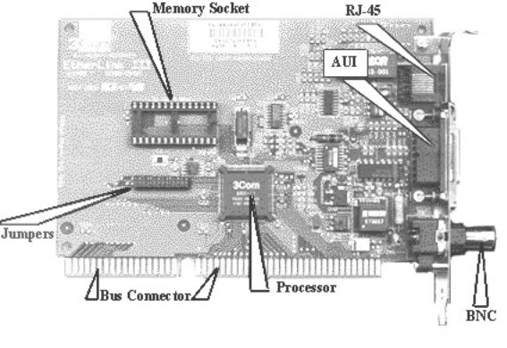

**Оглавление**

Введение	

Лекция 1. Обзор и архитектура информационных сетей	8

Тема 1. Основные определения и термины	8

Тема 2. Преимущества использования сетей	10

Тема 3. Архитектура сетей	12

Архитектура терминал – главный компьютер	12

Одноранговая архитектура	13

Архитектура клиент – сервер	14

Выбор архитектуры сети	16

Вопросы к лекции	16

Лекция 2. Семиуровневая модель OSI	18

Тема 1. Взаимодействие уровней модели OSI	18

Тема 2. Прикладной уровень (Application layer)	21

Тема 3. Уровень представления данных (Presentation layer)	23

Тема 4. Сеансовый уровень (Session layer)	24

Тема 5. Транспортный уровень (Transport Layer)	25

Тема 6. Сетевой уровень (Network Layer)	26

Тема 7. Канальный уровень (Data Link)	28

Тема 8. Физический уровень (Physical Layer)	30

Тема 9. Сетезависимые протоколы	32

Тема 10. Стеки коммуникационных протоколов	33

Вопросы	33

Лекция 3. Стандарты и стеки протоколов	35

Тема 1. Спецификации стандартов	35

802.1	35

802.2	35

802.3	35

802.4	36

802.5	37

802.6	37

802.7	37

802.8	37

802.9	37

802.10	38

802.11	38

802.12	38

Тема 2. Протоколы и стеки протоколов	38

Сетевые протоколы	39

Транспортные протоколы	39

Прикладные протоколы	40

Тема 3. Стек OSI	40

Тема 4. Архитектура стека протоколов Microsoft TCP/IP	41

Уровень Приложения	42

Уровень транспорта	43

Протокол управления передачей (TCP)	43

Пользовательский протокол дейтаграмм (UDP)	44

Межсетевой уровень	44

Протокол Интернета IP	44

Адресация в IP-сетях	45

Протоколы сопоставления адреса ARP и RARP	45

Протокол ICMP	46

Протокол IGMP	46

NDIS	46

Уровень сетевого интерфейса	46

Вопросы	47

Лекция 4. Топология информационной сети и методы доступа	48

Тема 1. Топология информационной сети	48

Виды топологий	48

Общая шина	49

Кольцо	50

Звезда	50

Тема 2. Методы доступа	51

CSMA/CD	52

TPMA	53

TDMA	54

FDMA	55

Вопросы	56

Лекция 5. ИС и компоненты ИС	58

Тема 1. Основные компоненты	58

Тема 2. Рабочие станции	59

Тема 3. Сетевые адаптеры	60

Тема 4. Файловые серверы	60

Тема 5. Сетевые операционные системы	62

Тема 6. Сетевое программное обеспечение	62

Тема 7. Защита данных	63

Тема 8. Использование паролей и ограничение доступа	63

Тема 9. Типовой состав оборудования информационной сети	63

Вопросы	64

Лекция 6. Физическая среда передачи данных	66

Тема 1. Кабели связи, линии связи, каналы связи	66

Тема 2. Типы кабелей и структурированные кабельные системы	67

Тема 3. Кабельные системы	68

Тема 4. Типы кабелей	69

Кабель типа «витая пара» (twisted pair)	69

Коаксиальные кабели	70

Оптоволоконный кабель	70

Тема 5. Кабельные системы Ethernet	71

10Base-T, 100Base-TX	71

10Base2	72

10Base5	72

Тема 6. Беспроводные технологии	73

Радиосвязь	73

Связь в микроволновом диапазоне	73

Инфракрасная связь	73

Вопросы	73

Лекция 7. Сетевые операционные системы	75

Тема 1. Структура сетевой операционной системы	76

Клиентское программное обеспечение	77

Редиректоры	77

Распределители	77

Имена UNC	78

Серверное программное обеспечение	78

Клиентское и серверное программное обеспечение	78

Выбор сетевой операционной системы	79

Тема 2. Одноранговые NOS и NOS с выделенными серверами	80

Тема 3. NOS для сетей масштаба предприятия	82

Сети отделов	82

Сети кампусов	83

Корпоративные сети	83

Тема 4. Сетевые ОС NetWare фирмы Novell	84

Назначение ОС NetWare	84

Структурная схема OC	84

Сетевая файловая система	85

Основные сетевые возможности	85

Защита информации	86

Тема 5. Семейство сетевых ОС Windows NT	87

Структура Windows NT	87

Сетевые средства	88

Состав Windows NT	88

Свойства Windows NT	89

Области использования Windows NT	90

Тема 6. Семейство ОС UNIX	90

Программы	92

Ядро ОС UNIX	92

Файловая система	93

Принципы защиты	93

Идентификаторы пользователя и группы пользователей	93

Защита файлов	94

Тема 7. Обзор Системы Linux	94

Графический интерфейс пользователя	95

Работа с сетью	95

Сетевые файловые системы	96

Почта	96

Вопросы	96

Лекция 8. Требования, предъявляемые к сетям	98

Тема 1. Производительность	98

Тема 2. Надежность и безопасность	99

Тема 3. Прозрачность	100

Тема 4. Поддержка разных видов трафика	101

Тема 5. Управляемость	102

Управление эффективностью	102

Управление конфигурацией	102

Управление учетом использования ресурсов	103

Управление неисправностями	103

Управление защитой данных	103

Тема 6. Совместимость	104

Вопросы	105

Лекция 9. Сетевое оборудование	106

Тема 1. Сетевые адаптеры, или NIC (Network Interface Card).	106

Назначение.	106

Настройка сетевого адаптера и трансивера	106

Функции сетевых адаптеров	108

Базовый, или физический, адрес	109

Типы сетевых адаптеров	109

Тема 2. Повторители и концентраторы	111

Планирование сети с хабом	113

Преимущества концентратора	113

Тема 3. Мосты и коммутаторы	114

Различие между мостом и коммутатором	115

Коммутатор	116

Коммутатор информационной сети	117

Тема 4. Маршрутизатор	118

Различие между маршрутизаторами и мостами	119

Тема 5. Шлюзы	120

Вопросы	121

Русские термины	122

Английские термины	135

Английские сокращения	146

Литература	154

1. # **Обзор и архитектура вычислительных сетей**
   1. ## **Основные определения и термины**
*Сеть* – это совокупность объектов, образуемых устройствами передачи и обработки данных. Международная организация по стандартизации определила вычислительную сеть *как последовательную бит-ориентированную передачу информации между связанными друг с другом независимыми устройствами.* 

Сети обычно находится в частном ведении пользователя и занимают некоторую территорию и по территориальному признаку разделяются на:
-
- Локальные вычислительные сети (ЛВС) или Local Area Network (LAN), расположенные в одном или нескольких близко расположенных зданиях. ЛВС обычно размещаются в рамках какой-либо организации (корпорации, учреждения), поэтому их называют корпоративными.
- Распределенные компьютерные сети, глобальные или Wide Area Network (WAN), расположенные в разных зданиях, городах и странах, которые бывают территориальными, смешанными и глобальными. В зависимости от этого глобальные сети бывают четырех основных видов: городские, региональные, национальные и транснациональные. В качестве примеров распределенных сетей очень большого масштаба можно назвать: Internet, EUNET, Relcom, FIDO.

В состав сети в общем случае включается следующие элементы:
-
- сетевые компьютеры (оснащенные сетевым адаптером);
- каналы связи (кабельные, спутниковые, телефонные, цифровые, волоконно-оптические, радиоканалы и др.);
- различного рода преобразователи сигналов;
- сетевое оборудование.

Различают два понятия сети: *коммуникационная сеть* и *информационная сеть* (рис. 1.1).

*Коммуникационная сеть* предназначена для передачи данных, также она выполняет задачи, связанные с преобразованием данных. Коммуникационные сети различаются по типу используемых физических средств соединения.

*Информационная сеть* предназначена для хранения информации и состоит из *информационных систем*. На базе коммуникационной сети может быть построена группа информационных сетей: 

Под *информационной системой* следует понимать систему, которая является поставщиком или потребителем информации.

Рис. 1.1 Информационные и коммуникационные сети

Компьютерная сеть состоит из *информационных систем* и *каналов связи*.

Под *информационной системой* следует понимать объект, способный осуществлять хранение, обработку или передачу информация. В состав *информационной системы* входят: компьютеры, программы, пользователи и другие составляющие, предназначенные для процесса обработки и передачи данных. В дальнейшем информационная система, предназначенная для решения задач пользователя, будет называться – *рабочая станция (client)*. Рабочая станция в сети отличается от обычного персонального компьютера (ПК) наличием *сетевой карты* (*сетевого адаптера*), канала для передачи данных и сетевого программного обеспечения.

Под *каналом связи* следует понимать путь или средство, по которому передаются сигналы. Средство передачи сигналов называют *абонентским,* или *физическим, каналом*. 

*Каналы связи (data link)* создаются по линиям связи при помощи сетевого оборудования и физических средств связи. Физические средства связи построены на основе витых пар, коаксиальных кабелей, оптических каналов или эфира. Между взаимодействующими информационными системами через физические каналы коммуникационной сети и узлы коммутации устанавливаются *логические каналы.*

*Логический канал* – это путь для передачи данных от одной системы к другой. Логический канал прокладывается по маршруту в одном или нескольких физических каналах. *Логический канал* можно охарактеризовать, как маршрут, проложенный через физические каналы и узлы коммутации.

Информация в сети передается *блоками данных* по процедурам обмена между объектами. Эти процедуры называют *протоколами передачи данных.*

*Протокол –* это совокупность правил, устанавливающих формат и процедуры обмена информацией между двумя или несколькими устройствами.

Загрузка сети характеризуется параметром, называемым *трафиком*. *Трафик (traffic) –* это поток сообщений в сети передачи данных. Под ним понимают количественное измерение в выбранных точках сети числа проходящих *блоков данных* и их длины, выраженное в битах в секунду.

Существенное влияние на характеристику сети оказывает *метод доступа*. *Метод доступа* – это способ определения того, какая из рабочих станций сможет следующей использовать канал связи и как управлять доступом к каналу связи (кабелю).

В сети все рабочие станции физически соединены между собою каналами связи по определенной структуре, называемой *топологией*. *Топология* – это описание физических соединений в сети, указывающее какие рабочие станции могут связываться между собой. Тип топологии определяет производительность, работоспособность и надежность эксплуатации рабочих станций, а также время обращения к файловому серверу. В зависимости от топологии сети используется тот или иной метод доступа.

Состав основных элементов в сети зависит от ее архитектуры. *Архитектура* – это концепция, определяющая взаимосвязь, структуру и функции взаимодействия рабочих станций в сети. Она предусматривает логическую, функциональную и физическую организацию технических и программных средств сети. Архитектура определяет принципы построения и функционирования аппаратного и программного обеспечения элементов сети.

В основном выделяют три вида архитектур: архитектура *терминал – главный компьютер*, архитектура *клиент – сервер* и *одноранговая* архитектура.

Современные сети можно классифицировать по различным признакам: по удаленности компьютеров, топологии, назначению, перечню предоставляемых услуг, принципам управления (централизованные и децентрализованные), методам коммутации, методам доступа, видам среды передачи, скоростям передачи данных и т. д. Все эти понятия будут рассмотрены более подробно при дальнейшем изучении курса.
1. ## **Преимущества использования сетей**
Компьютерные сети представляют собой вариант сотрудничества людей и компьютеров, обеспечивающего ускорение доставки и обработки информации. Объединять компьютеры в сети начали более 30 лет назад. Когда возможности компьютеров выросли и ПК стали доступны каждому, развитие сетей значительно ускорилось.

Соединенные в сеть компьютеры обмениваются информацией и совместно используют периферийное оборудование и устройства хранения информации рис. 1.2.

Рис. 1.2 Использование периферийного оборудования

С помощью сетей можно разделять ресурсы и информацию. Ниже перечислены основные задачи, которые решаются с помощью рабочей станции в сети, и которые трудно решить с помощью отдельного компьютера:

Компьютерная сеть позволит совместно использовать периферийные устройства, включая:

принтеры; 

плоттеры; 

дисковые накопители; 

приводы CD-ROM; 

дисководы; 

стримеры; 

сканеры; 

факс-модемы; 

Компьютерная сеть позволяет совместно использовать информационные ресурсы: 

каталоги; 

файлы; 

прикладные программы; 

игры; 

базы данных; 

текстовые процессоры.

Компьютерная сеть позволяет работать с многопользовательскими программами, обеспечивающими одновременный доступ всех пользователей к общим базам данных с блокировкой файлов и записей, обеспечивающей целостность данных. Любые программы, разработанные для стандартных ЛВС, можно использовать в других сетях. 

Совместное использование ресурсов обеспечит существенную экономию средств и времени. Например, можно коллективно использовать один лазерный принтер вместо покупки принтера каждому сотруднику или беготни с дискетами к единственному принтеру при отсутствии сети. 

Организация электронной почты. Можно использовать *ЛВС* как почтовую службу и рассылать служебные записки, доклады и сообщения другим пользователям.
1. ## **Архитектура сетей**
Архитектура сети определяет основные элементы сети, характеризует ее общую логическую организацию, техническое обеспечение, программное обеспечение, описывает методы кодирования. Архитектура также определяет принципы функционирования и интерфейс пользователя.

В данном курсе будет рассмотрено три вида архитектур:
-
- архитектура терминал – главный компьютер;
- одноранговая архитектура;
- архитектура клиент – сервер.
### **Архитектура терминал – главный компьютер**
Архитектура терминал – главный компьютер (terminal – host computer architecture) – это концепция информационной сети, в которой вся обработка данных осуществляется одним или группой главных компьютеров.

Рис. 1.3 Архитектура терминал – главный компьютер

Рассматриваемая архитектура предполагает два типа оборудования:
-
- Главный компьютер, где осуществляется управление сетью, хранение и обработка данных.
- Терминалы, предназначенные для передачи главному компьютеру команд на организацию сеансов и выполнения заданий, ввода данных для выполнения заданий и получения результатов.

*Главный компьютер* через мультиплексоры передачи данных (МПД) взаимодействуют с терминалами, как представлено на рис. 1.3.

Классический пример архитектуры сети с главными компьютерами – системная сетевая архитектура (System Network Architecture – SNA).
### **Одноранговая архитектура**
Одноранговая архитектура (peer-to-peer architecture) – это концепция информационной сети, в которой ее ресурсы рассредоточены по всем системам. Данная архитектура характеризуется тем, что в ней все системы равноправны.

К *одноранговым* сетям относятся малые сети, где любая рабочая станция может выполнять одновременно функции файлового сервера и рабочей станции. В *одноранговых* *ЛВС* дисковое пространство и файлы на любом компьютере могут быть общими. Чтобы ресурс стал общим, его необходимо отдать в общее пользование, используя службы удаленного доступа сетевых одноранговых операционных систем. В зависимости от того, как будет установлена защита данных, другие пользователи смогут пользоваться файлами сразу же после их создания. *Одноранговые* *ЛВС* достаточно хороши только для небольших рабочих групп.

Рис. 1.4 Одноранговая архитектура

*Одноранговые* *ЛВС* являются наиболее легким и дешевым типом сетей для установки. Они на компьютере требуют, кроме сетевой карты и сетевого носителя, только операционной системы *Windows* 95 или *Windows for Workgroups.* При соединении компьютеров, пользователи могут предоставлять ресурсы и информацию в совместное пользование.

Одноранговые сети имеют следующие преимущества:
-
- они легки в установке и настройке;
- отдельные ПК не зависят от выделенного сервера;
- пользователи в состоянии контролировать свои ресурсы;
- малая стоимость и легкая эксплуатация;
- минимум оборудования и программного обеспечения;
- нет необходимости в администраторе;
- хорошо подходят для сетей с количеством пользователей, не превышающим десяти.

Проблемой одноранговой архитектуры является ситуация, когда компьютеры отключаются от сети. В этих случаях из сети исчезают виды *сервиса*, которые они предоставляли. Сетевую безопасность одновременно можно применить только к одному ресурсу, и пользователь должен помнить столько паролей, сколько сетевых ресурсов. При получении доступа к разделяемому ресурсу ощущается падение производительности компьютера. Существенным недостатком одноранговых сетей является отсутствие централизованного администрирования.

Использование одноранговой архитектуры не исключает применения в той же сети также архитектуры «терминал – главный компьютер» или архитектуры «клиент – сервер».
### **Архитектура клиент – сервер**
*Архитектура клиент – сервер* (client-server architecture) – это концепция информационной сети, в которой основная часть ее ресурсов сосредоточена в серверах, обслуживающих своих клиентов (рис. 1.5). Рассматриваемая архитектура определяет два типа компонентов: *серверы и клиенты*.

*Сервер -* это объект, предоставляющий *сервис* другим объектам сети по их запросам. *Сервис* – это процесс обслуживания клиентов.

Рис. 1.5 Архитектура клиент – сервер

Сервер работает по заданиям клиентов и управляет выполнением их заданий. После выполнения каждого задания сервер посылает полученные результаты клиенту, пославшему это задание. 

Сервисная функция в архитектуре клиент – сервер описывается комплексом прикладных программ, в соответствии с которым выполняются разнообразные прикладные процессы.

Процесс, который вызывает сервисную функцию с помощью определенных операций, называется *клиентом*. Им может быть программа или пользователь. На рис. 1.6 приведен перечень сервисов в архитектуре клиент – сервер.

*Клиенты* – это рабочие станции, которые используют ресурсы сервера и предоставляют удобные *интерфейсы пользователя*. *Интерфейсы пользователя* это процедуры взаимодействия пользователя с системой или сетью.

Клиент является инициатором и использует электронную почту или другие сервисы сервера. В этом процессе клиент запрашивает вид обслуживания, устанавливает сеанс, получает нужные ему результаты и сообщает об окончании работы.

Рис. 1.6 Модель клиент-сервер

В *сетях с выделенным файловым сервером* на выделенном автономном *ПК* устанавливается серверная сетевая операционная система. Этот *ПК* становится *сервером.* Программное обеспечение (*ПО*)*,* установленное на рабочей станции, позволяет ей обмениваться данными с сервером. Наиболее распространенные сетевые операционная системы:
-
- NetWare фирмы Novel;
- Windows NT фирмы Microsoft;
- UNIX фирмы AT&T;
- Linux.

Помимо сетевой операционной системы необходимы сетевые прикладные программы, реализующие преимущества, предоставляемые сетью.

Сети на базе серверов* имеют лучшие характеристики и повышенную надежность. Сервер* владеет главными ресурсами сети,* к которым обращаются остальные рабочие станции.

В современной клиент – серверной архитектуре выделяется четыре группы объектов: клиенты, серверы, данные и сетевые службы. Клиенты располагаются в системах на рабочих местах пользователей. Данные в основном хранятся в серверах. Сетевые службы являются совместно используемыми серверами и данными. Кроме того службы управляют процедурами обработки данных.

Сети клиент – серверной архитектуры имеют следующие преимущества:
-
- позволяют организовывать сети с большим количеством рабочих станций;
- обеспечивают централизованное управление учетными записями пользователей, безопасностью и доступом, что упрощает сетевое администрирование;
- эффективный доступ к сетевым ресурсам;
- пользователю нужен один пароль для входа в сеть и для получения доступа ко всем ресурсам, на которые распространяются права пользователя.

Наряду с преимуществами сети клиент – серверной архитектуры имеют и ряд недостатков:
-
- неисправность сервера может сделать сеть неработоспособной, как минимум потерю сетевых ресурсов;
- требуют квалифицированного персонала для администрирования;
- имеют более высокую стоимость сетей и сетевого оборудования.
### **Выбор архитектуры сети**
Выбор архитектуры сети зависит от назначения сети, количества рабочих станций и от выполняемых на ней действий. 

Следует выбрать одноранговую сеть, если:
-
- количество пользователей не превышает десяти;
- все машины находятся близко друг от друга;
- имеют место небольшие финансовые возможности;
- нет необходимости в специализированном сервере, таком как сервер БД, факс-сервер или какой-либо другой;
- нет возможности или необходимости в централизованном администрировании.

Следует выбрать клиент серверную сеть, если:
-
- количество пользователей превышает десяти;
- требуется централизованное управление, безопасность, управление ресурсами или резервное копирование;
- необходим специализированный сервер;
- нужен доступ к глобальной сети;
- требуется разделять ресурсы на уровне пользователей.
### **Вопросы к лекции**
1. Дать определение сети.
1. Чем отличается коммуникационная сеть от информационной сети?
1. Как разделяются сети по территориальному признаку?
1. Что такое информационная система?
1. Что такое каналы связи?
1. Дать определение физического канала связи.
1. Дать определение логического канала связи.
1. Как называется совокупность правил обмена информацией между двумя или несколькими устройствами?
1. Как называется объект, способный осуществлять хранение, обработку или передачу данных, в состав, которого входят компьютер, программное обеспечение, пользователи и др. составляющие, предназначенные для процесса обработки и передачи данных?
1. Каким параметром характеризуется загрузка сети?
1. Что такое метод доступа?
1. Что такое совокупность правил, устанавливающих процедуры и формат обмена информацией?
1. Чем отличается рабочая станция в сети от обычного персонального компьютера?
1. Какие элементы  входят в состав сети?
1. Как называется описание физических соединений в сети?
1. Что такое архитектура сети?
1. Как назвать способ определения, какая из рабочих станций сможет следующей использовать канал связи?
1. Перечислить преимущества использования сетей.
1. Чем отличается одноранговая архитектура от клиент серверной архитектуры?
1. Каковы преимущества крупномасштабной сети с выделенным сервером?
1. Какие сервисы предоставляет клиент серверная архитектура?
1. Преимущества и недостатки архитектуры терминал – главный компьютер.
1. В каком случае используется одноранговая архитектура?
1. Что характерно для сетей с выделенным сервером?
1. Как называются рабочие станции, которые используют ресурсы сервера?
1. Что такое сервер?

2

*Семиуровневая модель OSI*
1. # **Семиуровневая модель OSI** 
Для единого представления данных в сетях с неоднородными устройствами и программным обеспечением международная организация по стандартам ISO (International Standardization Organization) разработала базовую модель связи открытых систем OSI (Open System Interconnection). Эта модель описывает правила и процедуры передачи данных в различных сетевых средах при организации сеанса связи. Основными элементами модели являются уровни, прикладные процессы и физические средства соединения. На рис. 2.1 представлена структура базовой модели. Каждый уровень модели* OSI выполняет определенную задачу в процессе передачи данных по сети. Базовая модель является основой для разработки сетевых протоколов. OSI разделяет коммуникационные функции в сети на семь уровней, каждый из которых обслуживает различные части процесса области взаимодействия открытых систем.

Рис. 2.1 Модель OSI

Модель OSI описывает только системные средства взаимодействия, не касаясь приложений конечных пользователей. Приложения реализуют свои собственные протоколы взаимодействия, обращаясь к системным средствам. Если приложение может взять на себя функции некоторых верхних уровней модели OSI, то для обмена данными оно обращается напрямую к системным средствам, выполняющим функции оставшихся нижних уровней модели OSI.
1. ## **Взаимодействие уровней модели OSI**
Модель OSI можно разделить на две различных модели, как показано на рис.2.2: 
-
- горизонтальную модель на базе протоколов, обеспечивающую механизм взаимодействия программ и процессов на различных машинах; 
- вертикальную модель на основе услуг, обеспечиваемых соседними уровнями друг другу на одной машине.

Рис. 2.2 Схема взаимодействия компьютеров в базовой эталонной модели OSI

Каждый уровень компьютера–отправителя взаимодействует с таким же уровнем компьютера-получателя, как будто он связан напрямую. Такая связь называется логической или виртуальной связью. В действительности взаимодействие осуществляется между смежными уровнями одного компьютера.

Итак, информация на компьютере-отправителе должна пройти через все уровни. Затем она передается по физической среде до компьютера–получателя и опять проходит сквозь все слои, пока не доходит до того же уровня, с которого она была послана на компьютере-отправителе.

В горизонтальной модели двум программам требуется общий протокол для обмена данными. В вертикальной модели соседние уровни обмениваются данными с использованием интерфейсов прикладных программ API (Application Programming Interface).

Перед подачей в сеть данные разбиваются на пакеты. Пакет (packet) – это единица информации, передаваемая между станциями сети. При отправке данных пакет проходит последовательно через все уровни программного обеспечения. На каждом уровне к пакету добавляется управляющая информация данного уровня (заголовок), которая необходима для успешной передачи данных по сети, как это показано на рис. 2.3, где *Заг* – заголовок пакета, *Кон* – конец пакета.

На принимающей стороне пакет проходит через все уровни в обратном порядке. На каждом уровне протокол этого уровня читает информацию пакета, затем удаляет информацию, добавленную к пакету на этом же уровне отправляющей стороной, и передает пакет следующему уровню. Когда пакет дойдет до *Прикладного* уровня, вся управляющая информация будет удалена из пакета, и данные примут свой первоначальный вид.

Рис. 2.3 Формирование пакета каждого уровня семиуровневой модели

Каждый уровень модели выполняет свою функцию. Чем выше уровень, тем более сложную задачу он решает.

Отдельные уровни модели *OSI* удобно рассматривать как *группы программ*, предназначенных для выполнения конкретных *функций*. Один уровень, к примеру, отвечает за обеспечение преобразования данных из *ASCII* в *EBCDIC* и содержит *программы* необходимые для выполнения этой задачи.

Каждый уровень обеспечивает сервис для вышестоящего уровня, запрашивая в свою очередь, сервис у нижестоящего уровня. Верхние уровни запрашивают сервис почти одинаково: как правило, это требование маршрутизации каких-то данных из одной сети в другую. Практическая реализация принципов адресации данных возложена на нижние уровни.

Рассматриваемая модель определяет взаимодействие открытых систем разных производителей в одной сети. Поэтому она выполняет для них координирующие действия по:
-
- взаимодействию прикладных процессов; 
- формам представления данных; 
- единообразному хранению данных; 
- управлению сетевыми ресурсами; 
- безопасности данных и защите информации; 
- диагностике программ и технических средств. 

На рис. 2.4 приведено краткое описание функций всех уровней.

Рис. 2.4 Функции уровней
1. ## **Прикладной уровень (Application layer)**
Прикладной уровень обеспечивает прикладным процессам средства доступа к области взаимодействия, является верхним (седьмым) уровнем и непосредственно примыкает к прикладным процессам. В действительности прикладной уровень – это набор разнообразных протоколов, с помощью которых пользователи сети получают доступ к разделяемым ресурсам, таким как файлы, принтеры или гипертекстовые Web-страницы, а также организуют свою совместную работу, например с помощью протокола электронной почты [30]. Специальные элементы прикладного сервиса обеспечивают сервис для конкретных прикладных программ, таких как программы пересылки файлов и эмуляции терминалов. Если, например программе необходимо переслать файлы, то обязательно будет использован *протокол передачи, доступа и управления файлами* FTAM (File Transfer, Access, and Management). В модели OSI *прикладная программа*, которой нужно выполнить конкретную задачу (например, обновить базу данных на компьютере), посылает конкретные данные в виде *Дейтаграммы* на *прикладной уровень*. Одна из основных задач этого уровня - определить, как следует обрабатывать запрос прикладной программы, другими словами, какой вид должен принять данный запрос.

Единица данных, которой оперирует прикладной уровень, обычно называется сообщением (message).

Прикладной уровень выполняет следующие функции: 

Описание форм и методов взаимодействия прикладных процессов.

1. Выполнение различных видов работ.

передача файлов;

управление заданиями;

управление системой и т.д.

1. Идентификация пользователей по их паролям, адресам, электронным подписям;
1. Определение функционирующих абонентов и возможности доступа к новым прикладным процессам;
1. Определение достаточности имеющихся ресурсов;
1. Организация запросов на соединение с другими прикладными процессами;
1. Передача заявок представительскому уровню на необходимые методы описания информации;
1. Выбор процедур планируемого диалога процессов;
1. Управление данными, которыми обмениваются прикладные процессы и синхронизация взаимодействия прикладных процессов;
1. Определение качества обслуживания (время доставки блоков данных, допустимой частоты ошибок);
1. Соглашение об исправлении ошибок и определении достоверности данных;
1. Согласование ограничений, накладываемых на синтаксис (наборы символов, структура данных).

Указанные функции определяют виды сервиса, которые прикладной уровень предоставляет прикладным процессам. Кроме этого, прикладной уровень передает прикладным процессам сервис, предоставляемый физическим, канальным, сетевым, транспортным, сеансовым и представительским уровнями. 

На *прикладном уровне* необходимо предоставить в распоряжение пользователей уже переработанную информацию. С этим может справиться системное и пользовательское программное обеспечение.

Прикладной уровень отвечает за доступ приложений в сеть. Задачами этого уровня является перенос файлов, обмен почтовыми сообщениями и управление сетью. 

К числу наиболее распространенных протоколов верхних трех уровней относятся: 
-
- FTP (File Transfer Protocol) протокол передачи файлов;
- TFTP (Trivial File Transfer Protocol) простейший протокол пересылки файлов;
- X.400 электронная почта;
- Telnet работа с удаленным терминалом;
- SMTP (Simple Mail Transfer Protocol) простой протокол почтового обмена;
- CMIP (Common Management Information Protocol) общий протокол управления информацией;
- SLIP **(**Serial Line IP) IP для последовательных линий. Протокол последовательной посимвольной передачи данных;
- SNMP (Simple Network Management Protocol) простой протокол сетевого управления;
- FTAM (File Transfer, Access, and Management) протокол передачи, доступа и управления файлами.
  1. ## **Уровень представления данных (Presentation layer)**
Уровень представления данных или представительский уровень представляет данные, передаваемые между прикладными процессами, в нужной форме данные.

Этот уровень обеспечивает то, что информация, передаваемая прикладным уровнем, будет понятна прикладному уровню в другой системе. В случаях необходимости уровень представления в момент передачи информации выполняет преобразование форматов данных в некоторый общий формат представления, а в момент приема, соответственно, выполняет обратное преобразование. Таким образом, прикладные уровни могут преодолеть, например, синтаксические различия в представлении данных. Такая ситуация может возникнуть в ЛВС с неоднотипными компьютерами (*IBM PC и Macintosh*), которым необходимо обмениваться данными. Так, в полях баз данных информация должна быть представлена в виде букв и цифр, а зачастую и в виде графического изображения. Обрабатывать же эти данные нужно, например, как числа с плавающей запятой.

В основу общего представления данных положена единая для всех уровней модели система ASN.1. Эта система служит для описания структуры файлов, а также позволяет решить проблему шифрования данных. На этом уровне может выполняться шифрование и дешифрование данных, благодаря которым секретность обмена данными обеспечивается сразу для всех прикладных сервисов. Примером такого протокола является протокол *Secure Socket Layer (SSL),* который обеспечивает секретный обмен сообщениями для протоколов прикладного уровня стека TCP/IP. Этот уровень обеспечивает преобразование данных (кодирование, компрессия и т.п.) прикладного уровня в поток информации для транспортного уровня. 

Представительный уровень выполняет следующие основные функции: 

1. Генерация запросов на установление сеансов взаимодействия прикладных процессов.
1. Согласование представления данных между прикладными процессами.
1. Реализация форм представления данных.
1. Представление графического материала (чертежей, рисунков, схем).
1. Засекречивание данных.
1. Передача запросов на прекращение сеансов.

Протоколы уровня представления данных обычно являются составной частью протоколов трех верхних уровней модели.
1. ## **Сеансовый уровень (Session layer)**
Сеансовый уровень – это уровень, определяющий процедуру проведения сеансов между пользователями или прикладными процессами.

Сеансовый уровень обеспечивает управление диалогом для того, чтобы фиксировать, какая из сторон является активной в настоящий момент, а также предоставляет средства синхронизации. Последние позволяют вставлять контрольные точки в длинные передачи, чтобы в случае отказа можно было вернуться назад к последней контрольной точке, вместо того чтобы начинать все сначала. На практике немногие приложения используют сеансовый уровень, и он редко реализуется.

Сеансовый уровень управляет передачей информации между прикладными процессами, координирует прием, передачу и выдачу одного сеанса связи. Кроме того, сеансовый уровень содержит дополнительно функции управления паролями, управления диалогом, синхронизации и отмены связи в сеансе передачи после сбоя вследствие ошибок в нижерасположенных уровнях. Функции этого уровня состоят *в координации связи* между двумя прикладными программами, работающими на разных рабочих станциях. Это происходит в виде хорошо структурированного диалога. В число этих функций входит создание сеанса, управление передачей и приемом пакетов сообщений во время сеанса и завершение сеанса.

На сеансовом уровне определяется, какой будет передача между двумя прикладными процессами:
-
- *полудуплексной* (процессы будут передавать и принимать данные по очереди);
- *дуплексной* (процессы будут передавать данные, и принимать их одновременно).

В полудуплексном режиме сеансовый уровень выдает тому процессу, который начинает передачу, *маркер данных*. Когда второму процессу приходит время отвечать, маркер данных передается ему. Сеансовый уровень разрешает передачу только той стороне, которая обладает маркером данных.

Сеансовый уровень обеспечивает выполнение следующих функций: 

1. Установление и завершение на сеансовом уровне соединения между взаимодействующими системами.
1. Выполнение нормального и срочного обмена данными между прикладными процессами.
1. Управление взаимодействием прикладных процессов.
1. Синхронизация сеансовых соединений.
1. Извещение прикладных процессов об исключительных ситуациях.
1. Установление в прикладном процессе меток, позволяющих после отказа либо ошибки восстановить его выполнение от ближайшей метки.
1. Прерывание в нужных случаях прикладного процесса и его корректное возобновление.
1. Прекращение сеанса без потери данных.
1. Передача особых сообщений о ходе проведения сеанса.

Сеансовый уровень отвечает за организацию сеансов обмена данными между оконечными машинами. Протоколы сеансового уровня обычно являются составной частью протоколов трех верхних уровней модели.
1. ## **Транспортный уровень (Transport Layer)**
Транспортный уровень предназначен для передачи пакетов через коммуникационную сеть. На транспортном уровне пакеты разбиваются на блоки.

На пути от отправителя к получателю пакеты могут быть искажены или утеряны. Хотя некоторые приложения имеют собственные средства обработки ошибок, существуют и такие, которые предпочитают сразу иметь дело с надежным соединением. Работа транспортного уровня заключается в том, чтобы обеспечить приложениям или верхним уровням модели (прикладному и сеансовому) передачу данных с той степенью надежности, которая им требуется. Модель OSI определяет пять классов сервиса, предоставляемых транспортным уровнем. Эти виды сервиса отличаются качеством предоставляемых услуг: срочностью, возможностью восстановления прерванной связи, наличием средств мультиплексирования нескольких соединений между различными прикладными протоколами через общий транспортный протокол, а главное способностью к обнаружению и исправлению ошибок передачи, таких как искажение, потеря и дублирование пакетов. 

Транспортный уровень определяет адресацию физических устройств (систем, их частей) в сети. Этот уровень гарантирует доставку блоков информации адресатам и управляет этой доставкой. Его главной задачей является обеспечение эффективных, удобных и надежных форм передачи информации между системами. Когда в процессе обработки находится более одного пакета, транспортный уровень контролирует очередность прохождения пакетов. Если проходит дубликат принятого ранее сообщения, то данный уровень опознает это и игнорирует сообщение.

В функции транспортного уровня входят: 

1. Управление передачей по сети и обеспечение целостности блоков данных.
1. Обнаружение ошибок, частичная их ликвидация и сообщение о неисправленных ошибках.
1. Восстановление передачи после отказов и неисправностей.
1. Укрупнение или разделение блоков данных.
1. Предоставление приоритетов при передаче блоков (нормальная или срочная).
1. Подтверждение передачи.
1. Ликвидация блоков при тупиковых ситуациях в сети.

Начиная с транспортного уровня, все вышележащие протоколы реализуются программными средствами, обычно включаемыми в состав сетевой операционной системы.

Наиболее распространенные протоколы транспортного уровня включают в себя:
-
- TCP (Transmission Control Protocol) протокол управления передачей стека TCP/IP;
- UDP (User Datagram Protocol) пользовательский протокол дейтаграмм стека TCP/IP;
- NCP (NetWare Core Protocol) базовый протокол сетей NetWare;
- SPX (Sequenced Packet eXchange) упорядоченный обмен пакетами стека Novell;
- TP4 (Transmission Protocol) – протокол передачи класса 4.
  1. ## **Сетевой уровень (Network Layer)**
Сетевой уровень обеспечивает прокладку каналов, соединяющих абонентские и административные системы через коммуникационную сеть, выбор маршрута наиболее быстрого и надежного пути.

Сетевой уровень устанавливает связь в вычислительной сети между двумя системами и обеспечивает прокладку виртуальных каналов между ними. *Виртуальный или логический канал* - это такое функционирование компонентов сети, которое создает взаимодействующим компонентам иллюзию прокладки между ними нужного тракта. Кроме этого, сетевой уровень сообщает транспортному уровню о появляющихся ошибках. Сообщения сетевого уровня принято называть *пакетами* (packet). В них помещаются фрагменты данных. Сетевой уровень отвечает за их адресацию и доставку.

Прокладка наилучшего пути для передачи данных называется *маршрутизацией*, и ее решение является главной задачей сетевого уровня. Эта проблема осложняется тем, что самый короткий путь не всегда самый лучший. Часто критерием при выборе маршрута является время передачи данных по этому маршруту; оно зависит от пропускной способности каналов связи и интенсивности трафика, которая может изменяться с течением времени. Некоторые алгоритмы маршрутизации пытаются приспособиться к изменению нагрузки, в то время как другие принимают решения на основе средних показателей за длительное время. Выбор маршрута может осуществляться и по другим критериям, например, надежности передачи.

Протокол канального уровня обеспечивает доставку данных между любыми узлами только в сети с соответствующей *типовой топологией*. Это очень жесткое ограничение, которое не позволяет строить сети с развитой структурой, например, сети, объединяющие несколько сетей предприятия в единую сеть, или высоконадежные сети, в которых существуют избыточные связи между узлами.

Таким образом, внутри сети доставка данных регулируется канальным уровнем, а вот доставкой данных между сетями занимается сетевой уровень. При организации доставки пакетов на сетевом уровне используется понятие *номер сети.* В этом случае *адрес* получателя состоит из *номера сети* и *номера компьютера* в этой сети.

Сети соединяются между собой специальными устройствами, называемыми маршрутизаторами. *Маршрутизатор* это устройство, которое собирает информацию о топологии межсетевых соединений и на ее основании пересылает пакеты сетевого уровня в сеть назначения. Для того чтобы передать сообщение от отправителя, находящегося в одной сети, получателю, находящемуся в другой сети, нужно совершить некоторое количество транзитных передач (hops) между сетями, каждый раз, выбирая подходящий маршрут. Таким образом, маршрут представляет собой последовательность маршрутизаторов, по которым проходит пакет.

Сетевой уровень отвечает за деление пользователей на группы и маршрутизацию пакетов на основе преобразования MAC-адресов в сетевые адреса. Сетевой уровень обеспечивает также прозрачную передачу пакетов на транспортный уровень. 

Сетевой уровень выполняет функции:

- Создание сетевых соединений и идентификация их портов.
- Обнаружение и исправление ошибок, возникающих при передаче через коммуникационную сеть.
- Управление потоками пакетов.
- Организация (упорядочение) последовательностей пакетов.
- Маршрутизация и коммутация.
- Сегментирование и объединение пакетов.

На сетевом уровне определяется два вида протоколов. Первый вид относится к определению *правил передачи пакетов* с данными конечных узлов от узла к маршрутизатору и между маршрутизаторами. Именно эти протоколы обычно имеют в виду, когда говорят о протоколах сетевого уровня. Однако часто к сетевому уровню относят и другой вид протоколов, называемых *протоколами обмена маршрутной информацией*. С помощью этих протоколов маршрутизаторы собирают информацию о топологии межсетевых соединений. 

Протоколы сетевого уровня реализуются программными модулями операционной системы, а также программными и аппаратными средствами маршрутизаторов.

Наиболее часто на сетевом уровне используются протоколы: 
-
- IP (Internet Protocol) протокол Internet, сетевой протокол стека TCP/IP, который предоставляет адресную и маршрутную информацию; 
- IPX (Internetwork Packet Exchange) протокол межсетевого обмена пакетами, предназначенный для адресации и маршрутизации пакетов в сетях Novell; 
- X.25 международный стандарт для глобальных коммуникаций с коммутацией пакетов (частично этот протокол реализован на уровне 2); 
- CLNP (Connection Less Network Protocol) сетевой протокол без организации соединений. 
  1. ## **Канальный уровень (Data Link)**
Единицей информации канального уровня являются *кадры (frame).* Кадры – это логически организованная структура, в которую можно помещать данные. Задача канального уровня передавать кадры от сетевого уровня к физическому уровню.

На физическом уровне просто пересылаются биты. При этом не учитывается, что в некоторых сетях, в которых линии связи используются попеременно несколькими парами взаимодействующих компьютеров, физическая среда передачи может быть занята. Поэтому одной из задач канального уровня является проверка доступности среды передачи. Другой задачей канального уровня является реализация механизмов обнаружения и коррекции ошибок. 

Канальный уровень обеспечивает корректность передачи каждого кадра, помещая специальную последовательность бит, в начало и конец каждого кадра, чтобы отметить его, а также вычисляет контрольную сумму, суммируя все байты кадра определенным способом и добавляя контрольную сумму к кадру. Когда кадр приходит, получатель снова вычисляет контрольную сумму полученных данных и сравнивает результат с контрольной суммой из кадра. Если они совпадают, кадр считается правильным и принимается. Если же контрольные суммы не совпадают, то фиксируется ошибка.

Задача канального уровня - брать пакеты, поступающие с сетевого уровня и готовить их к передаче, укладывая в кадр соответствующего размера. Этот уровень обязан определить, где начинается и где заканчивается блок, а также обнаруживать ошибки передачи.

На этом же уровне определяются правила использования физического уровня узлами сети. Электрическое представление данных в ЛВС (биты данных, методы кодирования данных и маркеры) распознаются на этом и только на этом уровне. Здесь обнаруживаются и исправляются (путем требований повторной передачи данных) ошибки.

Канальный уровень обеспечивает создание, передачу и прием кадров данных. Этот уровень обслуживает запросы сетевого уровня и использует сервис физического уровня для приема и передачи пакетов. Спецификации IEEE 802.Х делят канальный уровень на два подуровня:
-
- *LLC* (*Logical Link Control*) управление логическим каналом осуществляет логический контроль связи. Подуровень LLC обеспечивает обслуживание сетевого уровня и связан с передачей и приемом пользовательских сообщений. 
- *MAC* (*Media Assess Control)* контроль доступа к среде. Подуровень MAC регулирует доступ к разделяемой физической среде (передача маркера или обнаружение коллизий или столкновений) и управляет доступом к каналу связи. Подуровень *LLC* находится выше подуровня *МАC.*

Канальный уровень определяет доступ к среде и управление передачей посредством процедуры передачи данных по каналу. При больших размерах передаваемых блоков данных канальный уровень делит их на кадры и передает кадры в виде последовательностей. При получении кадров уровень формирует из них переданные блоки данных. Размер блока данных зависит от способа передачи, качества канала, по которому он передается. 

В локальных сетях протоколы канального уровня используются компьютерами, мостами, коммутаторами и маршрутизаторами. В компьютерах функции канального уровня реализуются совместными усилиями сетевых адаптеров и их драйверов.

Канальный уровень может выполнять следующие виды функций: 

1. Организация (установление, управление, расторжение) канальных соединений и идентификация их портов.
1. Организация и передача кадров.
1. Обнаружение и исправление ошибок.
1. Управление потоками данных.
1. Обеспечение прозрачности логических каналов (передачи по ним данных, закодированных любым способом).

Наиболее часто используемые протоколы на канальном уровне включают:
-
- HDLC (High Level Data Link Control) протокол управления каналом передачи данных высокого уровня, для последовательных соединений;
- IEEE 802.2 LLC (тип I и тип II) обеспечивают MAC для сред 802.x;
- Ethernet сетевая технология по стандарту IEEE 802.3 для сетей, использующая шинную топологию и коллективный доступ с прослушиванием несущей и обнаружением конфликтов;
- Token ring сетевая технология по стандарту IEEE 802.5, использующая кольцевую топологию и метод доступа к кольцу с передачей маркера;
- FDDI (Fiber Distributed Date Interface Station) сетевая технология по стандарту IEEE 802.6, использующая оптоволоконный носитель;
- X.25 международный стандарт для глобальных коммуникаций с коммутацией пакетов;
- Frame relay сеть, организованная из технологий Х25 и ISDN.
  1. ## **Физический уровень (Physical Layer)**
Физический уровень предназначен для сопряжения с *физическими средствами соединения*. *Физические средства соединения* – это совокупность *физической среды*, аппаратных и программных средств, обеспечивающая передачу сигналов между системами. *Физическая среда* – это материальная субстанция, через которую осуществляется передача сигналов. Физическая среда является основой, на которой строятся физические средства соединения. В качестве физической среды широко используются эфир, металлы, оптическое стекло и кварц. 

Физический уровень состоит из *Подуровня стыковки со средой* и *Подуровня преобразования передачи.*

Первый из них обеспечивает сопряжение потока данных с используемым физическим каналом связи. Второй осуществляет преобразования, связанные с применяемыми протоколами. Физический уровень обеспечивает физический интерфейс с каналом передачи данных, а также описывает процедуры передачи сигналов в канал и получения их из канала. На этом уровне определяются электрические, механические, функциональные и процедурные параметры для физической связи в системах. Физический уровень получает пакеты данных от вышележащего канального уровня и преобразует их в оптические или электрические сигналы, соответствующие 0 и 1 бинарного потока. Эти сигналы посылаются через среду передачи на приемный узел. Механические и электрические / оптические свойства среды передачи определяются на физическом уровне и включают: 
-
- тип кабелей и разъемов; 
- разводку контактов в разъемах;
- схему кодирования сигналов для значений 0 и 1.

Физический уровень выполняет следующие функции: 

1. Установление и разъединение физических соединений.
1. Передача сигналов в последовательном коде и прием.
1. Прослушивание, в нужных случаях, каналов.
1. Идентификация каналов.
1. Оповещение о появлении неисправностей и отказов.

Оповещение о появлении неисправностей и отказов связано с тем, что на физическом уровне происходит обнаружение определенного класса событий, мешающих нормальной работе сети (столкновение кадров, посланных сразу несколькими системами, обрыв канала, отключение питания, потеря механического контакта и т. д.). Виды сервиса, предоставляемого канальному уровню, определяются протоколами физического уровня. Прослушивание канала необходимо в тех случаях, когда к одному каналу подключается группа систем, но одновременно передавать сигналы разрешается только одной из них. Поэтому прослушивание канала позволяет определить, свободен ли он для передачи. В ряде случаев для более четкого определения структуры физический уровень разбивается на несколько подуровней. Например, физический уровень беспроводной сети делится на три подуровня рис. 2.5. 

Рис. 2.5 Физический уровень беспроводной локальной сети

Функции физического уровня реализуются во всех устройствах, подключенных к сети. Со стороны компьютера функции физического уровня выполняются сетевым адаптером. Повторители являются единственным типом оборудования, которое работает только на физическом уровне.

Выполняется преобразование данных, поступающих от более высокого уровня, в сигналы передающие по кабелю. В глобальных сетях на этом уровне могут использоваться модемы и интерфейс *RS-232C*. В локальных сетях для преобразования данных применяют сетевые адаптеры, обеспечивающие скоростную передачу данных в цифровой форме. Пример протокола физического уровня - это широко известный интерфейс *RS-232C* */ CCITT V.2*, который является наиболее широко распространенной стандартной последовательной связью между компьютерами и периферийными устройствами.

Можно считать этот уровень, отвечающим за аппаратное обеспечение.

Физический уровень может обеспечивать как асинхронную (последовательную) так и синхронную (параллельную) передачу, которая применяется для некоторых мэйнфреймов и мини - компьютеров. На Физическом уровне должна быть определена схема кодирования для представления двоичных значений с целью их передачи по каналу связи. Во многих локальных сетях используется манчестерское кодирование.

Примером протокола физического уровня может служить спецификация 10Base-T технологии Ethernet, которая определяет в качестве используемого кабеля неэкранированную витую пару категории 3 с волновым сопротивлением 100 Ом, разъем RJ-45, максимальную длину физического сегмента 100 метров, манчестерский код для представления данных на кабеле, и другие характеристики среды и электрических сигналов.

К числу наиболее распространенных спецификаций физического уровня относятся: 
-
- EIA-RS-232-C, CCITT V.24/V.28 - механические/электрические характеристики несбалансированного последовательного интерфейса; 
- EIA-RS-422/449, CCITT V.10 - механические, электрические и оптические характеристики сбалансированного последовательного интерфейса;
- Ethernet – сетевая технология по стандарту IEEE 802.3 для сетей, использующая шинную топологию и коллективный доступ с прослушиванием несущей и обнаружением конфликтов;
- Token ring – сетевая технология по стандарту IEEE 802.5, использующая кольцевую топологию и метод доступа к кольцу с передачей маркера;
  1. ## **Сетезависимые протоколы** 
Функции всех уровней модели OSI могут быть отнесены к одной из двух групп: либо к функциям, зависящим от конкретной технической реализации сети, либо к функциям, ориентированным на работу с приложениями. 

Три нижних уровня физический, канальный и сетевой являются сетезависимыми, протоколы этих уровней тесно связаны с технической реализацией сети, с используемым коммуникационным оборудованием. Например, переход на оборудование FDDI означает смену протоколов физического и канального уровня во всех узлах сети. 

Три верхних уровня сеансовый, уровень представления и прикладной ориентированы на приложения и мало зависят от технических особенностей построения сети. На протоколы этих уровней не влияют никакие изменения в топологии сети, замена оборудования или переход на другую сетевую технологию. Так, переход от Ethernet на высокоскоростную технологию 100VG-AnyLAN не потребует никаких изменений в программных средствах, реализующих функции прикладного, представительного и сеансового уровней. 

Транспортный уровень является промежуточным, он скрывает все детали функционирования нижних уровней от верхних уровней. Это позволяет разрабатывать приложения, не зависящие от технических средств, непосредственно занимающихся транспортировкой сообщений. 

Одна рабочая станция взаимодействует с другой рабочей станцией посредством протоколов всех семи уровней. Это взаимодействие станции осуществляют через различные коммуникационные устройства: концентраторы, модемы, мосты, коммутаторы, маршрутизаторы, мультиплексоры. В зависимости от типа коммуникационное устройство может работать:
-
- либо только на физическом уровне (повторитель);
- либо на физическом и канальном уровнях (мост);
- либо на физическом, канальном и сетевом уровнях, иногда захватывая и транспортный уровень (маршрутизатор). 

Модель OSI представляет собой хотя и очень важную, но только одну из многих моделей коммуникаций. Эти модели и связанные с ними стеки протоколов могут отличаться количеством уровней, их функциями, форматами сообщений, сервисами, предоставляемыми на верхних уровнях, и прочими параметрами. 
1. ## **Стеки коммуникационных протоколов**
Иерархически организованная совокупность протоколов, решающих задачу взаимодействия узлов сети, называется *стеком коммуникационных протоколов*. 

Протоколы соседних уровней, находящихся в одном узле, взаимодействуют друг с другом также в соответствии с четко определенными правилами и с помощью стандартизованных форматов сообщений. Эти правила принято называть *интерфейсом.* Интерфейс определяет набор услуг, которые нижележащий уровень предоставляет вышележащему уровню.
## **Вопросы**
1. Что такое OSI?
1. Каково назначение базовой модели взаимодействия открытых систем?
1. На какие уровни разбита базовая модель OSI?
1. Какие функции несет уровень в модели взаимодействия открытых систем?
1. На какие единицы разбивается информация для передачи данных по сети?
1. Что обеспечивает горизонтальная составляющая модели взаимодействия открытых систем?
1. Какие элементы являются основными элементами для базовой модели взаимодействия открытых систем?
1. Какие функции выполняются на физическом уровне?
1. Какие вопросы решаются на физическом уровне?
1. Какой уровень модели OSI преобразует данные в общий формат для передачи по сети?
1. Какое оборудование используется на физическом уровне?
1. Какие известны спецификации физического уровня?
1. Перечислить функции канального уровня.
1. Какие функции канального уровня?
1. На какие подуровни разделяется канальный уровень и каковы их функции?
1. Функцией какого уровня является засекречивание и реализация форм представления данных?.
1. Какие протоколы используются на канальном уровне?
1. Какое оборудование используется на канальном уровне?
1. Какие функции выполняются и какие протоколы используются на сетевом уровне?
1. Какое оборудование используется на сетевом уровне?
1. Перечислить функции транспортного уровня.
1. Какие протоколы используются на транспортном уровне?
1. Перечислить оборудование транспортного уровня.
1. Дать определение сеансового уровня.
1. Какой уровень отвечает за доступ приложений в сеть?
1. Задачи уровня представления данных.
1. Перечислить функции прикладного уровня.
1. Перечислить протоколы верхних уровней.
1. Дать определение стандартных стеков коммуникационных протоколов

1. # **Стандарты и стеки протоколов**
   1. ## **Спецификации стандартов**
Спецификации Institute of Electrical and Electronics Engineers IEEE802 определяют стандарты для физических компонентов сети. Эти компоненты – сетевая карта (Network Interface Card – NIC) и сетевой носитель (network media), которые относятся к физическому и канальному уровням модели OSI. Спецификации IEEE802 определяют механизм доступа адаптера к каналу связи и механизм передачи данных. Стандарты IEEE802 подразделяют канальный уровень на подуровни:
-
- Logical Link Control (LLC) – подуровень управления логической связью;
- Media Access Control (MAC) – подуровень управления доступом к устройствам.

Спецификации IEEE 802 делятся на двенадцать стандартов:
### **802.1**
Стандарт 802.1 (Internetworking – объединение сетей) задает механизмы управления сетью на MAC – уровне. В разделе 802.1 приводятся основные понятия и определения, общие характеристики и требования к локальным сетям, а также поведение маршрутизации на канальном уровне, где логические адреса должны быть преобразованы в их физические адреса и наоборот.
### **802.2**
Стандарт 802.2 (Logical Link Control – управление логической связью) определяет функционирование подуровня LLC на канальном уровне модели OSI. LLC обеспечивает интерфейс между методами доступа к среде и сетевым уровнем.
### **802.3**
Стандарт 802.3 (Ethernet Carrier Sense Multiple Access with Collision Detection – CSMA/CD LANs Ethernet – множественный доступ к сетям Ethernet с проверкой несущей и обнаружением конфликтов) описывает физический уровень и подуровень MAC для сетей, использующих шинную топологию и коллективный доступ с прослушиванием несущей и обнаружением конфликтов. Прототипом этого метода является метод доступа стандарта Ethernet (10BaseT, 10Base2, 10Base5). Метод доступа CSMA/CD. 802.3 также включает технологии Fast Ethernet (100BaseTx, 100BaseFx, 100BaseFl).

100Base-Tx – двухпарная витая пара. Использует метод MLT-3 для передачи сигналов 5-битовых порций кода 4В/5B по витой паре, а также имеется функция автопереговоров (Auto-negotiation) для выбора режима работы порта.

100Base-T4 – четырехпарная витая пара. Вместо кодирования 4B/5В в этом методе используется кодирование 8B/6T.

100BaseFx – многомодовое оптоволокно. Эта спецификация определяет работу протокола Fast Ethernet по многомодовому оптоволокну в полудуплексном и полнодуплексном режимах на основе хорошо проверенной схемы кодирования и передачи оптических сигналов, использующейся уже на протяжении ряда лет в стандарте FDDI. Как и в стандарте FDDI, каждый узел соединяется с сетью двумя оптическими волокнами, идущими от приемника (Rx) и от передатчика (Tx).

Этот метод доступа используется в сетях с общей шиной (к которым относятся и радиосети, породившие этот метод). Все компьютеры такой сети имеют непосредственный доступ к общей шине, поэтому она может быть использована для передачи данных между любыми двумя узлами сети. Простота схемы подключения - это один из факторов, определивших успех стандарта Ethernet. Говорят, что кабель, к которому подключены все станции, работает в режиме *коллективного доступа (multiply access* – *MA).*

Метод доступа CSMA/CD определяет основные временные и логические соотношения, гарантирующие корректную работу всех станций в сети.

Все данные, передаваемые по сети, помещаются в кадры определенной структуры и снабжаются уникальным адресом станции назначения. Затем кадр передается по кабелю. Все станции, подключенные к кабелю, могут распознать факт передачи кадра, и та станция, которая узнает собственный адрес в заголовках кадра, записывает его содержимое в свой внутренний буфер, обрабатывает полученные данные и посылает по кабелю кадр-ответ. Адрес станции–источника также включен в исходный кадр, поэтому станция-получатель знает, кому нужно послать ответ.
### **802.4**
Стандарт 802.4 (Token Bus LAN – локальные сети Token Bus) определяет метод доступа к шине с передачей маркера, прототип – ArcNet.

При подключении устройств в ArcNet применяют топологию «шина» или «звезда». Адаптеры ArcNet поддерживают метод доступа Token Bus (маркерная шина) и обеспечивают производительность 2,5 Мбит/с. Этот метод предусматривает следующие правила: 
-
- все устройства, подключённые к сети, могут передавать данные, только получив разрешение на передачу (маркер);
- в любой момент времени только одна станция в сети обладает таким правом;
- кадр, передаваемый одной станцией, одновременно анализируется всеми остальными станциями сети. 

В сетях ArcNet используется асинхронный метод передачи данных (в сетях Ethernet и Token Ring применяется синхронный метод), т. е. передача каждого байта в ArcNet выполняется посылкой ISU (Information Symbol Unit – единица передачи информации), состоящей из трёх служебных старт/стоповых битов и восьми битов данных. 
### **802.5**
Стандарт 802.5 (Token Ring LAN – локальные сети Token Ring) описывает метод доступа к кольцу с передачей маркера, прототип – Token Ring.

Сети стандарта Token Ring, так же как и сети Ethernet, используют разделяемую среду передачи данных, которая состоит из отрезков кабеля, соединяющих все станции сети в кольцо. Кольцо рассматривается как общий разделяемый ресурс, и для доступа к нему используется не случайный алгоритм, как в сетях Ethernet, а детерминированный, основанный на передаче станциями права на использование кольца в определенном порядке. Право на использование кольца передается с помощью кадра специального формата, называемого маркером, или токеном. 
### **802.6**
Стандарт 802.6 (Metropolitan Area Network – городские сети) описывает рекомендации для региональных сетей.
### **802.7**
Стандарт 802.7 (Broadband Technical Advisory Group – техническая консультационная группа по широковещательной передаче) описывает рекомендации по широкополосным сетевым технологиям, носителям, интерфейсу и оборудованию.
### **802.8**
Стандарт 802.8 (Fiber Technical Advisory Group – техническая консультационная группа по оптоволоконным сетям) содержит обсуждение использования оптических кабелей в сетях 802.3 – 802.6, а также рекомендации по оптоволоконным сетевым технологиям, носителям, интерфейсу и оборудованию, прототип – сеть FDDI (Fiber Distributed Data Interface).

Стандарт FDDI использует оптоволоконный кабель и доступ с применением маркера. Сеть FDDI строится на основе двух оптоволоконных колец, которые образуют основной и резервный пути передачи данных между узлами сети. Использование двух колец – это основной способ повышения отказоустойчивости в сети FDDI, и узлы, которые хотят им воспользоваться, должны быть подключены к обоим кольцам. Скорость сети до 100 Мб/с. Данная технология позволяет включать до 500 узлов на расстоянии 100 км.
### **802.9**
Стандарт 802.9 (Integrated Voice and Data Network – интегрированные сети передачи голоса и данных) задает архитектуру и интерфейсы устройств одновременной передачи данных и голоса по одной линии, а также содержит рекомендации по гибридным сетям, в которых объединяют голосовой трафик и трафик данных в одной и той же сетевой среде.
### **802.10**
В стандарте 802.10 (Network Security – сетевая безопасность) рассмотрены вопросы обмена данными, шифрования, управления сетями и безопасности в сетевых архитектурах, совместимых с моделью OSI.
### **802.11**
Стандарт 802.11 (Wireless Network – беспроводные сети) описывает рекомендации по использованию беспроводных сетей.
### **802.12**
Стандарт 802.12 описывает рекомендации по использованию сетей 100VG – AnyLAN со скоростью100Мб/с и методом доступа по очереди запросов и по приоритету (Demand Priority Queuing – DPQ, Demand Priority Access – DPA).

Технология 100VG – это комбинация *Ethernet*** и** *Token-Ring* со скоростью передачи 100 Мбит/c, работающая на неэкранированных витых парах. В проекте 100Base-VG усовершенствован метод доступа с учетом потребности мультимедийных приложений. В спецификации *100VG*** предусматривается поддержка волоконно-оптических кабельных систем. Технология *100VG*** использует метод доступа – обработка запросов по приоритету (demand priority access). В этом случае узлам сети предоставляется право равного доступа. Концентратор опрашивает каждый порт и проверяет наличие запроса на передачу, а затем разрешает этот запрос в соответствии с приоритетом. Имеется два уровня приоритетов – высокий и низкий.
1. ## **Протоколы и стеки протоколов**
Согласованный набор протоколов разных уровней, достаточный для организации межсетевого взаимодействия, называется *стеком протоколов*. Для каждого уровня определяется набор функций–запросов для взаимодействия с выше лежащим уровнем, который называется *интерфейсом*. Правила взаимодействия двух машин могут быть описаны в виде набора процедур для каждого из уровней, которые называются *протоколами*. 

Существует достаточно много стеков протоколов, широко применяемых в сетях. Это и стеки, являющиеся международными и национальными стандартами, и фирменные стеки, получившие распространение благодаря распространенности оборудования той или иной фирмы. Примерами популярных стеков протоколов могут служить стек IPX/SPX фирмы Novell, стек TCP/IP, используемый в сети Internet и во многих сетях на основе операционной системы UNIX, стек OSI международной организации по стандартизации, стек DECnet корпорации Digital Equipment и некоторые другие. 

Стеки протоколов разбиваются на три уровня:
-
- сетевые;
- транспортные; 
- прикладные.
### **Сетевые протоколы**
Сетевые протоколы предоставляют следующие услуги: адресацию и маршрутизацию информации, проверку на наличие ошибок, запрос повторной передачи и установление правил взаимодействия в конкретной сетевой среде. Ниже приведены наиболее популярные сетевые протоколы.
-
- **DDP** (Datagram Delivery Protocol – Протокол доставки дейтаграмм).** Протокол передачи данных Apple, используемый в Apple Talk. 
- **IP** (Internet Protocol – Протокол Internet). Протокол стека TCP/IP, обеспечивающий адресную информацию и информацию о маршрутизации. 
- **IPX** (Internetwork Packet eXchange – Межсетевой обмен пакетами) в NWLink.** Протокол Novel NetWare, используемый для маршрутизации и направления пакетов.
- **NetBEUI** (NetBIOS Extended User Interface – расширенный пользовательский интерфейс базовой сетевой системы ввода вывода)**.** Разработанный совместно IBM и Microsoft, этот протокол обеспечивает транспортные услуги для **NetBIOS.**
### **Транспортные протоколы**
Транспортные протоколы предоставляют следующие услуги надежной транспортировки данных между компьютерами. Ниже приведены наиболее популярные транспортные протоколы.
-
- **ATP** (Apple Talk Protocol – Транзакционный протокол Apple Talk) и **NBP** (Name Binding Protocol – Протокол связывания имен). Сеансовый и транспортный протоколы Apple Talk. 
- **NetBIOS (**Базовая сетевая система ввода вывода)**.** NetBIOS Устанавливает соединение между компьютерами, а **NetBEUI** предоставляет услуги передачи данных для этого соединения.
- **SPX** (Sequenced Packet eXchange – Последовательный обмен пакетами) в NWLink.** Протокол Novel NetWare, используемый для обеспечения доставки данных.
- **TCP** (Transmission Control Protocol – Протокол управления передачей).** Протокол стека TCP/IP, отвечающий за надежную доставку данных. 
### **Прикладные протоколы**
Прикладные протоколы отвечают за взаимодействие приложений. Ниже приведены наиболее популярные прикладные протоколы.
-
- **AFP** (Apple Talk File Protocol – Файловый протокол Apple Talk).** Протокол удаленного управления файлами Macintosh.
- **FTP** (File Transfer Protocol – Протокол передачи файлов). Протокол стека TCP/IP,** используемый для обеспечения услуг по передачи файлов.
- **NCP** (NetWare Core Protocol – Базовый протокол NetWare). Оболочка и редиректоры клиента Novel NetWare.
- **SNMP** (Simple Network Management Protocol – Простой протокол управления сетью).** Протокол стека TCP/IP, используемый для** управления и наблюдения за сетевыми устройствами.
- **HTTP** (Hyper Text Transfer Protocol) – протокол передачи гипертекста и другие протоколы.
  1. ## **Стек OSI**
Следует различать стек протоколов OSI и модель OSI рис.3.1. Стек OSI – это набор вполне конкретных спецификаций протоколов, образующих согласованный стек протоколов. Этот стек протоколов поддерживает правительство США в своей программе GOSIP. Стек OSI в отличие от других стандартных стеков полностью соответствует модели взаимодействия OSI и включает спецификации для всех семи уровней модели взаимодействия открытых систем 

Рис. 3.1 Стек OSI

На *физическом и канальном уровнях* стек OSI поддерживает спецификации Ethernet, Token Ring, FDDI, а также протоколы LLC, X.25 и ISDN.

На *сетевом* уровне реализованы протоколы, как без установления соединений, так и с установлением соединений.

*Транспортный* протокол стека OSI скрывает различия между сетевыми сервисами с установлением соединения и без установления соединения, так что пользователи получают нужное качество обслуживания независимо от нижележащего сетевого уровня. Чтобы обеспечить это, транспортный уровень требует, чтобы пользователь задал нужное качество обслуживания. Определены 5 классов транспортного сервиса, от низшего класса 0 до высшего класса 4, которые отличаются степенью устойчивости к ошибкам и требованиями к восстановлению данных после ошибок. 

Сервисы *прикладного уровня* включают передачу файлов, эмуляцию терминала, службу каталогов и почту. Из них наиболее перспективными являются служба каталогов (стандарт Х.500), электронная почта (Х.400), протокол виртуального терминала (VT), протокол передачи, доступа и управления файлами (FTAM), протокол пересылки и управления работами (JTM). В последнее время ISO сконцентрировала свои усилия именно на сервисах верхнего уровня. 
1. ## **Архитектура стека протоколов Microsoft TCP/IP**
Набор многоуровневых протоколов, или как называют стек *TCP/IP*, предназначен для использования в различных вариантах сетевого окружения. Стек *TCP/IP* с точки зрения системной архитектуры соответствует эталонной модели *OSI* (Open Systems Interconnection – взаимодействие открытых систем) и позволяет обмениваться данными по сети приложениям и службам, работающим практически на любой платформе, включая Unix, Windows, Macintosh и другие.

Рис. 3.2 Соответствие семиуровневой модели OSI и четырехуровневой модели TCP/IP

Реализация TCP/IP фирмы Microsoft [1] соответствует четырехуровневой модели вместо семиуровневой модели, как показано на рис. 3.2. Модель TCP/IP включает большее число функций на один уровень, что приводит к уменьшению числа уровней. В модели используются следующие уровни:
-
- уровень *Приложения* модели TCP/IP соответствует уровням *Приложения, Представления* и *Сеанса* модели OSI;
- уровень *Транспорта* модели TCP/IP соответствует аналогичному уровню *Транспорта* модели OSI;
- *межсетевой* уровень модели TCP/IP выполняет те же функции, что и уровень *Сети* модели OSI;
- уровень сетевого интерфейса модели TCP/IP соответствует *Канальному* и *Физическому* уровням модели OSI.
### **Уровень Приложения**
Через уровень *Приложения* модели TCP/IP приложения и службы получают доступ к сети. Доступ к протоколам TCP/IP осуществляется посредством двух программных интерфейсов (API – Application Programming Interface):
-
- Сокеты Windows;
- NetBIOS.

Интерфейс *сокетов Windows,* или как его называют *WinSock*, является сетевым программным интерфейсом, предназначенным для облегчения взаимодействия между различными TCP/IP – приложениями и семействами протоколов.

Интерфейс *NetBIOS* используется для связи между процессами (IPC – Interposes Communications) служб и приложений ОС Windows. *NetBIOS* выполняет три основных функции:
-
- определение имен NetBIOS;
- служба дейтаграмм NetBIOS;
- служба сеанса NetBIOS.

В таблице 3.1 приведено семейство протоколов TCP/IP.

Таблица 3.1

|Название протокола|Описание протокола|
| :-: | :-: |
|WinSock|Сетевой программный интерфейс|
|NetBIOS|Связь с приложениями ОС Windows|
|TDI|Интерфейс транспортного драйвера (Transport Driver Interface) позволяет создавать компоненты сеансового уровня.|
|TCP|Протокол управления передачей (Transmission Control Protocol)|
|UDP|Протокол пользовательских дейтаграмм (User Datagram Protocol)|
|ARP|Протокол разрешения адресов (Address Resolution Protocol)|
|RARP|Протокол обратного разрешения адресов (Reverse Address Resolution Protocol)|
|IP|Протокол Internet(Internet Protocol)|
|ICMP|Протокол управляющих сообщений Internet (Internet Control Message Protocol)|
|IGMP|Протокол управления группами Интернета (Internet Group Management Protocol),|
|NDIS|Интерфейс взаимодействия между драйверами транспортных протоколов|
|FTP|Протокол пересылки файлов (File Transfer Protocol)|
|TFTP|Простой протокол пересылки файлов (Trivial File Transfer Protocol)|
### **Уровень транспорта**
Уровень транспорта TCP/IP отвечает за установления и поддержания соединения между двумя узлами. Основные функции уровня:
-
- подтверждение получения информации4
- управление потоком данных;
- упорядочение и ретрансляция пакетов.

В зависимости от типа службы могут быть использованы два протокола:
-
- TCP (Transmission Control Protocol – протокол управления передачей);
- UDP (User Datagram Protocol – пользовательский протокол дейтаграмм).

TCP обычно используют в тех случаях, когда приложению требуется передать большой объем информации и убедиться, что данные своевременно получены адресатом. Приложения и службы, отправляющие небольшие объемы данных и не нуждающиеся в получении подтверждения, используют протокол UDP, который является протоколом без установления соединения.
### **Протокол управления передачей (TCP)**
Протокол TCP отвечает за надежную передачу данных от одного узла сети к другому. Он создает сеанс с установлением соединения, иначе говоря виртуальный канал между машинами. Установление соединения происходит в три шага:

1. Клиент, запрашивающий соединение, отправляет серверу пакет, указывающий номер порта, который клиент желает использовать, а также код (определенное число) ISN (Initial Sequence number).
1. Сервер отвечает пакетом, содержащий ISN сервера, а также ISN клиента, увеличенный на 1.
1. Клиент должен подтвердить установление соединения, вернув ISN сервера, увеличенный на 1.

Трехступенчатое открытие соединения устанавливает номер порта, а также ISN клиента и сервера. Каждый, отправляемый TCP – пакет содержит номера TCP – портов отправителя и получателя, номер фрагмента для сообщений, разбитых на меньшие части, а также контрольную сумму, позволяющую убедиться, что при передачи не произошло ошибок.
### **Пользовательский протокол дейтаграмм (UDP)**
В отличие от TCP UDP не устанавливает соединения. Протокол UDP предназначен для отправки небольших объемов данных без установки соединения и используется приложениями, которые не нуждаются в подтверждении адресатом их получения. UDP также использует номера портов для определения конкретного процесса по указанному IP адресу. Однако UDP порты отличаются от TCP портов и, следовательно, могут использовать те же номера портов, что и TCP, без конфликта между службами.
### **Межсетевой уровень**
Межсетевой уровень отвечает за маршрутизацию данных внутри сети и между различными сетями. На этом уровне работают маршрутизаторы, которые зависят от используемого протокола и используются для отправки пакетов из одной сети (или ее сегмента) в другую (или другой сегмент сети). В стеке TCP/IP на этом уровне используется протокол IP.
### **Протокол Интернета IP**
Протокол IP обеспечивает обмен дейтаграммами между узлами сети и является протоколом, не устанавливающим соединения и использующим дейтаграммы для отправки данных из одной сети в другую. Данный протокол не ожидает получение подтверждения (ASK, Acknowledgment) отправленных пакетов от узла адресата. Подтверждения, а также повторные отправки пакетов осуществляется протоколами и процессами, работающими на верхних уровнях модели. 

К его функциям относится фрагментация дейтаграмм и межсетевая адресация. Протокол IP предоставляет управляющую информацию для сборки фрагментированных дейтаграмм. Главной функцией протокола является межсетевая и глобальная адресация. В зависимости от размера сети, по которой будет маршрутизироваться дейтаграмма или пакет, применяется одна из трех схем адресации. 
### **Адресация в IP-сетях**
Каждый компьютер в сетях TCP/IP имеет адреса трех уровней: физический (MAC-адрес), сетевой (IP-адрес) и символьный (DNS-имя). 

*Физический, или локальный адрес узла,* определяемый технологией, с помощью которой построена сеть, в которую входит узел. Для узлов, входящих в локальные сети - это МАС–адрес сетевого адаптера или порта маршрутизатора, например, 11-А0-17-3D-BC-01. Эти адреса назначаются производителями оборудования и являются уникальными адресами, так как управляются централизовано. Для всех существующих технологий локальных сетей МАС – адрес имеет формат 6 байтов: старшие 3 байта - идентификатор фирмы производителя, а младшие 3 байта назначаются уникальным образом самим производителем.

*Сетевой, или IP-адрес*, состоящий из 4 байт, например, 109.26.17.100. Этот адрес используется на сетевом уровне. Он назначается администратором во время конфигурирования компьютеров и маршрутизаторов. IP-адрес состоит из двух частей: номера сети и номера узла. Номер сети может быть выбран администратором произвольно, либо назначен по рекомендации специального подразделения Internet (Network Information Center, NIC), если сеть должна работать как составная часть Internet. Обычно провайдеры услуг Internet получают диапазоны адресов у подразделений NIC, а затем распределяют их между своими абонентами. Номер узла в протоколе IP назначается независимо от локального адреса узла. Деление IP-адреса на поле номера сети и номера узла - гибкое, и граница между этими полями может устанавливаться произвольно. Узел может входить в несколько IP-сетей. В этом случае узел должен иметь несколько IP-адресов, по числу сетевых связей. IP-адрес характеризует не отдельный компьютер или маршрутизатор, а одно сетевое соединение.

**Символьный адрес, или DNS-имя**, например, SERV1.IBM.COM. Этот адрес назначается администратором и состоит из нескольких частей, например, имени машины, имени организации, имени домена. Такой адрес используется на прикладном уровне, например, в протоколах FTP или telnet. 
### **Протоколы сопоставления адреса ARP и RARP**
Для определения локального адреса по IP-адресу используется протокол разрешения адреса *Address Resolution Protocol (ARP)*. ARP работает различным образом в зависимости от того, какой протокол канального уровня работает в данной сети – протокол локальной сети (Ethernet, Token Ring, FDDI) с возможностью широковещательного доступа одновременно ко всем узлам сети, или же протокол глобальной сети (X.25, frame relay), как правило, не поддерживающий широковещательный доступ. Существует также протокол, решающий обратную задачу – нахождение IP-адреса по известному локальному адресу. Он называется реверсивный ARP – *RARP (Reverse Address Resolution Protocol)* и используется при старте бездисковых станций, не знающих в начальный момент своего IP-адреса, но знающих адрес своего сетевого адаптера. 

В локальных сетях ARP использует широковещательные кадры протокола канального уровня для поиска в сети узла с заданным IP-адресом. 

Узел, которому нужно выполнить отображение IP-адреса на локальный адрес, формирует ARP-запрос, вкладывает его в кадр протокола канального уровня, указывая в нем известный IP-адрес, и рассылает запрос широковещательно. Все узлы локальной сети получают ARP-запрос и сравнивают указанный там IP-адрес с собственным адресом. В случае их совпадения узел формирует ARP-ответ, в котором указывает свой IP-адрес и свой локальный адрес и отправляет его уже направленно, так как в ARP-запросе отправитель указывает свой локальный адрес. ARP-запросы и ответы используют один и тот же формат пакета. 
### **Протокол ICMP** 
Протокол управления сообщениями Интернета (ICMP – Internet Control Message Protocol) используется IP и другими протоколами высокого уровня для отправки и получения отчетов о состоянии переданной информации. Этот протокол используется для контроля скорости передачи информации между двумя системами. Если маршрутизатор, соединяющий две системы, перегружен трафиком, он может отправить специальное сообщение ICMP – ошибку для уменьшения скорости отправления сообщений.
### **Протокол IGMP** 
Узлы локальной сети используют** протокол управления группами Интернета (IGMP – Internet Group Management Protocol), чтобы зарегистрировать себя в группе. Информация о группах содержится на маршрутизаторах локальной сети. Маршрутизаторы используют эту информацию для передачи групповых сообщений.

Групповое сообщение, как и широковещательное, используется для отправки данных сразу нескольким узлам.
### **NDIS**
Network Device Interface Specification – спецификация интерфейса сетевого устройства, программный интерфейс, обеспечивающий взаимодействие между драйверами транспортных протоколов, и соответствующими драйверами сетевых интерфейсов. Позволяет использовать несколько протоколов, даже если установлена только одна сетевая карта.
### **Уровень сетевого интерфейса**
Этот уровень модели TCP/IP отвечает за распределение IP-дейтаграмм. Он работает с ARP для определения информации, которая должна быть помещена в заголовок каждого кадра. Затем на этом уровне создается кадр, подходящий для используемого типа сети, такого как Ethernet, Token Ring или ATM, затем IP-дейтаграмма помещается в область данных этого кадра, и он отправляется в сеть.
## **Вопросы**
1. Назначение спецификации стандартов IEEE802.
1. Какой стандарт описывает сетевую технологию Ethernet?
1. Какой стандарт определяет задачи управления логической связью?
1. Какой стандарт задает механизмы управления сетью?
1. Какой стандарт описывает сетевую технологию ArcNet?
1. Какой стандарт описывает сетевую технологию Token Ring?
1. Какой стандарт содержит  рекомендации по оптоволоконным сетевым технологиям?
1. Что такое интерфейс уровня базовой модели OSI?
1. Что такое протокол уровня базовой модели OSI?
1. Дать определение стека протоколов.
1. На какие уровни разбиваются стеки протоколов?
1. Назвать наиболее популярные сетевые протоколы.
1. Назвать наиболее популярные транспортные протоколы.
1. Назвать наиболее популярные прикладные протоколы.
1. Перечислить наиболее популярные стеки протоколов.
1. Назначение программных интерфейсов сокетов Windows и NetBIOS.
1. Чем отличается протокол TCP от UDP?
1. Функции протокола IP.
1. Какие существуют виды адресации в IP-сетях?
1. Какой протокол необходим для определения локального адреса по IP-адресу?
1. Какой протокол необходим для определения IP-адреса по локальному адресу? 
1. Какой протокол используется для управления сообщениями Интернета?
1. Назначение уровня сетевого интерфейса стека TCP/IP.

1. # **Топология вычислительной сети и методы доступа**
   1. ## **Топология вычислительной сети**
*Топология* *(конфигурация)* – это способ соединения компьютеров в сеть. Тип топологии определяет стоимость, защищенность, производительность и надежность эксплуатации рабочих станций, для которых имеет значение время обращения к файловому серверу.

Понятие топологии широко используется при создании сетей. Одним из подходов к классификации топологий ЛВС является выделение двух основных классов топологий*: широковещательные* и *последовательные*.

В *широковещательных* *топологиях* ПК передает сигналы, которые могут быть восприняты остальными ПК. К таким топологиям относятся топологии: *общая шина, дерево, звезда*.

В *последовательных* *топологиях* информация передается только одному ПК. Примерами таких топологий являются: *произвольная* (произвольное соединение ПК), *кольцо, цепочка*.

При выборе оптимальной топологии преследуются три основных цели: 
-
- обеспечение альтернативной маршрутизации и максимальной надежности передачи данных; 
- выбор оптимального маршрута передачи блоков данных; 
- предоставление приемлемого времени ответа и нужной пропускной способности. 

При выборе конкретного типа сети важно учитывать ее топологию. Основными сетевыми топологиями являются: шинная (линейная) топология, звездообразная, кольцевая и древовидная. 

Например, в конфигурации сети ArcNet используется одновременно и линейная, и звездообразная топология. Сети Token Ring физически выглядят как звезда, но логически их пакеты передаются по кольцу. Передача данных в сети Ethernet происходит по линейной шине, так что все станции видят сигнал одновременно. 
### **Виды топологий**
Существуют пять основных топологий (рис. 4.1):
-
- общая шина (Bus); 
- кольцо (Ring);
- звезда (Star);
- древовидная (Tree);
- ячеистая (Mesh).

Рис. 4.1 Типы топологий
### **Общая шина**
Общая шина это тип сетевой топологии, в которой рабочие станции расположены вдоль одного участка кабеля, называемого сегментом.

Рис. 4.2 Топология *Общая шина*

Топология *Общая шина* (рис. 4.2) предполагает использование одного кабеля, к которому подключаются все компьютеры сети. В случае топологии *Общая шина* кабель используется всеми станциями по очереди. Принимаются специальные  меры для того, чтобы при работе с общим кабелем компьютеры не мешали друг другу передавать и принимать данные. Все сообщения, посылаемые отдельными компьютерами, принимаются и прослушиваются всеми остальными компьютерами, подключенными к сети. *Рабочая станция* отбирает адресованные ей сообщения, пользуясь *адресной* информацией. Надежность здесь выше, так как выход из строя отдельных компьютеров не нарушит работоспособность сети в целом. Поиск неисправности в сети затруднен. Кроме того, так как используется только один кабель, в случае обрыва нарушается работа всей сети. Шинная топология - это наиболее простая и наиболее распространенная топология сети.

Примерами использования топологии общая шина является сеть 10Base–5 (соединение ПК толстым коаксиальным кабелем) и 10Base–2 (соединение ПК тонким коаксиальным кабелем).
### **Кольцо**

Рис. 4.3 Топология *Кольцо*

*Кольцо –* это топология ЛВС, в которой каждая станция соединена с двумя другими станциями, образуя кольцо (рис.4.3). Данные передаются от одной рабочей станции к другой в одном направлении (по кольцу). Каждый ПК работает как повторитель, ретранслируя сообщения к следующему ПК, т.е. данные, передаются от одного компьютера к другому как бы по эстафете. Если компьютер получает данные, предназначенные для другого компьютера, он передает их дальше по кольцу, в ином случае они дальше не передаются. Очень просто делается запрос на все станции одновременно. Основная проблема при кольцевой топологии заключается в том, что каждая рабочая станция должна активно участвовать в пересылке информации, и в случае выхода из строя хотя бы одной из них, вся сеть парализуется. Подключение новой рабочей станции требует краткосрочного выключения сети, т.к. во время установки кольцо должно быть разомкнуто. Топология *Кольцо* имеет хорошо предсказуемое время отклика, определяемое числом рабочих станций.

Чистая кольцевая топология используется редко. Вместо этого кольцевая топология играет транспортную роль в схеме метода доступа. Кольцо описывает логический маршрут, а пакет передается от одной станции к другой, совершая в итоге полный круг. В сетях Token Ring кабельная ветвь из центрального концентратора называется MAU (Multiple Access Unit). MAU имеет внутреннее кольцо, соединяющее все подключенные к нему станции, и используется как альтернативный путь, когда оборван или отсоединен кабель одной рабочей станции. Когда кабель рабочей станции подсоединен к MAU, он просто образует расширение кольца: сигналы поступают к рабочей станции, а затем возвращаются обратно во внутреннее кольцо
### **Звезда**
*Звезда –* это топология ЛВС (рис.4.4), в которой все *рабочие станции* присоединены к центральному узлу (например, к концентратору), который устанавливает, поддерживает и разрывает связи между рабочими станциями. Преимуществом такой топологии является возможность простого исключения неисправного *узла*. Однако, если неисправен центральный узел, вся сеть выходит из строя.

В этом случае каждый компьютер через специальный сетевой адаптер подключается отдельным кабелем к объединяющему устройству. При необходимости можно объединять вместе несколько сетей с топологией *Звезда,* при этом получаются разветвленные конфигурации сети. В каждой точке ветвления необходимо использовать специальные соединители (распределители, повторители или устройства доступа).

Рис. 4.4 Топология *Звезда*

Примером звездообразной топологии является топология Ethernet с кабелем типа *Витая пара* 10BASE-T, центром *Звезды* обычно является Hub.

Звездообразная топология обеспечивает защиту от разрыва кабеля. Если кабель рабочей станции будет поврежден, это не приведет к выходу из строя всего сегмента сети. Она позволяет также легко диагностировать проблемы подключения, так как каждая рабочая станция имеет свой собственный кабельный сегмент, подключенный к концентратору. Для диагностики достаточно найти разрыв кабеля, который ведет к неработающей станции. Остальная часть сети продолжает нормально работать. 

Однако звездообразная топология имеет и недостатки. Во-первых, она требует много кабеля. Во-вторых, концентраторы довольно дороги. В-третьих, кабельные концентраторы при большом количестве кабеля трудно обслуживать. Однако в большинстве случаев в такой топологии используется недорогой кабель типа *витая пара*. В некоторых случаях можно даже использовать существующие телефонные кабели. Кроме того, для диагностики и тестирования выгодно собирать все кабельные концы в одном месте. По сравнению с концентраторами ArcNet концентраторы Ethernet и MAU Token Ring достаточно дороги. Новые подобные концентраторы включают в себя средства тестирования и диагностики, что делает их еще более дорогими.
1. ## **Методы доступа**
Метод доступа – это способ определения того, какая из рабочих станций сможет следующей использовать ЛВС. То, как сеть управляет доступом к каналу связи (кабелю), существенно влияет на ее характеристики. Примерами методов доступа являются:
-
- множественный доступ с прослушиванием несущей и разрешением коллизий (Carrier Sense Multiple Access with Collision Detection – CSMA/CD);
- множественный доступ с передачей полномочия (Token Passing Multiple Access – TPMA) или метод с передачей маркера;
- множественный доступ с разделением во времени (Time Division Multiple Access – TDMA);
- множественный доступ с разделением частоты (Frequency Division Multiple Access – FDMA) или множественный доступ с разделением длины волны (Wavelength Division Multiple Access – WDMA).
### **CSMA/CD**
Алгоритм множественного доступа с прослушиванием несущей и разрешением коллизий приведен на рис. 4.5.

Рис. 4.5 Алгоритм *CSMA/CD*

*Метод множественного доступа с прослушиванием несущей и разрешением коллизий (CSMA/CD)* устанавливает следующий порядок: если рабочая станция хочет воспользоваться сетью для передачи данных, она сначала должна проверить состояние канала: начинать передачу станция может, если канал свободен. В процессе передачи станция продолжает прослушивание сети для обнаружения возможных конфликтов. Если возникает конфликт из-за того, что два узла попытаются занять канал, то обнаружившая конфликт интерфейсная плата, выдает в сеть специальный сигнал, и обе станции одновременно прекращают передачу. Принимающая станция отбрасывает частично принятое сообщение, а все рабочие станции, желающие передать сообщение, в течение некоторого, случайно выбранного промежутка времени выжидают, прежде чем начать сообщение.

Все сетевые интерфейсные платы запрограммированы на разные псевдослучайные промежутки времени. Если конфликт возникнет во время повторной передачи сообщения, этот промежуток времени будет увеличен. Стандарт типа *Ethernet* определяет сеть с конкуренцией, в которой несколько рабочих станций должны конкурировать друг с другом за право доступа к сети.
### **TPMA**
Алгоритм множественного доступа с передачей полномочия, или маркера, приведен на рис. 4.6.

Рис. 4.6 Алгоритм TPMA

*Метод с передачей маркера* – это метод доступа к среде, в котором от рабочей станции к рабочей станции передается маркер, дающий разрешение на передачу сообщения. При получении маркера рабочая станция может передавать сообщение, присоединяя его к маркеру, который переносит это сообщение по сети. Каждая станция между передающей станцией и принимающей видит это сообщение, но только станция – адресат принимает его. При этом она создает новый маркер.

Маркер (token), или полномочие, – уникальная комбинация битов, позволяющая начать передачу данных.

Каждый узел принимает пакет от предыдущего, восстанавливает уровни сигналов до номинального уровня и передает дальше. Передаваемый пакет может содержать данные или являться маркером. Когда рабочей станции необходимо передать пакет, ее адаптер дожидается поступления маркера, а затем преобразует его в пакет, содержащий данные, отформатированные по протоколу соответствующего уровня, и передает результат далее по *ЛВС*.

Пакет распространяется по *ЛВС* от адаптера к адаптеру, пока не найдет своего адресата, который установит в нем определенные биты для подтверждения того, что данные достигли адресата, и ретранслирует его вновь в *ЛВС*. После чего пакет возвращается в узел из которого был отправлен. Здесь после проверки безошибочной передачи пакета, узел освобождает *ЛВС*, выпуская новый маркер. Таким образом, в *ЛВС* с передачей маркера невозможны коллизии (конфликты). Метод с передачей маркера в основном используется в кольцевой топологии.

Данный метод характеризуется следующими достоинствами: 
-
- гарантирует определенное время доставки блоков данных в сети;
- дает возможность предоставления различных приоритетов передачи данных.

Вместе с тем он имеет существенные недостатки:
-
- в сети возможны потеря маркера, а также появление нескольких маркеров, при этом сеть прекращает работу;
- включение новой рабочей станции и отключение связаны с изменением адресов всей системы.
### **TDMA**
Множественный доступ с разделением во времени основан на распределении времени работы канала между системами (рис.4.7).

Доступ *TDMA* основан на использовании специального устройства, называемого тактовым генератором. Этот генератор делит время канала на повторяющиеся циклы. Каждый из циклов начинается сигналом *Разграничителем*. Цикл включает *n* пронумерованных временных интервалов, называемых ячейками. Интервалы предоставляются для загрузки в них блоков данных.

Рис. 4.7 Структура множественного доступа с разделением во времени

Данный способ позволяет организовать передачу данных с коммутацией пакетов и с коммутацией каналов. 

Первый (простейший) вариант использования интервалов заключается в том, что их число (n) делается равным количеству абонентских систем, подключенных к рассматриваемому каналу. Тогда во время цикла каждой системе предоставляется один интервал, в течение которого она может передавать данные. При использовании рассмотренного метода доступа часто оказывается, что в одном и том же цикле одним системам нечего передавать, а другим не хватает выделенного времени. В результате – неэффективное использование пропускной способности канала. 

Второй, более сложный, но высокоэкономичный вариант заключается в том, что система получает интервал только тогда, когда у нее возникает необходимость в передаче данных, например при асинхронном способе передачи. Для передачи данных система может в каждом цикле получать интервал с одним и тем же номером. В этом случае передаваемые системой блоки данных появляются через одинаковые промежутки времени и приходят с одним и тем же временем запаздывания. Это режим передачи данных с имитацией коммутации каналов. Способ особенно удобен при передаче речи.
### **FDMA**
Доступ *FDMA* основан на разделении полосы пропускания канала на группу полос частот (Рис. 4.8), образующих *логические каналы*.

Широкая полоса пропускания канала делится на ряд узких полос, разделенных защитными полосами. Размеры узких полос могут быть различными.

При использовании FDMA, именуемого также *множественным доступом с разделением волны* WDMA, широкая полоса пропускания канала делится на ряд узких полос, разделенных защитными полосами. В каждой узкой полосе создается логический канал. Размеры узких полос могут быть различными. Передаваемые по логическим каналам сигналы накладываются на разные несущие и поэтому в частотной области не должны пересекаться. Вместе с этим, иногда, несмотря на наличие защитных полос, спектральные составляющие сигнала могут выходить за границы логического канала и вызывать шум в соседнем логическом канале. 

Рис. 4.8 Схема выделения логических каналов

В оптических каналах разделение частоты осуществляется направлением в каждый из них лучей света с различными частотами. Благодаря этому пропускная способность физического канала увеличивается в несколько раз. При осуществлении этого мультиплексирования в один световод излучает свет большое число лазеров (на различных частотах). Через световод излучение каждого из них проходит независимо от другого. На приемном конце разделение частот сигналов, прошедших физический канал, осуществляется путем фильтрации выходных сигналов. 

Метод доступа FDMA относительно прост, но для его реализации необходимы передатчики и приемники, работающие на различных частотах. 
## **Вопросы**
1. Что такое топология?
1. Перечислить наиболее используемые типы топологий?
1. Охарактеризовать топологию *Общая шина* и привести примеры использования данной топологии.
1. Какие сетевые технологии используют топологию *Общая шина*?
1. Охарактеризовать топологию *Кольцо* и привести примеры этой топологии.
1. В каких случаях используют топологию *Кольцо*?
1. Охарактеризовать топологию *Звезда* и привести примеры использования этой топологии.
1. К какой топологии относится сеть при подсоединении всех компьютеров к общему концентратору?
1. Привести примеры и охарактеризовать древовидную топологию.
1. Что такое ячеистая топология и в каких случаях она используется?
1. Что такое метод доступа и как влияет метод доступа на передачу данных в сети?
1. Какие существуют методы доступа?
1. Охарактеризовать метод доступа с прослушиванием несущей и разрешением коллизий.
1. При каком методе доступа обе станции могут одновременно начать передачу и войти в конфликт?
1. В каких сетевых технологиях используется метод *CSMA/CD*?
1. Охарактеризовать метод доступа с разделением во времени и перечислить в каких случаях используется данный метод.
1. Что такое маркер?
1. В каком случае рабочая станция может начать передачу данных при использовании метода доступа с передачей полномочия?
1. Охарактеризовать метод доступа с передачей полномочия.
1. Охарактеризовать метод множественного доступа с разделением частоты.
1. Какие существуют варианты использования множественного доступа с разделением во времени?

1. # **ЛВС и компоненты ЛВС**
Компьютерная сеть состоит из трех основных аппаратных компонент и двух программных, которые должны работать согласованно. Для корректной работы устройств в сети их нужно правильно инсталлировать и установить рабочие параметры. 
1. ## **Основные компоненты**
Основными аппаратными компонентами сети являются следующие:

1. Абонентские системы:

компьютеры (рабочие станции или клиенты и серверы);

принтеры;

сканеры и др.

1. Сетевое оборудование:

сетевые адаптеры;

концентраторы (хабы);

мосты;

маршрутизаторы и др.

1. Коммуникационные каналы: 

кабели; 

разъемы;

устройства передачи и приема данных в беспроводных технологиях.

Основными программными компонентами сети являются следующие:

1. Сетевые операционные системы, где наиболее известные из них это:

Windows NT;

Windows for Workgroups;

LANtastic;

NetWare;

Unix;

Linux и т.д.

1. Сетевое программное обеспечение (Сетевые службы):

клиент сети;

сетевая карта;

протокол;

служба удаленного доступа.

ЛВС (Локальная вычислительная сеть) – это совокупность компьютеров, каналов связи, сетевых адаптеров, работающих под управлением сетевой операционной системы и сетевого программного обеспечения.

В *ЛВС* каждый *ПК* называется *рабочей станцией*, за исключением одного или нескольких компьютеров, которые предназначены для выполнения функций *файл-серверов.* Каждая *рабочая станция* и *файл-сервер* имеют *сетевые карты (адаптеры)*, которые посредством *физических каналов* соединяются между собой. В дополнение к локальной операционной системе на каждой рабочей станции активизируется сетевое программное обеспечение, позволяющее станции взаимодействовать с файловым сервером.

Компьютеры, входящие в ЛВС клиент – серверной архитектуры, делятся на два типа: *рабочие станции, или клиенты*, предназначенные для пользователей, и *файловые серверы*, которые, как правило, недоступны для обычных пользователей и предназначены для управления ресурсами сети.

Аналогично на файловом сервере запускается сетевое программное обеспечение, которое позволяет ему взаимодействовать с рабочей станцией и обеспечить доступ к своим файлам.
1. ## **Рабочие станции**
Рабочая станция (workstation) – это абонентская система, специализированная для решения определенных задач и использующая сетевые ресурсы. К сетевому программному обеспечению рабочей станции относятся следующие службы:

клиент для сетей;

служба доступа к файлам и принтерам;

сетевые протоколы для данного типа сетей;

сетевая плата;

контроллер удаленного доступа.

Рабочая станция отличается от обычного автономного персонального компьютера следующим:

наличием сетевой карты (сетевого адаптера) и канала связи;

на экране во время загрузки ОС появляются дополнительные сообщения, которые информируют о том, что загружается сетевая операционная система;

перед началом работы необходимо сообщить сетевому программному обеспечению имя пользователя и пароль. Это называется процедурой входа в сеть;

после подключения к ЛВС появляются дополнительные сетевые дисковые накопители;

появляется возможность использования сетевого оборудования, которое может находиться далеко от рабочего места.
1. ## **Сетевые адаптеры**
Для подключения *ПК* к сети требуется устройство сопряжения, которое называют сетевым адаптером, интерфейсом, модулем, или картой. Оно вставляется в гнездо материнской платы. Карты сетевых адаптеров устанавливаются на каждой рабочей станции и на файловом сервере. Рабочая станция отправляет запрос через сетевой адаптер к файловому серверу и получает ответ через сетевой адаптер, когда файловый сервер готов.

Сетевые адаптеры вместе с сетевым программным обеспечением способны распознавать и обрабатывать ошибки, которые могут возникнуть из-за электрических помех, коллизий или плохой работы оборудования.

Последние типы сетевых адаптеров поддерживают технологию *Plug and Play (вставляй и работай)*. Если сетевую карту установить в компьютер, то при первой загрузке система определит тип адаптера и запросит для него драйверы.

Различные типы сетевых адаптеров отличаются не только методами доступа к каналу связи и протоколами, но еще и следующими параметрами:

скорость передачи;

объем буфера для пакета;

тип шины; 

быстродействие шины;

совместимость с различными микропроцессорами;

использованием прямого доступа к памяти (DMA);

адресация портов ввода/вывода и запросов прерывания;

конструкция разъема.
1. ## **Файловые серверы**
Сервер – это компьютер, предоставляющий свои ресурсы (диски, принтеры, каталоги, файлы и т.п.) другим пользователям сети.

Файловый сервер обслуживает рабочие станции. В настоящее время это обычно быстродействующий *ПК* на базе процессоров Pentium, работающие с тактовой частотой 500 Мгц и выше, с объемом *ОЗУ 128Мбт* или более. Чаще всего файловый сервер выполняет только эти функции. Но иногда в малых *ЛВС* файл–сервер используется еще и в качестве рабочей станции. На файловом сервере должна стоять сетевая операционная система, а также сетевое программное обеспечение. К сетевому программному обеспечению сервера относятся сетевые службы и протоколы, а также средства администрирования сервера.

Файловые серверы могут контролировать доступ пользователей к различным частям файловой системы. Это обычно осуществляется разрешением пользователю присоединить некоторую файловую систему (или каталог) к рабочей станции пользователя для дальнейшего использования как локального диска. 

По мере усложнения возлагаемых на серверы функций и увеличения числа обслуживаемых ими клиентов происходит все большая специализация серверов. Существует множество типов серверов.
-
- Первичный контроллер домена, сервер, на котором хранится база бюджетов пользователей и поддерживается политика защиты.
- Вторичный контроллер домена, сервер, на котором хранится резервная копия базы бюджетов пользователей и политики защиты.
- Универсальный сервер, предназначенный для выполнения несложного набора различных задач обработки данных в локальной сети. 
- Сервер базы данных, выполняющий обработку запросов, направляемых базе данных.
- Proxy сервер, подключающий локальную сеть к сети Internet.
- Web–сервер, предназначенный для работы с web–информацией.
- Файловый сервер, обеспечивающий функционирование распределенных ресурсов, включая файлы, программное обеспечение. 
- Сервер приложений, предназначенный для выполнения прикладных процессов. С одной стороны, взаимодействует с клиентами, получая задания, а с другой стороны, работает с базами данных, подбирая данные, необходимые для обработки. 
- Сервер удаленного доступа, обеспечивающий сотрудникам, работающим дома торговым агентам, служащим филиалов, лицам, находящимся в командировках, возможность работы с данными сети. 
- Телефонный сервер, предназначенный для организации в локальной сети службы телефонии. Этот сервер выполняет функции речевой почты, автоматического распределения вызовов, учет стоимости телефонных разговоров, интерфейса с внешней телефонной сетью. Наряду с телефонией сервер может также передавать изображения и сообщения факсимильной связи. 
- Почтовый сервер, предоставляющий сервис в ответ на запросы, присланные по электронной почте. 
- Сервер доступа, дающий возможность коллективного использования ресурсов пользователями, оказавшимися вне своих сетей (например, пользователями, которые находятся в командировках и хотят работать со своими сетями). Для этого пользователи через коммуникационные сети соединяются с сервером доступа и последний предоставляет нужные ресурсы, имеющиеся в сети. 
- Терминальный сервер, объединяющий группу терминалов, упрощающий переключения при их перемещении. 
- Коммуникационный сервер, выполняющий функции терминального сервера, но осуществляющий также маршрутизацию данных. 
- Видеосервер, который в наибольшей степени приспособлен к обработке изображений, снабжает пользователей видеоматериалами, обучающими программами, видеоиграми, обеспечивает электронный маркетинг. Имеет высокую производительность и большую память. 
- Факс–сервер, обеспечивающий передачу и прием сообщений в стандартах факсимильной связи. 
- Сервер защиты данных, оснащенный широким набором средств обеспечения безопасности данных и, в первую очередь, идентификации паролей. 
  1. ## **Сетевые операционные системы**
Сетевые операционные системы **(**Network Operating System – NOS) – это комплекс программ, обеспечивающих в сети обработку, хранение и передачу данных.

Для организации сети кроме аппаратных средств, необходима также* сетевая операционная система. Операционные системы сами по себе не могут поддерживать сеть. Для дополнения какой-нибудь *ОС* сетевыми средствами необходима процедура инсталляции сети.

Сетевая операционная система необходима для управления потоками сообщений между рабочими станциями и файловым сервером. Она* является прикладной платформой, предоставляет разнообразные виды сетевых служб и поддерживает работу прикладных процессов, реализуемых в сетях. NOS* используют архитектуру клиент–сервер или одноранговую архитектуру.

NOS* определяет группу протоколов, обеспечивающих основные функции сети. К ним относятся:

адресация объектов сети;

функционирование сетевых служб;

обеспечение безопасности данных;

управление сетью.
1. ## **Сетевое программное обеспечение**
*Клиент для сетей* обеспечивает связь с другими компьютерами и серверами, а также доступ к файлам и принтерам.

*Сетевая карта* является устройством, физически соединяющим компьютер с сетью. Для каждой сетевой карты устанавливаются свои драйверы, значение IRQ (требования к прерыванию) и адреса ввода/вывода.

*Протоколы* используются для установления правил обмена информацией в сетях.

*Служба удаленного доступа* позволяет делать файлы и принтеры доступными для компьютеров в сети.

Применение многопользовательских версий прикладных программ резко увеличивают производительность. Многие системы управления базами данных позволяют нескольким рабочим станциям работать с общей базой данных. Большинство деловых прикладных программ также являются многопользовательскими.
1. ## **Защита данных**
Защита данных от несанкционированного доступа при работе в ЛВС необходима по следующим причинам:
-
- *Необходимость обеспечения гарантии от разрушений*. При работе в сети неопытных пользователей возможно уничтожение файлов и каталогов.
- *Необходимость защиты конфиденциальности*. Далеко не всегда есть желание, чтобы частная информация была доступна всем;
- *Необходимость защиты от мошенничества*. Некоторые расчетные ведомости несут в себе большие денежные суммы, и бывает, пользователи поддаются искушению выписать чек на свое имя.
- *Необходимость защиты от преднамеренных разрушений*. В некоторых случаях раздосадованный работник может испортить какую-нибудь информацию.
  1. ## **Использование паролей и ограничение доступа**
Первый шаг к безопасности – это введение пароля. Каждому пользователю ЛВС присваивается пароль – секретное слово, известное только этому пользователю. При вводе пароля высвечиваются звездочки. Сетевая операционная система хранит информацию по всем именам и паролям (в закодированной форме), а также о правах доступа к директориям и другие атрибуты пользователей.

Еще одна возможность защиты данных заключается в ограничении доступа к определенным директориям или определенным серверам. Доступ к дискам рабочих станций выбирается посредством вкладки *Управление доступом* в программе *Сетевое окружение*. Доступ между серверами организуется посредством установки доверительных отношений между серверами.
1. ## **Типовой состав оборудования локальной сети**
Фрагмент вычислительной сети включает основные типы коммуникационного оборудования, применяемого сегодня для образования локальных сетей и соединения их через глобальные связи друг с другом.

Для построения локальных связей между компьютерами используются различные виды кабельных систем, сетевые адаптеры, концентраторы, повторители. Для связей между сегментами локальной вычислительной сети используются концентраторы, мосты, коммутаторы, маршрутизаторы и шлюзы.

Для подключения локальных сетей к глобальным связям используются:
-
- специальные выходы (WAN–порты) мостов и маршрутизаторов;
- аппаратура передачи данных по длинным линиям – модемы (при работе по аналоговым линиям);
- устройства подключения к цифровым каналам (TA – терминальные адаптеры сетей ISDN, устройства обслуживания цифровых выделенных каналов типа CSU/DSU и т.п.).

На рис. 5.1 приведен фрагмент вычислительной сети.

Рис. 5.1 Фрагмент сети
## **Вопросы**
1. Перечислить основные компоненты сети.
1. Как подразделяются компьютеры в сети?
1. Дать определение рабочей станции.
1. Чем отличается рабочая станция в сети от локального компьютера?
1. Что такое файловый сервер?
1. Какие бывают файловые серверы?
1. Какое назначение первичного контролера домена в сети7
1. Для чего используется вторичный контролера домена?
1. Что такое Proxy–сервер?
1. Какая информация хранится на сервере баз данных?
1. Достаточно ли одного сервера баз данных в сети с клиент–серверной архитектурой?
1. Может ли сервер баз данных и Web–сервер размещаться на одном компьютере?
1. Перечислить сетевое программное обеспечение рабочей станции.
1. Какое назначение СОС?
1. Перечислить наиболее известные сетевые операционные системы.
1. Чем различаются типы сетевых адаптеров?
1. Какую технологию поддерживают последние типы сетевых адаптеров?
1. Что такое сетевая операционная система?
1. Перечислить сетевое программное обеспечение и его назначение.
1. Для чего используется защита данных?
1. Что дает использование паролей и ограничение доступа?
1. Перечислить основные функции сетевых протоколов.
1. Для какой цели используется Web–сервер?
1. Какой сервер необходим для подключения к сети Internet?
1. Какое сетевое оборудование используется для связи между сегментами ЛВС?

1. # **Физическая среда передачи данных**
Физическая среда является основой, на которой строятся физические средства соединения. Сопряжение с *физическими средствами соединения* посредством физической среды обеспечивает *Физический уровень*. В качестве физической среды широко используются эфир, металлы, оптическое стекло и кварц. На физическом уровне находится носитель, по которому передаются данные. Среда передачи данных может включать как кабельные, так и беспроводные технологии. Хотя физические кабели являются наиболее распространенными носителями для сетевых коммуникаций, беспроводные технологии все более внедряются благодаря их способности связывать глобальные сети.

На физическом уровне для физических кабелей определяются механические и электрические (оптические) свойства среды передачи, которые включают:
-
- тип кабелей и разъемов;
- разводку контактов в разъемах;
- схему кодирования сигналов для значений 0 и 1.

Канальный уровень определяет доступ к среде и управление передачей посредством процедуры передачи данных по каналу. В локальных сетях протоколы канального уровня используются компьютерами, мостами, коммутаторами и маршрутизаторами. В компьютерах функции канального уровня реализуются совместными усилиями сетевых адаптеров и их драйверов.
1. ## **Кабели связи, линии связи, каналы связи**
Для организации связи в сетях используются следующие понятия:
-
- кабели связи;
- линии связи; 
- каналы связи. 

*Кабель связи* — это длинномерное изделие электротехнической промышленности. Из кабелей связи и других элементов (монтаж, крепеж, кожухи и т.д.) строят *линии связи*. Прокладка линии внутри здания задача достаточно серьезная. Длина линий связи колеблется от десятков метров до десятков тысяч километров. В любую более-менее серьезную линию связи кроме кабелей входят: траншеи, колодцы, муфты, переходы через реки, море и океаны, а также грозозащита (равно как и другие виды защиты) линий. Очень сложны охрана, эксплуатация, ремонт линий связи; содержание кабелей связи под избыточным давлением, профилактика (в снег, дождь, на ветру, в траншее и в колодце, в реке и на дне моря). Большую сложность представляют собой юридические вопросы, включающие согласование прокладки линий связи, особенно в городе. Вот чем линия (связи) отличается от кабеля. Называть кабель связи линией — все равно что асфальт, еще в кузове самосвала, именовать готовой автострадой. Разница примерно такая же.

По уже построенным линиям организуют *каналы связи*. Причем если линию, как правило, строят и сдают сразу всю, то каналы связи вводят постепенно. Уже по линии можно дать связь, но такое использование крайне дорогостоящих сооружений очень неэффективно. Поэтому применяют аппаратуру каналообразования (или, как раньше говорили, уплотнение линии). По каждой электрической цепи, состоящей из двух проводов, обеспечивают связь не одной паре абонентов (или компьютеров), а сотням или тысячам: по одной коаксиальной паре в междугородном кабеле может быть образовано до 10800 каналов тональной частоты (0,3 – 3,4 КГц) или почти столько же цифровых, с пропускной способностью 64 Кбит/с.

При наличии кабелей связи создаются линии связи, а уже по линиям связи создаются каналы связи. Линии связи и каналы связи заводятся на узлы связи. Линии, каналы и узлы образуют первичные сети связи. 
1. ## **Типы кабелей и структурированные кабельные системы**
В качестве среды передачи данных используются различные виды кабелей: коаксиальный кабель, кабель на основе экранированной и неэкранированной витой пары и оптоволоконный кабель. Наиболее популярным видом среды передачи данных на небольшие расстояния (до 100 м) становится *неэкранированная витая пара*, которая включена практически во все современные стандарты и технологии локальных сетей и обеспечивает пропускную способность до 100 Мб/с (на кабелях категории 5). *Оптоволоконный кабель* широко применяется как для построения локальных связей, так и для образования магистралей глобальных сетей. Оптоволоконный кабель может обеспечить очень высокую пропускную способность канала (до нескольких Гб/с) и передачу на значительные расстояния (до нескольких десятков километров без промежуточного усиления сигнала). 

В качестве среды передачи данных в вычислительных сетях используются также электромагнитные волны различных частот – КВ, УКВ, СВЧ. Однако пока в локальных сетях радиосвязь используется только в тех случаях, когда оказывается невозможной прокладка кабеля, например, в зданиях. Это объясняется недостаточной надежностью сетевых технологий, построенных на использовании электромагнитного излучения. Для построения глобальных каналов этот вид среды передачи данных используется шире – на нем построены спутниковые каналы связи и наземные радиорелейные каналы, работающие в зонах прямой видимости в СВЧ диапазонах.

Очень важно правильно построить фундамент сети – кабельную систему. В последнее время в качестве такой надежной основы все чаще используется *структурированная кабельная система*.

*Структурированная кабельная система* (Structured Cabling System – SCS) – это набор коммутационных элементов (кабелей, разъемов, коннекторов, кроссовых панелей и шкафов), а также методика их совместного использования, которая позволяет создавать регулярные, легко расширяемые структуры связей в вычислительных сетях. 

Преимущества структурированной кабельной системы.
-
- *Универсальность.* Структурированная кабельная система при продуманной организации может стать единой средой для передачи компьютерных данных в локальной вычислительной сети. 
- *Увеличение срока службы.* Срок старения хорошо структурированной кабельной системы может составлять 8-10 лет. 
- *Уменьшение стоимости добавления новых пользователей и изменения их мест размещения.* Стоимость кабельной системы в основном определяется не стоимостью кабеля, а стоимостью работ по его прокладке.
- *Возможность легкого расширения сети.* Структурированная кабельная система является модульной, поэтому ее легко наращивать, позволяя легко и ценой малых затрат переходить на более совершенное оборудование, удовлетворяющее растущим требованиям к системам коммуникаций. 
- *Обеспечение более эффективного обслуживания.* Структурированная кабельная система облегчает обслуживание и поиск неисправностей.
- *Надежность.* Структурированная кабельная система имеет повышенную надежность, поскольку обычно производство всех ее компонентов и техническое сопровождение осуществляется одной фирмой-производителем.
  1. ## **Кабельные системы**
Выделяют два больших класса кабелей: электрические и оптические, которые принципиально различаются по способу передачи по ним сигнала.

Отличительная особенность оптоволоконных систем – высокая стоимость как самого кабеля (по сравнению с медным), так и специализированных установочных элементов (розеток, разъемов, соединителей и т. п.). Правда, главный вклад в стоимость сети вносит цена активного сетевого оборудования для оптоволоконных сетей.

Оптоволоконные сети применяются для горизонтальных высокоскоростных каналов, а также все чаще стали применяться для вертикальных каналов связи (межэтажных соединений).

Оптоволоконные кабели в будущем смогут составить реальную конкуренцию медным высокочастотным, поскольку стоимость производства медных кабелей снижаться не будет, ведь для него нужна очень чистая медь, запасов которой на земле гораздо меньше, чем кварцевого песка, из которого производят оптоволокно.

Основные поставщики оптоволоконного кабеля для России – Mohawk/CDT, Lucent Technologies и AMP.
1. ## **Типы кабелей**
Существует несколько различных типов кабелей, используемых в современных сетях. Ниже приведены наиболее часто используемые типы кабелей. Множество разновидностей медных кабелей составляют класс электрических кабелей, используемых как для прокладки телефонных сетей, так и для инсталляции ЛВС. По внутреннему строению различают кабели на витой паре и коаксиальные кабели. 
### **Кабель типа «витая пара» (twisted pair)**
*Витой парой* называется кабель, в котором изолированная пара проводников скручена с небольшим числом витков на единицу длины. Скручивание проводов уменьшает электрические помехи извне при распространении сигналов по кабелю, а *экранированные витые пары* еще более увеличивают степень помехозащищенности сигналов.

Кабель типа «витая пара» используется во многих сетевых технологиях, включая Ethernet, ARCNet и IBM Token Ring.

Кабели на витой паре подразделяются на: неэкранированные (UTP – Unshielded Twisted Pair) и экранированные медные кабели. Последние подразделяются на две разновидности: с экранированием каждой пары и общим экраном (STP – Shielded Twisted Pair) и с одним только общим экраном (FTP – Foiled Twisted Pair). Наличие или отсутствие экрана у кабеля вовсе не означает наличия или отсутствия защиты передаваемых данных, а говорит лишь о различных подходах к подавлению помех. Отсутствие экрана делает неэкранированные кабели более гибкими и устойчивыми к изломам. Кроме того, они не требуют дорогостоящего контура заземления для эксплуатации в нормальном режиме, как экранированные. Неэкранированные кабели идеально подходят для прокладки в помещениях внутри офисов, а экранированные лучше использовать для установки в местах с особыми условиями эксплуатации, например, рядом с очень сильными источниками электромагнитных излучений, которых в офисах обычно нет.

Кабели классифицируются по категории, указанным в таблице 6.1. Основанием для отнесения кабеля к одной из категорий служит максимальная частота передаваемого по нему сигнала. 

Таблица 6.1

|Категория|Частота передаваемого сигнала, (МГц)|
| :-: | :-: |
|3|16|
|4|20|
|5|100|
|5+|300|
|6|200|
|7|600|
### **Коаксиальные кабели** 
*Коаксиальные* *кабели* используются в радио и телевизионной аппаратуре. *Коаксиальные* *кабели*** могут передавать данные со скоростью 10 Мбит/с на максимальное расстояние от 185 до 500 метров. Они разделяются на *толстые* и *тонкие* в зависимости от толщины. Типы коаксиальных кабелей приведены в таблице 6.2.

Таблица 6.2 

|Тип|Название, значение сопротивления|
| :- | :- |
|RG-8 и RG-11|Thicknet, 50 Ом|
|RG-58/U|Thinnet, 50 Ом, сплошной центральный медный проводник|
|RG-58 А/U|Thinnet, 50 Ом, центральный многожильный проводник|
|RG-59|Broadband/Cable television (широковещательное и кабельное телевидение), 75 Ом|
|RG-59 /U|Broadband/Cable television (широковещательное и кабельное телевидение), 50 Ом|
|RG-62|ARCNet, 93 Ом|

Кабель Thinnet, известный как кабель RG-58, является наиболее широко используемым физическим носителем данных. Сети при этом не требуют дополнительного оборудования и являются простыми и недорогими. Хотя *тонкий коаксиальный кабель (Thin* *Ethernet)* позволяет передачу на меньшее расстояние, чем толстый, но для соединений *с тонким кабелем* применяются стандартные байонетные разъемы *BNC* типа *СР-50* и ввиду его небольшой стоимости он становится фактически стандартным для офисных ЛВС. Используется в технологии *Ethernet* *10Base2,* описанной ниже.

*Толстый коаксиальный кабель (Thick Ethernet)*** имеет большую степень помехозащищенности, большую механическую прочность, но требует специального приспособления для прокалывания кабеля, чтобы создать ответвления для подключения к ЛВС. Он более дорогой и менее гибкий, чем тонкий. Используется в технологии *Ethernet* *10Base5*, описанной ниже. Сети ARCNet с посылкой маркера обычно используют кабель RG-62 А/U. 
### **Оптоволоконный кабель**
Оптоволоконный кабель (Fiber Optic Cable) обеспечивает высокую скорость передачи данных на большом расстоянии. Они также невосприимчивы к интерференции и подслушиванию. В *оптоволоконном кабеле* для передачи сигналов используется свет. Волокно, применяемое в качестве световода, позволяет передачу сигналов на большие расстояния с огромной скоростью, но оно дорого, и с ним трудно работать.

Для установки разъемов, создания ответвлений, поиска неисправностей в *оптоволоконном кабеле*** необходимы специальные приспособления и высокая квалификация. *Оптоволоконный кабель* состоит из центральной стеклянной нити толщиной в несколько микрон, покрытой сплошной стеклянной оболочкой. Все это, в свою очередь, спрятано во внешнюю защитную оболочку.

Оптоволоконные линии очень чувствительны к плохим соединениям в разъемах. В качестве источника света в таких кабелях применяются *светодиоды* (*LED - Light Emitting Diode*), а информация кодируется путем изменения интенсивности света. На приемном конце кабеля детектор преобразует световые импульсы в электрические сигналы.

Существуют два типа оптоволоконных кабелей – одномодовые и многомодовые. Одномодовые кабели имеют меньший диаметр, большую стоимость и позволяют передачу информации на большие расстояния. Поскольку световые импульсы могут двигаться в одном направлении, системы на базе оптоволоконных кабелей должны иметь входящий кабель и исходящий кабель для каждого сегмента. Оптоволоконный кабель требует специальных коннекторов и высококвалифицированной установки.
1. ## **Кабельные системы Ethernet**
### **10Base-T, 100Base-TX**
Неэкранированная витая пара (Unshielded Twisted Pair – UTP) – это кабель из скрученных пар проводов.

Характеристики кабеля:
-
- диаметр проводников 0.4 – 0.6 мм (22~26 AWG), 4 скрученных пары (8 проводников, из которых для 10Base-T и 100Base-TX используются только 4). Кабель должен иметь категорию 3 или 5 и качество data grade или выше;
- максимальная длина сегмента 100 м;
- разъемы восьми контактные RJ-45.

Рис. 6.1 восьми контактные RJ-45

В таблице 6.3 приведены сигналы, соответствующие номерам контактов разъема RJ-45.

Таблица 6.3 

|Тип|Каскадирование|Нормальный режим|
| :-: | :-: | :-: |
|1|RD+ (прием)|TD+ (передача)|
|2|RD- (прием)|TD- (передача)|
|3|TD+ (передача)|RD+ (прием)|
|4|Не используется|Не используется|
|5|Не используется|Не используется|
|6|TD- (передача)|RD- (прием)|
|7|Не используется|Не используется|
|8|Не используется|Не используется|
### **10Base2**
- Тонкий коаксиальный кабель;
- Характеристики кабеля: диаметр 0.2 дюйма, RG-58A/U 50 Ом;
- Приемлемые разъемы – BNC;
- Максимальная длина сегмента – 185 м;
- Минимальное расстояние между узлами – 0.5 м;
- Максимальное число узлов в сегменте – 30.
### **10Base5**
- Толстый коаксиальный кабель;
- Волновое сопротивление – 50 Ом;
- Максимальная длина сегмента – 500 метров;
- Минимальное расстояние между узлами –: 2.5 м;
- Максимальное число узлов в сегменте – 100.
  1. ## **Беспроводные технологии**
Методы беспроводной технологии передачи данных (Radio Waves) являются удобным, а иногда незаменимым средством связи. Беспроводные технологии различаются по типам сигнала, частоте (большая частота означает большую скорость передачи) и расстоянию передачи. Большое значение имеют помехи и стоимость. Можно выделить три основных типа беспроводной технологии:
-
- радиосвязь;
- связь в микроволновом диапазоне;
- инфракрасная связь.
### **Радиосвязь**
Технологии радиосвязи пересылают данные на радиочастотах и практически не имеют ограничений по дальности. Она используется для соединения локальных сетей на больших географических расстояниях. Радиопередача в целом имеет высокую стоимость и чувствительна к электронному и атмосферному наложению, а также подвержена перехватам, поэтому требует шифрования для обеспечения уровня безопасности.
### **Связь в микроволновом диапазоне**
Передача данных в микроволновом диапазоне (Microwaves) использует высокие частоты и применяется как на коротких, так и на больших расстояниях. Главное ограничение заключается в том, чтобы передатчик и приемник были в зоне прямой видимости. Используется в местах, где использование физического носителя затруднено. Передача данных в микроволновом диапазоне при использовании спутников может быть очень дорогой.
### **Инфракрасная связь**
Инфракрасные технологии (Infrared transmission), функционируют на очень высоких частотах, приближающихся к частотам видимого света. Они могут быть использованы для установления двусторонней или широковещательной передачи на близких расстояниях. При инфракрасной связи обычно используют светодиоды (LED – *Light Emitting Diode*) для передачи инфракрасных волн приемнику. Инфракрасная передача ограничена малым расстоянием в прямой зоне видимости и может быть использована в офисных зданиях.
## **Вопросы**
1. Что такое физическая среда?
1. Что может быть использовано в качестве физической среды передачи данных?
1. Какие вопросы при организации сети решаются на физическом уровне?
1. Что такое кабель?
1. Что такое линии связи?
1. Дать определение каналов связи.
1. Какие проблемы существуют при организации каналов связи?
1. Перечислить типы кабелей, используемых для передачи данных в сети.
1. Каково назначение структурированной кабельной системы?
1. На какие классы подразделяются кабельные системы?
1. Что такое 10BaseT?
1. Какой кабель используется в технологии 10Base2?
1. Какой кабель используется в технологии 10Base5?
1. Назвать какие типы кабелей используют для передачи данных в сети?
1. Какие известны кабельные системы Ethernet?
1. Какие существуют типы оптоволоконных кабелей?
1. Какие известны технологи беспроводной передачи данных?
1. В каких случаях используется инфракрасная связь?
1. Назвать преимущества использования радиосвязи.

1. **Сетевые операционные системы**

Сетевые операционные системы (Network Operating System –NOS) – это комплекс программ, обеспечивающих обработку, хранение и передачу данных в сети [32].

Сетевая операционная система выполняет функции прикладной платформы, предоставляет разнообразные виды сетевых служб и поддерживает работу прикладных процессов, выполняемых в абонентских системах. Сетевые операционные системы используют клиент серверную либо одноранговую архитектуру. Компоненты NOS располагаются на всех рабочих станциях, включенных в сеть. 

NOS определяет взаимосвязанную группу протоколов верхних уровней, обеспечивающих выполнение основных функций сети. К ним, в первую очередь, относятся:

- адресация объектов сети; 
- функционирование сетевых служб;
- обеспечение безопасности данных;
- управление сетью.

При выборе NOS необходимо рассматривать множество факторов. Среди них: 

- набор сетевых служб, которые предоставляет сеть; 
- возможность наращивания имен, определяющих хранимые данные и прикладные программы; 
- механизм рассредоточения ресурсов по сети; 
- способ модификации сети и сетевых служб; 
- надежность функционирования и быстродействие сети; 
- используемые или выбираемые физические средства соединения; 
- типы компьютеров, объединяемых в сеть, их операционные системы;
- предлагаемые системы, обеспечивающие управление сетью; 
- используемые средства защиты данных; 
- совместимость с уже созданными прикладными процессами; 
- число серверов, которое может работать в сети; 
- перечень ретрансляционных систем, обеспечивающих сопряжение локальных сетей с различными территориальными сетями;
- способ документирования работы сети, организация подсказок и поддержек. 
  1. **Структура сетевой операционной системы**

Сетевая операционная система составляет основу любой вычислительной сети. Каждый компьютер в сети автономен, поэтому под сетевой операционной системой в широком смысле понимается совокупность операционных систем отдельных компьютеров, взаимодействующих с целью обмена сообщениями и разделения ресурсов по единым правилам – протоколам. В узком смысле сетевая ОС – это операционная система отдельного компьютера, обеспечивающая ему возможность работать в сети.

Рис. 7.1 Структура сетевой ОС

В соответствии со структурой, приведенной на рис. 7.1, в сетевой операционной системе отдельной машины можно выделить несколько частей.

1. Средства управления локальными ресурсами компьютера: функции распределения оперативной памяти между процессами, планирования и диспетчеризации процессов, управления процессорами, управления периферийными устройствами и другие функции управления ресурсами локальных ОС. 
1. Средства предоставления собственных ресурсов и услуг в общее пользование – серверная часть ОС (сервер). Эти средства обеспечивают, например, блокировку файлов и записей, ведение справочников имен сетевых ресурсов; обработку запросов удаленного доступа к собственной файловой системе и базе данных; управление очередями запросов удаленных пользователей к своим периферийным устройствам. 
1. Средства запроса доступа к удаленным ресурсам и услугам – клиентская часть ОС (редиректор). Эта часть выполняет распознавание и перенаправление в сеть запросов к удаленным ресурсам от приложений и пользователей. Клиентская часть также осуществляет прием ответов от серверов и преобразование их в локальный формат, так что для приложения выполнение локальных и удаленных запросов неразличимо. 
1. Коммуникационные средства ОС, с помощью которых происходит обмен сообщениями в сети. Эта часть обеспечивает адресацию и буферизацию сообщений, выбор маршрута передачи сообщения по сети, надежность передачи и т.п., т. е. является средством транспортировки сообщений. 

**Клиентское программное обеспечение**

Для работы с сетью на клиентских рабочих станциях должно быть установлено клиентское программное обеспечение. Это программное обеспечение обеспечивает доступ к ресурсам, расположенным на сетевом сервере. Тремя наиболее важными компонентами клиентского программного обеспечения являются редиректоры (redirector), распределители (designator) и имена UNC (UNC pathnames).[5]

**Редиректоры**

Редиректор – сетевое программное обеспечение, которое принимает запросы ввода/вывода для удаленных файлов, именованных каналов или почтовых слотов и затем переназначает их сетевым сервисам другого компьютера. Редиректор перехватывает все запросы, поступающие от приложений, и анализирует их.

Фактически существуют два типа редиректоров, используемых в сети: 

- клиентский редиректор (client redirector) 
- серверный редиректор (server redirector).

Оба редиректора функционируют на представительском уровне модели OSI. Когда клиент делает запрос к сетевому приложению или службе, редиректор перехватывает этот запрос и проверяет, является ли ресурс локальным (находящимся на запрашивающем компьютере) или удаленным (в сети). Если редиректор определяет, что это локальный запрос, он направляет запрос центральному процессору для немедленной обработки. Если запрос предназначен для сети, редиректор направляет запрос по сети к соответствующему серверу. По существу, редиректоры скрывают от пользователя сложность доступа к сети. После того как сетевой ресурс определен, пользователи могут получить к нему доступ без знания его точного расположения.

**Распределители**

Распределитель (designator) представляет собой часть программного обеспечения, управляющую присвоением букв накопителя (drive letter) как локальным, так и удаленным сетевым ресурсам или разделяемым дисководам, что помогает во взаимодействии с сетевыми ресурсами. Когда между сетевым ресурсом и буквой локального накопителя создана ассоциация, известная также как отображение дисковода (mapping a drive), распределитель отслеживает присвоение такой буквы дисковода сетевому ресурсу. Затем, когда пользователь или приложение получат доступ к диску, распределитель заменит букву дисковода на сетевой адрес ресурса, прежде чем запрос будет послан редиректору.

**Имена UNC**

Редиректор и распределитель являются не единственными методами, используемыми для доступа к сетевым ресурсам. Большинство современных сетевых операционных систем, так же как и Windows 95, 98, NT, распознают имена UNC (Universal Naming Convention — Универсальное соглашение по наименованию). UNC представляют собой стандартный способ именования сетевых ресурсов. Эти имена имеют форму *\\Имя\_сервера\имя\_ресурса.* Способные работать с UNC приложения и утилиты командной строки используют имена UNC вместо отображения сетевых дисков.

**Серверное программное обеспечение**

Для того чтобы компьютер мог выступать в роли сетевого сервера необходимо установить серверную часть сетевой операционной системы, которая позволяет поддерживать ресурсы и распространять их среди сетевых клиентов. Важным вопросом для сетевых серверов является возможность ограничить доступ к сетевым ресурсам. Это называется сетевой защитой (network security). Она предоставляет средства управления над тем, к каким ресурсам могут получить доступ пользователи, степень этого доступа, а также, сколько пользователей смогут получить такой доступ одновременно. Этот контроль обеспечивает конфиденциальность и защиту и поддерживает эффективную сетевую среду.

В дополнение к обеспечению контроля над сетевыми ресурсами сервер выполняет следующие функции:

- предоставляет проверку регистрационных имен (logon identification) для пользователей;
- управляет пользователями и группами;
- хранит инструменты сетевого администрирования для управления, контроля и аудита;
- обеспечивает отказоустойчивость для защиты целостности сети.

**Клиентское и серверное программное обеспечение**

Некоторые из сетевых операционных систем, в том числе Windows NT, имеют программные компоненты, обеспечивающие компьютеру как клиентские, так и серверные возможности. Это позволяет компьютерам поддерживать и использовать сетевые ресурсы и преобладает в одноранговых сетях. В общем, этот тип сетевых операционных систем не так мощен и надежен, как законченные сетевые операционные системы. Главное преимущество комбинированной клиентско–серверной сетевой операционной системы заключается в том, что важные ресурсы, расположенные на отдельной рабочей станции, могут быть разделены с остальной частью сети. Недостаток состоит в том, что если рабочая станция поддерживает много активно используемых ресурсов, она испытывает серьезное падение производительности. Если такое происходит, то необходимо перенести эти ресурсы на сервер для увеличения общей производительности.

В зависимости от функций, возлагаемых на конкретный компьютер, в его операционной системе может отсутствовать либо клиентская, либо серверная части.

На рис. 7.2 компьютер 1 выполняет функции клиента, а компьютер 2 – функции сервера, соответственно на первой машине отсутствует серверная часть, а на второй - клиентская. 

Рис. 7.2 Взаимодействие компонентов NOS

Если выдан запрос к ресурсу данного компьютера, то он переадресовывается локальной операционной системе. Если же это запрос к удаленному ресурсу, то он переправляется в клиентскую часть, где преобразуется из локальной формы в сетевой формат, и передается коммуникационным средствам. Серверная часть ОС компьютера 2 принимает запрос, преобразует его в локальную форму и передает для выполнения своей локальной ОС. После того, как результат получен, сервер обращается к транспортной подсистеме и направляет ответ клиенту, выдавшему запрос. Клиентская часть преобразует результат в соответствующий формат и адресует его тому приложению, которое выдало запрос.

**Выбор сетевой операционной системы**

При выборе сетевой операционной системы необходимо учитывать:

- совместимость оборудования;
- тип сетевого носителя;
- размер сети;
- сетевую топологию;
- требования к серверу;
- операционные системы на клиентах и серверах;
- сетевая файловая система;
- соглашения об именах в сети;
- организация сетевых устройств хранения.
  1. **Одноранговые NOS и NOS с выделенными серверами**

В зависимости от того как распределены функции между компьютерами сети, сетевые операционные системы, а следовательно, и сети делятся на два класса: одноранговые и сети с выделенными серверами.

Если компьютер предоставляет свои ресурсы другим пользователям сети, то он играет роль сервера. При этом компьютер, обращающийся к ресурсам другой машины, является клиентом. Компьютер, работающий в сети, может выполнять функции либо клиента, либо сервера, либо совмещать обе эти функции. На рис. 7.3, 7.4 приведены примеры структур одноранговых сетей и сетей с выделенными серверами.

Рис. 7.3 Одноранговая сеть

Если выполнение каких-либо серверных функций является основным назначением компьютера, то такой компьютер называется выделенным сервером. В зависимости от того, какой ресурс сервера является разделяемым, он называется файл–сервером, факс–сервером, принт–сервером, сервером приложений, сервером БД, Web–сервером и т. д. На выделенных серверах устанавливается ОС для выполнения тех или иных серверных функций. Выделенный сервер не принято использовать в качестве компьютера для выполнения текущих задач, не связанных с его основным назначением, так как это может уменьшить производительность его работы как сервера.

В одноранговых сетях все компьютеры равны в правах доступа к ресурсам друг друга. Каждый пользователь может по своему желанию объявить какой-либо ресурс своего компьютера разделяемым, после чего другие пользователи могут его эксплуатировать. В таких сетях на всех компьютерах устанавливается одна и та же ОС, которая предоставляет всем компьютерам в сети *потенциально* равные возможности. Одноранговые сети могут быть построены, например, на базе ОС LANtastic, Personal Ware, Windows for Workgroup, Windows NT Workstation. Одноранговые сети проще в организации и эксплуатации. Но они применяются в основном для объединения небольших групп пользователей, не предъявляющих больших требований к объемам хранимой информации, ее защищенности от несанкционированного доступа и к скорости доступа.

При повышенных требованиях к этим характеристикам более подходящими являются сети с выделенными серверами, где сервер лучше решает задачу обслуживания пользователей своими ресурсами, так как его аппаратура и сетевая операционная система специально спроектированы для этой цели. 

Рис. 7.4 Клиент серверная сеть

В сетях с выделенными серверами чаще всего используются сетевые операционные системы, в состав которых входит нескольких вариантов ОС, отличающихся возможностями серверных частей. Например, сетевая операционная система Novell NetWare имеет серверный вариант, оптимизированный для работы в качестве файл-сервера, а также варианты оболочек для рабочих станций с различными локальными ОС, причем эти оболочки выполняют исключительно функции клиента. Другим примером ОС, ориентированной на построение сети с выделенным сервером, является операционная система Windows NT. В отличие от NetWare, оба варианта данной сетевой ОС – Windows NT Server (для выделенного сервера) и Windows NT Workstation (для рабочей станции) - могут поддерживать функции и клиента и сервера. Но серверный вариант Windows NT имеет больше возможностей для предоставления ресурсов своего компьютера другим пользователям сети, так как может выполнять более широкий набор функций, поддерживает большее количество одновременных соединений с клиентами, реализует централизованное управление сетью, имеет более развитые средства защиты.

1. **NOS для сетей масштаба предприятия**

Сетевые операционные системы имеют разные свойства в зависимости от того, предназначены они для сетей масштаба рабочей группы (отдела), для сетей масштаба кампуса или для сетей масштаба предприятия. 

*Сети отделов* используются небольшой группой сотрудников, решающих общие задачи. Главной целью сети отдела является разделение локальных ресурсов, таких как приложения, данные, лазерные принтеры и модемы. Сети отделов обычно не разделяются на подсети. 

*Сети кампусов* соединяют несколько сетей отделов внутри отдельного здания или одной территории предприятия. Эти сети являются все еще локальными сетями, хотя и могут покрывать территорию в несколько квадратных километров. Сервисы такой сети обеспечивают взаимодействие между сетями отделов, доступ к базам данных предприятия, доступ к факс–серверам, высокоскоростным модемам и высокоскоростным принтерам. 

*Сети предприятия (корпоративные сети)* объединяют все компьютеры всех территорий отдельного предприятия. Они могут покрывать город, регион или даже континент. В таких сетях пользователям предоставляется доступ к информации и приложениям, находящимся в других рабочих группах, отделах, подразделениях и штаб-квартирах корпорации. 

**Сети отделов**

Главной задачей операционной системы, используемой в сети масштаба отдела, является организация разделения ресурсов, таких как приложения, данные, лазерные принтеры и, возможно, низкоскоростные модемы. Обычно сети отделов имеют один или два файловых сервера и не более чем 30 пользователей. Задачи управления на уровне отдела относительно просты. В задачи администратора входит добавление новых пользователей, устранение простых отказов, инсталляция новых узлов и установка новых версий программного обеспечения. Операционные системы сетей отделов хорошо отработаны и разнообразны, так же, как и сами сети отделов, уже давно применяющиеся и достаточно отлаженные. Такая сеть обычно использует одну или максимум две сетевые ОС. Чаще всего это сеть с выделенным сервером NetWare или Windows NT, или же одноранговая сеть, например сеть Windows for Workgroups. 

**Сети кампусов**

Операционная система, работающая в сети кампуса, должна обеспечивать для сотрудников одних отделов доступ к некоторым файлам и ресурсам сетей других отделов. Услуги, предоставляемые ОС сетей кампусов, не ограничиваются простым разделением файлов и принтеров, а часто предоставляют доступ и к серверам других типов, например к факс–серверам и серверам высокоскоростных модемов. Важным сервисом, предоставляемым операционными системами данного класса, является доступ к корпоративным базам данных. Именно на уровне сети кампуса начинаются проблемы интеграции. В общем случае, отделы уже выбрали для себя типы компьютеров, сетевого оборудования и сетевых операционных систем. Очень часто сеть кампуса соединяет разнородные компьютерные системы, в то время как сети отделов используют однотипные компьютеры.

**Корпоративные сети**

Корпоративная сеть соединяет сети всех подразделений предприятия даже находящихся на значительных расстояниях. Корпоративные сети используют глобальные связи (WAN links) для соединения локальных сетей или отдельных компьютеров. Пользователям корпоративных сетей требуются все те приложения и услуги, которые имеются в сетях отделов и кампусов, плюс некоторые дополнительные приложения и услуги, например доступ к приложениям мейнфреймов и миникомпьютеров и к глобальным связям. Наряду с базовыми сервисами, связанными с разделением файлов и принтеров, сетевая ОС, которая разрабатывается для корпораций, должна поддерживать более широкий набор сервисов, в который обычно входят почтовая служба, средства коллективной работы, поддержка удаленных пользователей, факс-сервис, обработка голосовых сообщений, организация видеоконференций и др. 

К признакам корпоративных ОС могут быть отнесены также следующие особенности.

1. *Поддержка приложений.* В корпоративных сетях выполняются сложные приложения, требующие для выполнения большой вычислительной мощности. Приложения будут выполняться более эффективно, если их наиболее сложные в вычислительном отношении части перенести на специально предназначенный для этого мощный компьютер – *сервер приложений.*
1. *Справочная служба.* Корпоративная ОС должна хранить информацию обо всех пользователях и ресурсах. Например, в Windows NT имеется по крайней мере пять различных типов справочных баз данных. Главный справочник домена (NT Domain Directory Service) хранит информацию о пользователях, которая используется при организации их логического входа в сеть. Данные о тех же пользователях могут содержаться и в другом справочнике, используемом электронной почтой Microsoft Mail. Еще три базы данных поддерживают разрешение низкоуровневых адресов: WINS устанавливает соответствие Netbios-имен IP-адресам, справочник DNS – сервер имен домена – оказывается полезным при подключении NT-сети к Internet, и, наконец, справочник протокола DHCP используется для автоматического назначения IP-адресов компьютерам сети. Наличие единой справочной службы для сетевой операционной системы – один из важнейших признаков ее корпоративности. 
1. *Безопасность.* Особую важность для ОС корпоративной сети приобретают вопросы безопасности данных. Для защиты данных в корпоративных сетях наряду с различными аппаратными средствами используется средства защиты, предоставляемые операционной системой: избирательные или мандатные права доступа, сложные процедуры аутентификации пользователей, программная шифрация.
   1. **Сетевые ОС NetWare фирмы Novell**

**Назначение ОС NetWare**

Файловый сервер в ОС NetWare является обычным ПК, сетевая ОС которого осуществляет управление работой ЛВС. Функции управления включают координацию рабочих станций и регулирование процесса разделения файлов и принтеров в ЛВС. Сетевые файлы всех рабочих станций хранятся на жестком диске файлового сервера, а не на дисках рабочих станций.

Сетевая операционная система NetWare допускает использование более двухсот типов сетевых адаптеров, более ста типов дисковых подсистем для хранения данных, а также устройств дублирования данных и файловых серверов.

ОС NetWare версий 3 и 4 предназначены для обеспечения доступа к общим ресурсам сети со стороны нескольких пользователей. В качестве таких ресурсов выступают файлы данных, принтеры, модемы, модули и т. д.

NetWare поддерживает возможность описания различных типов объектов: пользователей, групп, файловых серверов, очередей печати, серверов печати и т. д. Каждый из этих типов объектов имеет свой набор свойств. Например, объект–пользователь характеризуется следующими атрибутами: пароль, балансовый счет, список групп. Значением атрибута является та совокупность данных, которая содержится в полях этого атрибута. Системная база данных представляет собой множество файлов, хранящихся на томе SYS файлового сервера. 

**Структурная схема OC**

Структурная схема OC приведена на рис. 7.5. Ядро ОС NetWare загружается в ОП файлового сервера из-под DOS. В процессе функционирования ядро выполняет также роль диспетчера нитей (задач) операционной системы. Каждая нить или связана с каким-либо NLM-модулем (NetWare Loadable Module – загружаемый модуль NetWare), или представляет собой внутреннюю задачу ОС. NLM-модуль – это исполняемый файл ОС NetWare 3 и 4. 

Системная база данных сетевых ресурсов является частью операционной системы и играет роль надежного хранилища системной информации:

- об объектах;
- об их свойствах (атрибутах);
- о значениях этих свойств.

Рис. 7.5 Укрупненная структурная схема ОС NetWare

**Сетевая файловая система**

Одна из основных целей использования сетей – это обеспечение доступа всех пользователей к общим устройствам хранения информации, в основном, к жестким дискам. Организация файловой системы во многом схожа с организацией файловой системы DOS, но также имеет отличия. Как и в DOS, информация хранится в файлах. Файлы размещаются в древовидной структуре каталогов и подкаталогов. Корнем такого дерева, в отличие от DOS, является том. Тома располагаются на серверах. При наличии соответствующих прав пользователь может получить доступ к томам всех серверов, доступных в сети.

Войдя в сеть, можно создавать другие каталоги. Пользователи могут обмениваться файлами через эти каталоги и хранить в них свои собственные файлы. Однако прежде чем использовать созданные каталоги, необходимо, во-первых, описать пользователей в системе и, во-вторых, наделить их правами, необходимыми для доступа к каталогам. 

Пользователь осуществляет доступ к файлам и каталогам NetWare с рабочей станции, на которой установлена своя операционная система, например DOS

**Основные сетевые возможности**

NetWare поддерживает следующие уровни протоколов по классификации OSI: 

- канальный, обрабатывающий заголовок кадра (драйвер сетевого адаптера);
- сетевой (протоколы IPX, SPX, NetBIOS, TLI);
- транспортный (протоколы SPX, NetBIOS, TLI, NCP);
- сеансовый (протоколы NetBIOS, NCP);
- прикладной (протоколы RIP, NLSP, SAP).

Протокол IPX (Internetwork Packet eXchange) обрабатывает пакеты, являющиеся основным средством, которое используется при передаче данных в сетях NetWare.

Протокол IPX определяет самый быстрый уровень передачи данных в сетях NetWare. Он относится к классу дейтаграммных протоколов типа "точка–точка" без установления соединения. Это означает, что вашей прикладной программе не требуется устанавливать специальное соединение с получателем. Впрочем, IPX имеет несколько недостатков: 

- не гарантирует доставку данных;
- не гарантирует сохранения правильной последовательности при приёме пакетов;
- не подавляет прием дублированных пакетов, т. е. обработка ошибок, возникающих при передаче пакетов IPX, возлагается на прикладную программу, принимающую пакеты. 

Указанных недостатков не имеет протокол транспортного уровня SPX (Sequenced Packet eXchange), ориентированный на установление соединения. Протокол SPX обрабатывает пакет SPX. Оценивая  протоколы IPX и SPX, можно сказать, что протокол IPX быстр, но SPX надёжен. В NetWare протокол NETBIOS является надстройкой над протоколом IPX и используется для организации обмена данными между рабочими станциями. Протокол NetBIOS реализован в виде резидентной программы NetBIOS.EXE, входящей в комплект поставки NetWare. Сравнивая методы адресации, используемые протоколами IPX/SPX и NetBIOS, можно заметить, что метод адресации протокола NetBIOS более удобен. Вы можете адресовать данные не только одной станции (как в IPX и SPX) или всем станциям сразу (как в IPX), но и группе станций, имеющих одинаковое групповое имя.

**Защита информации**

Средства защиты информации встроены в NetWare на базовых уровнях операционной системы, а не являются надстройкой в виде какого-либо приложения. Поскольку NetWare использует на файл-сервере особую структуру файлов, то пользователи не могут получить доступ к сетевым файлам, даже если они получат физический доступ к файл-серверу. 

Операционные системы NetWare содержат механизмы защиты следующих уровней: 

- защита информации о пользователе; 
- защита паролем; 
- защита каталогов; 
- защита файлов; 
- межсетевая защита. 

С точки зрения защиты ОС NetWare не делает различия между операционными системами рабочих станций. Станции, работающие под управлением DOS, Windows, OS/2, Macintosh и UnixWare, обслуживаются совершенно одинаково, и все функции защиты применяются ко всем операционным системам, которые могут использоваться в сети NetWare. 

1. **Семейство сетевых ОС Windows NT**

В июле 1993 г. появились первые ОС семейства NT – Windows NT 3.1 и Windows NT Advanced Server 3.1. Выход версии 3.5, заметно снизившей требования, предъявляемые к технике, и включавшей ряд полезных функций, положил начало стремительному росту популярности ОС Windows NT. Сегодня она широко применяется самыми разными организациями, в том числе банками, заводами и индивидуальными пользователями. Операционная система Windows NT Server сертифицирована на соответствие уровню безопасности C-2. А также имеет встроенный криптографический интерфейс, позволяющий приложениям стандартным образом обращаться к системам криптозащиты разных производителей.

**Структура Windows NT**

Структурно Windows NT может быть представлена в виде двух частей: часть операционной системы, работающая в режиме пользователя, и часть операционной системы, работающая в режиме ядра (рис. 7.6). 

Windows NT Server может выступать как: 

файл-сервер; 

сервер печати; 

сервер приложений; 

контроллер домена; 

сервер удаленного доступа; 

сервер Internet; 

сервер обеспечения безопасности данных; 

[сервер резервирования данных](#rsvd); 

[сервер связи сетей](#lnkn); 

сервер вспомогательных служб. 

Рис. 7.6 Структура ОС на базе микроядра

**Сетевые средства**

Средства сетевого взаимодействия Windows NT направлены на реализацию взаимодействия с существующими типами сетей, обеспечение возможности загрузки и выгрузки сетевого программного обеспечения, а также на поддержку распределенных приложений. 

Windows NT с точки зрения реализации сетевых средств имеет следующие особенности: 

- встроенность на уровне драйверов, обеспечивает быстродействие;
- открытость, предполагает легкость динамической загрузки/выгрузки и мультиплексируемость протоколов.
- наличие сервиса вызова удаленных процедур (RPC – Remote Procedure Call), именованных конвейеров и почтовых ящиков для поддержки распределенных приложений.
- Наличие дополнительных сетевых средств, позволяющих строить сети в масштабах корпорации: дополнительные средства безопасности, централизованное администрирование, отказоустойчивость (источник бесперебойного питания, зеркальные диски).

**Состав Windows NT**

Windows NT представляет из себя модульную операционную систему. Основными модулями являются:

- Уровень аппаратных абстракций (Hardware Abstraction Layer – HAL);
- Ядро (Kernel);
- Исполняющая система (Windows NT executive);
- Защитные подсистемы (Protected subsystems);
- Подсистемы среды (Environment subsystems).

Рис. 7.7 Структура Windows NT

**Свойства Windows NT**

*Улучшенное авто распознавание аппаратуры*, возможность ручного выбора и конфигурирования сетевых адаптеров, если автоматическое распознавание не дает положительного результата. 

*Встроенная совместимость с NetWare*. Возможность выполнения роли шлюза к сетям NetWare, так что Windows NT-компьютеры могут получать доступ к файлам, принтерам и серверам приложений NetWare.

*Встроенная поддержка TCP/IP.* Новая высокопроизводительная реализация протоколов TCP/IP, которая обеспечивает простое, мощное решение для межсетевого взаимодействия. Помимо этого, имеются базовые утилиты, такие как ftp, tftp, telnet, команды rarp , arp, route и finger.

Значительные улучшения *средств удаленного доступа* RAS, включающие поддержку IPX/SPX и TCP/IP, использование стандартов Point to Point Protocol (PPP) и Serial Line IP (SLIP). Сервер RAS может теперь поддерживать до 256 соединений (вместо 64 в версии 3.1). 

Полная поддержка хранения *встроенных объектов* OLE 2.x и поиска составных документов. К этим возможностям относятся связывание, встраивание, связывание со встроенными объектами, технологии "drag-and-drop" и OLE-Automation. 

*Надежность.* Приложения, разработанные для MS Windows 3.x и MS-DOS, выполняются более надежно, так как каждое приложение теперь работает в *своем адресном пространстве*.

*Поддержка различных ОС.* Клиентами в сети с Windows NT Server могут являться компьютеры с различными операционными системами. Стандартно поддерживаются: MS-DOS, OS/2, Windows for Workgroups, UNIX, Macintosh, Windows NT Workstation. Программное обеспечение возможных клиентов включается в стандартную поставку Windows NT Server. 

*Взаимодействие с UNIX* в Windows NT обеспечивается посредством поддержки общих стандартных сетевых протоколов (включая TCP/IP), стандартных способов распределенной обработки, стандартных файловых систем и совместного использования данных, а также благодаря простоте переноса приложений. Несмотря на то, что система Windows NT была разработана для поддержки работы по схеме *клиент–сервер*, для совместимости с UNIX-хостами встроена эмуляция терминалов. 

*SNMP*. В Windows NT имеется ряд средств для интеграции в системы, использующие протокол SNMP (Simple Network Management Protocol), что позволяет выполнять удаленное администрирование Windows NT с помощью, например, SUN Net Manager и HP Open View. Обеспечивается поддержка графических и текстовых терминалов.

**Области использования Windows NT**

Сетевая операционная система Windows NT Workstation может использоваться как клиент в сетях Windows NT Server, а также в сетях NetWare, UNIX. Она может быть рабочей станцией и в одноранговых сетях, выполняя одновременно функции и клиента, и сервера. А также Windows NT Workstation может применяться в качестве ОС автономного компьютера при необходимости обеспечения повышенной производительности, секретности, а также при реализации сложных графических приложений, например в системах автоматизированного проектирования. 

Сетевая операционная система Windows NT Server может быть использована, прежде всего, как сервер в корпоративной сети. Здесь весьма полезной оказывается его возможность выполнять функции контроллера доменов, позволяя структурировать сеть и упрощать задачи администрирования и управления. Он используется также в качестве файл-сервера, принт–сервера, сервера приложений, сервера удаленного доступа и сервера связи (шлюза). Кроме того, Windows NT Server может быть использован как платформа для сложных сетевых приложений, особенно тех, которые построены с использованием технологии клиент–сервер. 

1. **Семейство ОС UNIX**

Операционная система UNIX с самого своего возникновения была по своей сути сетевой операционной системой. С появлением многоуровневых сетевых протоколов TCP/IP компания AT&T реализовала механизм потоков (Streams), обеспечивающий гибкие и модульные возможности для реализации драйверов устройств и коммуникационных протоколов. Streams представляют собой связанный набор средств общего назначения, включающий системные вызовы и подпрограммы, а также ресурсы ядра. В совокупности эти средства обеспечивают стандартный интерфейс символьного ввода/вывода внутри ядра, а также между ядром и соответствующими драйверами устройств, предоставляя гибкие и развитые возможности разработки и реализации коммуникационных сервисов. 

Большая часть коммуникационных средств ОС UNIX основывается на использовании протоколов стека TCP/IP. В UNIX System V Release 4 протокол TCP/IP реализован как набор потоковых модулей плюс дополнительный компонент TLI (Transport Level Interface - Интерфейс транспортного уровня). TLI является интерфейсом между прикладной программой и транспортным механизмом. Приложение, пользующееся интерфейсом TLI, получает возможность использовать TCP/IP. 

Простейшая форма организации потокового интерфейса показана на рисунке 

Рис. 7.8 Простая форма потокового интерфейса

Одним из достоинств ОС UNIX является то, что система базируется на небольшом числе интуитивно ясных понятий. 

С самого начала ОС UNIX замышлялась как интерактивная система. Другими словами, операционная система UNIX предназначена для терминальной работы. Чтобы начать работать, человек должен "войти" в систему, введя со свободного терминала свое учетное имя (account name) и, возможно, пароль (password). Человек, зарегистрированный в учетных файлах системы и, следовательно, имеющий учетное имя, называется зарегистрированным пользователем системы. Регистрацию новых пользователей обычно выполняет администратор системы. Пользователь не может изменить свое учетное имя, но может установить и/или изменить свой пароль.

**Программы**

ОС UNIX одновременно является операционной средой использования существующих прикладных программ и средой разработки новых приложений. Новые программы могут писаться на разных языках (Фортран, Паскаль, Модула, Ада и др.). Однако стандартным языком программирования в среде ОС UNIX является язык Си (который в последнее время все больше заменяется на Си++). Это объясняется тем, что, во-первых, сама система UNIX написана на языке Си, а, во-вторых, язык Си является одним из наиболее качественно стандартизованных языков. 

**Ядро ОС UNIX**

Как и в любой другой многопользовательской операционной системе, обеспечивающей защиту пользователей друг от друга и защиту системных данных от любого непривилегированного пользователя, в ОС UNIX имеется защищенное ядро, которое управляет ресурсами компьютера и предоставляет пользователям базовый набор услуг. 

К основным функциям ядра ОС UNIX принято относить следующие. 

1. *Инициализация системы* – функция запуска и раскрутки. Ядро системы обеспечивает средство раскрутки (bootstrap), которое обеспечивает загрузку полного ядра в память компьютера и запускает ядро. 
1. *Управление процессами и нитями* – функция создания, завершения и отслеживания существующих процессов и нитей (процессов, выполняемых на общей виртуальной памяти). Поскольку ОС UNIX является мультипроцессорной операционной системой, ядро обеспечивает разделение между запущенными процессами времени процессора (или процессоров в мультипроцессорных системах) и других ресурсов компьютера для создания внешнего ощущения того, что процессы реально выполняются в параллель. 
1. *Управление памятью* – функция отображения практически неограниченной виртуальной памяти процессов в физическую оперативную память компьютера, которая имеет ограниченные размеры. Соответствующий компонент ядра обеспечивает разделяемое использование одних и тех же областей оперативной памяти несколькими процессами с использованием внешней памяти. 
1. *Управление файлами –* функция, реализующая абстракцию файловой системы, иерархии каталогов и файлов. Файловые системы ОС UNIX поддерживают несколько типов файлов. Некоторые файлы могут содержать данные в формате ASCII, другие будут соответствовать внешним устройствам. В файловой системе хранятся объектные файлы, выполняемые файлы и т.д. Файлы обычно хранятся на устройствах внешней памяти; доступ к ним обеспечивается средствами ядра. В мире UNIX существует несколько типов организации файловых систем. Современные варианты ОС UNIX одновременно поддерживают большинство типов файловых систем. 
1. *Коммуникационные средства -* функция, обеспечивающая возможности обмена данными между процессами, выполняющимися внутри одного компьютера (IPC - Inter-Process Communications), между процессами, выполняющимися в разных узлах локальной или глобальной сети передачи данных, а также между процессами и драйверами внешних устройств. 
1. *Программный интерфейс* – функция, обеспечивающая доступ к возможностям ядра со стороны пользовательских процессов на основе механизма системных вызовов, оформленных в виде библиотеки функций. 

**Файловая система**

Понятие файла является одним из наиболее важных для ОС UNIX. Все файлы, с которыми могут манипулировать пользователи, располагаются в файловой системе, представляющей собой дерево, промежуточные вершины которого соответствуют каталогам, а листья – файлам и пустым каталогам. Реально на каждом логическом диске (разделе физического дискового пакета) располагается отдельная иерархия каталогов и файлов.

Каждый каталог и файл файловой системы имеет уникальное полное имя (в ОС UNIX это имя принято называть *full pathname* – имя, задающее полный путь, поскольку оно действительно задает полный путь от корня файловой системы через цепочку каталогов к соответствующему каталогу или файлу; мы будем использовать термин "полное имя", поскольку для *pathname* отсутствует благозвучный русский аналог). Каталог, являющийся корнем файловой системы (корневой каталог), в любой файловой системе имеет предопределенное имя "/" (слэш).

**Принципы защиты**

Поскольку ОС UNIX с самого своего зарождения задумывалась как многопользовательская операционная система, в ней всегда была актуальна проблема авторизации доступа различных пользователей к файлам файловой системы. Под авторизацией доступа мы понимаем действия системы, которые допускают или не допускают доступ данного пользователя к данному файлу в зависимости от прав доступа пользователя и ограничений доступа, установленных для файла. Схема авторизации доступа, примененная в ОС UNIX, настолько проста и удобна и одновременно настолько мощна, что стала фактическим стандартом современных операционных систем (не претендующих на качества систем с многоуровневой защитой). 

**Идентификаторы пользователя и группы пользователей**

При входе пользователя в систему программа login проверяет, что пользователь зарегистрирован в системе и знает правильный пароль (если он установлен), образует новый процесс и запускает в нем требуемый для данного пользователя shell. Но перед этим login устанавливает для вновь созданного процесса идентификаторы пользователя и группы, используя для этого информацию, хранящуюся в файлах /etc/passwd и /etc/group. После того, как с процессом связаны идентификаторы пользователя и группы, для этого процесса начинают действовать ограничения для доступа к файлам. Процесс может получить доступ к файлу или выполнить его (если файл содержит выполняемую программу) только в том случае, если хранящиеся при файле ограничения доступа позволяют это сделать. Связанные с процессом идентификаторы передаются создаваемым им процессам, распространяя на них те же ограничения. Однако в некоторых случаях процесс может изменить свои права с помощью системных вызовов setuid и setgid, а иногда система может изменить права доступа процесса автоматически.

**Защита файлов**

Как и принято, в многопользовательской операционной системе, в UNIX поддерживается единообразный механизм контроля доступа к файлам и справочникам файловой системы. Любой процесс может получить доступ к некоторому файлу в том и только в том случае, если права доступа, описанные при файле, соответствуют возможностям данного процесса. 

Защита файлов от несанкционированного доступа в ОС UNIX основывается на трех фактах. Во-первых, с любым процессом, создающим файл (или справочник), ассоциирован некоторый уникальный в системе идентификатор пользователя (UID - *User Identifier*), который в дальнейшем можно трактовать как идентификатор владельца вновь созданного файла. Во-вторых, с каждый процессом, пытающимся получить некоторый доступ к файлу, связана пара идентификаторов - текущие идентификаторы пользователя и его группы. В-третьих, каждому файлу однозначно соответствует его описатель – i-узел.

1. **Обзор Системы Linux**

Любая UNIX-подобная операционная система состоит из *ядра* и некоторых *системных программ*. Также существуют некоторые прикладные программы для выполнения какой-либо задачи. 

*Ядро* является сердцем операционной системы. Оно размещает файлы на диске, запускает программы и переключает процессор и другое оборудование между ними для обеспечения мультизадачности, распределяет память и другие ресурсы между процессами, обеспечивает обмен пакетами в сети и т.п. Ядро само по себе выполняет только маленькую часть общей работы, но оно предоставляет средства, обеспечивающие выполнение основных функций. Оно также предотвращает возможность прямого доступа к аппаратным средствам, предоставляя специальные средства для обращения к периферии. Таким образом, ядро позволяет контролировать использование аппаратных средств различными процессами и обеспечивать некоторую защиту пользователей друг от друга. 

*Системные программы* используют средства, предоставляемые ядром для обеспечения выполнения различных функций операционной системы. Системные и все остальные программы выполняются на поверхности ядра, в так называемом пользовательском режиме. Существует некоторая разница между системными и прикладными программами. Прикладные программы предназначены для выполнения какой-либо определенной задачи, в то время как системные программы используются для поддержания работы системы. Текстовый процессор является прикладной программой, а программа telnet – системной, хотя зачастую граница между ними довольно смутная.

Довольно часто операционная система содержит компиляторы и соответствующие им библиотеки, хотя не обязательно все языки программирования должны быть частью операционной системы. Документация, а иногда даже игры, могут являться ее частью. Обычно состав операционной системы определяется содержимым установочного диска или ленты, хотя дело обстоит несколько сложнее, так как различные части операционной системы разбросаны по разным FTP серверам во всем мире.

**Графический интерфейс пользователя**

Как в системе UNIX, так и в Linux, пользовательский интерфейс не встраивается в ядро системы. Вместо этого он представляется программами пользовательского уровня. Это применяется как к текстовым, так и к графическим оболочкам.

Такой стандарт делает систему более гибкой, хотя и имеет свои недостатки. Например, позволяет создавать новые интерфейсы для программ.

Первоначально используемой с системой Linux графической оболочкой была система X Window System (сокращенно X). Она не реализует пользовательский интерфейс, а только оконную систему, т. е. средства, с помощью которых может быть реализован графический интерфейс. Три наиболее популярных версии графических интерфейсов на основе X – это Athena, Motif и Open Look.

**Работа с сетью**

Подключение к системе через сеть работает несколько иначе, чем обычное подключение. Существуют отдельные физические последовательные линии для каждого терминала, через которые и происходит подключение. Для каждого пользователя, подключающегося к системе, существует отдельное виртуальное сетевое соединение, и их может быть любое количество. Однако не представляется возможным запустить отдельный процесс для каждого возможного виртуального соединения. Существуют также и другие способы подключения к системе посредством сети. Например, telnet и rlogin – основные службы в TCP/IP сетях.

**Сетевые файловые системы**

Одна из наиболее полезных функций, которая может быть реализована с помощью сети, это разделение файлов через сетевую файловую систему. Обычно используется система, называемая Network File System или NFS, которая разработана корпорацией Sun.

При работе с сетевой файловой системой любые операции над файлами, производимыми на локальном компьютере, передаются через сеть на удаленную машину. При работе сетевой файловой системы программа считает, что все файлы на удаленном компьютере находятся на компьютере, где она запущена. Таким образом, разделение информации посредством такой системы не требует внесения каких-либо изменений в программу.

**Почта**

Электронная почта является самым важным средством связи между компьютерами. Электронные письма хранятся в одном файле в специальном формате. Для чтения и отправления писем применяются специальные программы.

У каждого пользователя имеется отдельный почтовый ящик, файл, где информация хранится в специальном формате, в котором хранится приходящая почта. Если на компьютер приходит письмо, то программа обработки почты находит файл почтового ящика соответствующего пользователя и добавляет туда полученное письмо. Если же почтовый ящик пользователя находится на другом компьютере, то письмо перенаправляется на этот компьютер, где проходит его последующая обработка.

Почтовая система состоит из множества различных программ. Доставка писем к локальным или удаленным почтовым ящикам производится одной программой (например, sendmail или smail), в то время как для обычной отправки или просмотра писем применяется большое количество различных программ (например, Pine или elm).Файлы почтовых ящиков обычно хранятся в каталоге /var/spool/mail.

**Вопросы**

1. Что такое NOS и каково ее назначение?
1. Какие функции сети выполняет сетевая операционная система?
1. Из каких частей состоит структура NOS?
1. Что такое редиректор?
1. Как подразделяются сетевые операционные системы по правам доступа к ресурсам?
1. Как подразделяются сетевые операционные системы по масштабу сетей?
1. Как зависят свойства сетевой операционной системы от масштаба сетей?
1. Дать характеристику сетевой операционной системы NetWare фирмы Novell.
1. Из каких элементов состоит структура сетевой операционной системы NetWare?
1. Дать характеристику файловой системы сетевой ОС NetWare.
1. Какие уровни протоколов поддерживает сетевая операционная система NetWare?
1. Перечислить функции протоколов IPX, SPX.
1. Дать характеристику сетевой операционной системы Windows NT.
1. Перечислить задачи сетевой операционной системы Windows NT.
1. Из каких элементов состоит структура сетевой операционной системы Windows NT?
1. Дать характеристику файловой системы сетевой ОС Windows NT.
1. Какие принципы защиты используются в сетевой ОС Windows NT?
1. Перечислить особенности сетевой операционной системы Windows NT с точки зрения реализации сетевых средств.
1. Назвать свойства сетевой операционной системы Windows NT.
1. Каковы области использования Windows NT?
1. Дать характеристику сетевой операционной системы UNIX.
1. Перечислить функции сетевой операционной системы UNIX.
1. Дать характеристику файловой системы сетевой ОС UNIX.
1. Какие принципы защиты используются UNIX?
1. Дать обзор сетевой операционной системы Linux.
1. Охарактеризовать работу с сетью в сетевой ОС Linux.
1. Дать характеристику файловой системы сетевой ОС Linux.

9

*Требования, предъявляемые сетям*
1. # **Требования, предъявляемые к сетям**
При организации и эксплуатации сети важными требованиями при работе являются следующие:
-
- производительность; 
- надежность и безопасность; 
- расширяемость и масштабируемость; 
- прозрачность; 
- поддержка разных видов трафика; 
- управляемость; 
- совместимость.
  1. ## **Производительность**
*Производительность* – это характеристика сети, позволяющая оценить, насколько быстро информация передающей рабочей станции достигнет до приемной рабочей станции.

На производительность сети влияют следующие характеристики сети:
-
- конфигурация;
- скорость передачи данных;
- метод доступа к каналу;
- топология сети;
- технология.

Если производительность сети перестает отвечать предъявляемым к ней требованиям, то администратор сети может прибегнуть к различным приемам:
-
- изменить конфигурацию сети таким образом, чтобы структура сети более соответствовала структуре информационных потоков;
- перейти к другой модели построения распределенных приложений, которая позволила бы уменьшить сетевой трафик;
- заменить мосты более скоростными коммутаторами. 

Но самым радикальным решением в такой ситуации является переход на более скоростную технологию. Если в сети используются традиционные технологии Ethernet или Token Ring, то переход на Fast Ethernet, FDDI или 100VG-AnyLAN позволит сразу в 10 раз увеличить пропускную способность каналов.

С ростом масштаба сетей возникла необходимость в повышении их производительности. Одним из способов достижения этого стала их микросегментация. Она позволяет уменьшить число пользователей на один сегмент и снизить объем широковещательного трафика, а значит, повысить производительность сети.

Первоначально для микросегментации использовались маршрутизаторы, которые, вообще говоря, не очень приспособлены для этой цели. Решения на их основе были достаточно дорогостоящими и отличались большой временной задержкой и невысокой пропускной способностью. Более подходящими устройствами для микросегментации сетей стали коммутаторы. Благодаря относительно низкой стоимости, высокой производительности и простоте в использовании они быстро завоевали популярность.

Таким образом, сети стали строить на базе коммутаторов и маршрутизаторов. Первые обеспечивают высокоскоростную пересылку трафика между сегментами, входящими в одну подсеть, а вторые передают данные между подсетями, ограничивали распространение широковещательного трафика, решали задачи безопасности и т. д.

Виртуальные ЛВС (VLAN) обеспечивают возможность создания логических групп пользователей в масштабе корпоративной сети. Виртуальные сети позволяют организовать работу в сети более эффективно.
1. ## **Надежность и безопасность**
*Надежность и отказоустойчивость.* Важнейшей характеристикой вычислительных сетей является надежность. Повышение надежности основано на принципе предотвращения неисправностей путем снижения интенсивности отказов и сбоев за счет применения электронных схем и компонентов с высокой и сверхвысокой степенью интеграции, снижения уровня помех, облегченных режимов работы схем, обеспечение тепловых режимов их работы, а также за счет совершенствования методов сборки аппаратуры. 

*Отказоустойчивость* – это такое свойство вычислительной системы, которое обеспечивает ей как логической машине возможность продолжения действий, заданных программой, после возникновения неисправностей. Введение отказоустойчивости требует избыточного аппаратного и программного обеспечения. Направления, связанные с предотвращением неисправностей и отказоустойчивостью, основные в проблеме надежности. На параллельных вычислительных системах достигается как наиболее высокая производительность, так и, во многих случаях, очень высокая надежность. Имеющиеся ресурсы избыточности в параллельных системах могут гибко использоваться как для повышения производительности, так и для повышения надежности.

Следует помнить, что понятие надежности включает не только аппаратные средства, но и программное обеспечение. Главной целью повышения надежности систем является целостность хранимых в них данных.

*Безопасность* - одна из основных задач, решаемых любой нормальной компьютерной сетью. Проблему безопасности можно рассматривать с разных сторон – злонамеренная порча данных, конфиденциальность информации, несанкционированный доступ, хищения и т.п.

Рис. 8.1 Задачи обеспечения безопасности данных

Обеспечить защиту информации в условиях локальной сети всегда легче, чем при наличии на фирме десятка автономно работающих компьютеров. Практически в вашем распоряжении один инструмент – резервное копирование (backup). Для простоты давайте называть этот процесс резервированием. Суть его состоит в создании в безопасном месте полной копии данных, обновляемой регулярно и как можно чаще. Для персонального компьютера более или менее безопасным носителем служат дискеты. Возможно использование стримера, но это уже дополнительные затраты на аппаратуру.

Легче всего обеспечить защиту данных от самых разных неприятностей в случае сети с выделенным файловым сервером. На сервере сосредоточены все наиболее важные файлы, а уберечь одну машину куда проще, чем десять. Концентрированность данных облегчает и резервирование, так как не требуется их собирать по всей сети.

Экранированные линии позволяют повысить безопасность и надежность сети. Экранированные системы гораздо более устойчивы к внешним радиочастотным полям.
1. ## **Прозрачность**
*Прозрачность* – это такое состояние сети, когда пользователь, работая в сети, не видит ее.

Коммуникационная сеть является прозрачной относительно проходящей сквозь нее информации, если выходной поток битов, в точности повторяет входной поток. Но сеть может быть непрозрачной во времени, если из-за меняющихся размеров очередей блоков данных изменяется и время прохождения различных блоков через узлы коммутации. Прозрачность сети по скорости передачи данных указывает, что данные можно передавать с любой нужной скоростью.

Если в сети по одним и тем же маршрутам передаются информационные и управляющие (синхронизирующие) сигналы, то говорят, что сеть прозрачна по отношению к типам сигналов.

Если передаваемая информация может кодироваться любым способом, то это означает, что сеть прозрачна для любых методов кодировок.

*Прозрачная сеть* является простым решением, в котором для взаимодействия локальных сетей, расположенных на значительном расстоянии друг от друга, используется принцип *Plug-and-play* (подключись и работай).

*Прозрачное соединение.* Служба *прозрачных* локальных сетей обеспечивает сквозное (end-to-end) соединение, связывающее между собой удаленные локальные сети. Привлекательность данного решения состоит в том, что эта служба объединяет удаленные друг от друга на значительное расстояние узлы как части локальной сети. Поэтому не нужно вкладывать средства в изучение новых технологий и создание территориально распределенных сетей (Wide-Area Network – WAN). Пользователям требуется только поддерживать локальное соединение, а провайдер службы прозрачных сетей обеспечит беспрепятственное взаимодействие узлов через сеть масштаба города (Metropolitan-Area Network – MAN) или сеть WAN. Службы *Прозрачной* локальной сети имеют много преимуществ. Например, пользователь может быстро и безопасно передавать большие объемы данных на значительные расстояния, не обременяя себя сложностями, связанными с работой в сетях WAN. 
1. ## **Поддержка разных видов трафика**
Трафик в сети складывается случайным образом, однако в нем отражены и некоторые закономерности. Как правило, некоторые пользователи, работающие над общей задачей, (например, сотрудники одного отдела), чаще всего обращаются с запросами либо друг к другу, либо к общему серверу, и только иногда они испытывают необходимость доступа к ресурсам компьютеров другого отдела. Желательно, чтобы структура сети соответствовала структуре информационных потоков. В зависимости от сетевого трафика компьютеры в сети могут быть разделены на группы (сегменты сети). Компьютеры объединяются в группу, если большая часть порождаемых ими сообщений, адресована компьютерам этой же группы.

Для разделения сети на сегменты используются мосты и коммутаторы. Они экранируют локальный трафик внутри сегмента, не передавая за его пределы никаких кадров, кроме тех, которые адресованы компьютерам, находящимся в других сегментах. Таким образом, сеть распадается на отдельные подсети. Это позволяет более рационально выбирать пропускную способность имеющихся линий связи, учитывая интенсивность трафика внутри каждой группы, а также активность обмена данными между группами.

Однако локализация трафика средствами мостов и коммутаторов имеет существенные ограничения. С другой стороны, использование механизма виртуальных сегментов, реализованного в коммутаторах локальных сетей, приводит к полной локализации трафика; такие сегменты полностью изолированы друг от друга, даже в отношении широковещательных кадров. Поэтому в сетях, построенных только на мостах и коммутаторах, компьютеры, принадлежащие разным виртуальным сегментам, не образуют единой сети.

Для того чтобы эффективно консолидировать различные виды трафика в сети АТМ, требуется специальная предварительная подготовка (адаптация) данных, имеющих различный характер: кадры – для цифровых данных, сигналы импульсно-кодовой модуляции – для голоса, потоки битов – для видео. Эффективная консолидация трафика требует также учета и использования статистических вариаций интенсивности различных типов трафика. 
1. ## **Управляемость**
ISO внесла большой вклад в стандартизацию сетей. Модель управления сети является основным средством для понимания главных функций систем управления сети. Эта модель состоит из 5 концептуальных областей: 
-
- управление эффективностью;
- управление конфигурацией;
- управление учетом использования ресурсов;
- управление неисправностями;
- управление защитой данных.
### **Управление эффективностью** 
Цель управления эффективностью – измерение и обеспечение различных аспектов эффективности сети для того, чтобы межсетевая эффективность могла поддерживаться на приемлемом уровне. Примерами переменных эффективности, которые могли бы быть обеспечены, являются пропускная способность сети, время реакции пользователей и коэффициент использования линии. 

Управление эффективностью включает несколько этапов: 

1. сбор информации об эффективности по тем переменным, которые представляют интерес для администраторов сети;
1. анализ информации для определения нормальных (базовая строка) уровней;
1. определение соответствующих порогов эффективности для каждой важной переменной таким образом, что превышение этих порогов указывает на наличие проблемы в сети, достойной внимания. 
### **Управление конфигурацией** 
Цель управления конфигурацией – контролирование информации о сетевой и системной конфигурации для того, чтобы можно было отслеживать и управлять воздействием на работу сети различных версий аппаратных и программных элементов. Т.к. все аппаратные и программные элементы имеют эксплуатационные отклонения, погрешности (или то и другое вместе), которые могут влиять на работу сети, такая информация важна для поддержания гладкой работы сети. 

Каждое устройство сети располагает разнообразной информацией о версиях, ассоциируемых с ним. Чтобы обеспечить легкий доступ, подсистемы управления конфигурацией хранят эту информацию в базе данных. Когда возникает какая-нибудь проблема, в этой базе данных может быть проведен поиск ключей, которые могли бы помочь решить эту проблему. 
### **Управление учетом использования ресурсов** 
Цель управления учетом использования ресурсов – измерение параметров использования сети, чтобы можно было соответствующим образом регулировать ее использование индивидуальными или групповыми пользователями. Такое регулирование минимизирует число проблем в сети (т.к. ресурсы сети могут быть поделены исходя из возможностей источника) и максимизирует равнодоступность к сети для всех пользователей. 
### **Управление неисправностями** 
Цель управления неисправностями – выявить, зафиксировать, уведомить пользователей и (в пределах возможного) автоматически устранить проблемы в сети, с тем чтобы эффективно поддерживать работу сети. Так как неисправности могут привести к простоям или недопустимой деградации сети, управление неисправностями, по всей вероятности, является наиболее широко используемым элементом модели управления сети ISO. 

Управление неисправностями включает в себя несколько шагов: 

1. определение симптомов проблемы;
1. изолирование проблемы;
1. устранение проблемы;
1. проверка устранения неисправности на всех важных подсистемах;
1. регистрация обнаружения проблемы и ее решения. 
### **Управление защитой данных** 
Цель управления защитой данных – контроль доступа к сетевым ресурсам в соответствии с местными руководящими принципами, чтобы сделать невозможными саботаж сети и доступ к чувствительной информации лицам, не имеющим соответствующего разрешения. Например, одна из подсистем управления защитой данных может контролировать регистрацию пользователей ресурса сети, отказывая в доступе тем, кто вводит коды доступа, не соответствующие установленным. 

Подсистемы управления защитой данных работают путем разделения источников на санкционированные и несанкционированные области. Для некоторых пользователей доступ к любому источнику сети является несоответствующим.

Подсистемы управления защитой данных выполняют следующие функции: 
-
- идентифицируют чувствительные ресурсы сети (включая системы, файлы и другие объекты);
- определяют отображения в виде карт между чувствительными источниками сети и набором пользователей;
- контролируют точки доступа к чувствительным ресурсам сети;
- регистрируют несоответствующий доступ к чувствительным ресурсам сети.
  1. ## **Совместимость**
*Совместимость и мобильность программного обеспечения.* Концепция программной совместимости впервые в широких масштабах была применена разработчиками системы IBM/360. Основная задача при проектировании всего ряда моделей этой системы заключалась в создании такой архитектуры, которая была бы одинаковой с точки зрения пользователя для всех моделей системы независимо от цены и производительности каждой из них. Огромные преимущества такого подхода, позволяющего сохранять существующий задел программного обеспечения при переходе на новые (как правило, более производительные) модели, были быстро оценены как производителями компьютеров, так и пользователями, и начиная с этого времени практически все фирмы-поставщики компьютерного оборудования взяли на вооружение эти принципы, поставляя серии совместимых компьютеров. Следует заметить однако, что со временем даже самая передовая архитектура неизбежно устаревает и возникает потребность внесения радикальных изменений в архитектуру и способы организации вычислительных систем. 

В настоящее время одним из наиболее важных факторов, определяющих современные тенденции в развитии информационных технологий, является ориентация компаний-поставщиков компьютерного оборудования на рынок прикладных программных средств. 

Этот переход выдвинул ряд новых требований. Прежде всего, такая вычислительная среда должна позволять гибко менять количество и состав аппаратных средств и программного обеспечения в соответствии с меняющимися требованиями решаемых задач. Во-вторых, она должна обеспечивать возможность запуска одних и тех же программных систем на различных аппаратных платформах, т.е. обеспечивать мобильность программного обеспечения. В–третьих, эта среда должна гарантировать возможность применения одних и тех же человеко-машинных интерфейсов на всех компьютерах, входящих в неоднородную сеть. В условиях жесткой конкуренции производителей аппаратных платформ и программного обеспечения сформировалась концепция открытых систем, представляющая собой совокупность стандартов на различные компоненты вычислительной среды, предназначенных для обеспечения мобильности программных средств в рамках неоднородной, распределенной вычислительной системы. 
## **Вопросы**
1. Какие основные требования предъявляются к сетям?
1. Что такое производительность сети?
1. Какие характеристики влияют на производительность сети?
1. Какие есть способы повышения производительности сетей?
1. Как обеспечить высокоскоростную пересылку трафика?
1. Чем обеспечивается надежность сети?
1. Что такое отказоустойчивость?
1. Перечислить задачи безопасности данных в сети.
1. Для какой цели используется резервное копирование?
1. Чем обеспечивается безопасность сетей в клиент–серверной архитектуре?
1. Для какой цели устанавливаются экранированные линии в сети?
1. Что такое прозрачность сетей?
1. В каком случае линия прозрачна по отношению к типам сигналов?
1. Что такое прозрачное соединение?
1. Что используется для разделения сети на сегменты?
1. Каким образом можно уменьшить трафик в сети?
1. Дать определение управляемости сетей и перечислить основные функции управления сетями.
1. Что включается в управление эффективностью?
1. Для какой цели используется управление неисправностями?
1. Для чего необходимо управление конфигурацией?
1. Какова цель управления защитой данных?
1. Какие функции подсистемы управления защитой данных?
1. Дать определение понятия совместимости сетей.

1. # **Сетевое оборудование**
   1. ## **Сетевые адаптеры, или NIC (Network Interface Card).** 
### **Назначение.**
Сетевые адаптеры – это сетевое оборудование, обеспечивающее функционирование сети на физическом и канальном уровнях.

Сетевой адаптер относится к периферийному устройству компьютера, непосредственно взаимодействующему со средой передачи данных, которая прямо или через другое коммуникационное оборудование связывает его с другими компьютерами. Это устройство решает задачи надежного обмена двоичными данными, представленными соответствующими электромагнитными сигналами, по внешним линиям связи. Как и любой контроллер компьютера, сетевой адаптер работает под управлением драйвера операционной системы, и распределение функций между сетевым адаптером и драйвером может изменяться от реализации к реализации. 

Компьютер, будь то сервер или рабочая станция, подключается к сети с помощью внутренней платы – сетевого адаптера (хотя бывают и внешние сетевые адаптеры, подключаемые к компьютеру через параллельный порт). Сетевой адаптер вставляется в гнездо материнской платы. Карты сетевых адаптеров устанавливаются на каждой рабочей станции и на файловом сервере. Рабочая станция отправляет запрос к файловому серверу и получает ответ через сетевой адаптер, когда файловый сервер готов. Сетевые адаптеры преобразуют параллельные коды, используемые внутри компьютера и представленные маломощными сигналами, в последовательный поток мощных сигналов для передачи данных по внешней сети. Сетевые адаптеры должны быть совместимы с кабельной системой сети, внутренней информационной шиной ПК и сетевой операционной системой.
### **Настройка сетевого адаптера и трансивера**
Для работы ПК в сети надо правильно установить и настроить сетевой адаптер. Для адаптеров, отвечающих стандарту PnP, настройка производится автоматически. В ином случае необходимо настроить линию запроса на прерывание IRQ (Interrupt Request Line) и адрес ввода/вывода (Input/Output address). Адрес ввода/вывода – это трехзначное шестнадцатеричное число, которое идентифицирует коммуникационный канал между аппаратными устройствами и центральным процессором. Чтобы сетевой адаптер функционировал правильно, должны быть настроены линия IRQ и адрес ввода/вывода. Запросы на прерывание IRQ и адреса ввода/вывода для основных устройств приведены в таблице 9.1.

Обычно сетевая карта работает с конфликтами, если двум устройствам назначен один и тот же ресурс (запроса на прерывание или адрес ввода/вывода). Сетевые карты поддерживают различные типы сетевых соединений. Физический интерфейс между самой сетевой картой и сетью называют трансивером (transceiver) – это устройство, которое как получает, так и посылает данные. Трансиверы на сетевых картах могут получать и посылать цифровые и аналоговые сигналы. Тип интерфейса, который использует сетевая карта, часто может быть физически определен на сетевой карте. Перемычки, или джамперы (маленькие перемычки, соединяющие два контакта), могут быть настроены для указания типа трансивера, который должна использовать сетевая карта в соответствии со схемой сети. Например, перемычка в одном положении может включить разъем RJ-45 для поддержки сети типа витая пара, в другом – поддержку внешнего трансивера.

Таблица 9.1

|Стандартное применение|Запрос на прерывание|Диапазон  ввода/вывода|
| :- | :- | :- |
|Системный таймер|IRQ0||
|Клавиатура|IRQ1||
|Вторичный контроллер IRQ или видеокарта|IRQ2||
|Прерывание от асинхронного последовательного порта СОМ2 и СОМ4|IRQ3|От 2F0 до 2FF|
|Прерывание от асинхронного последовательного порта СОМ1 и СОМ3|IRQ4|От 3F0 до 3FF|
|Обычно свободен (может быть занят параллельным портом LPT2)|IRQ5||
|Контроллер флоппи-диска|IRQ6||
|Прерывание от параллельного принтерного порта LPT1|IRQ7||
|Аппаратный таймер|IRQ8||
|Обычно свободен |IRQ9|От 370 до 37F|
|Обычно свободен (может быть занят первичным контроллером SCSI)|IRQ10||
|Обычно свободен (может быть занят вторичным контроллером SCSI)|IRQ11|IRQ11|
|Мышь PS/2|IRQ12|IRQ12|
|Прерывание от сопроцессора |IRQ13|IRQ13|
|Прерывание от первичного контроллера жесткого диска|IRQ14|IRQ14|
|Обычно свободен (может быть занят вторичным контроллером жесткого диска IDE)|IRQ15|IRQ15|
### **Функции сетевых адаптеров**
Сетевые адаптеры производят семь основных операций при приеме или передачи сообщения:

1. *Гальваническая развязка* с коаксиальным кабелем или витой парой. Для этой цели используются импульсные трансформаторы. Иногда дя развязки используются оптроны.
1. *Прием (передача) данных*. Данные передаются из ОЗУ ПК в адаптер или из адаптера в память ПК через программируемый канал ввода/вывода, канал прямого доступа или разделяемую память.
1. *Буферизация*. Для согласования скоростей пересылки данных в адаптер или из него со скоростью обмена по сети используются буфера. Во время обработки в сетевом адаптере, данные хранятся в буфере. Буфер позволяет адаптеру осуществлять доступ ко всему пакету информации. Использование буферов необходимо для согласования между собой скоростей обработки информации различными компонентами ЛВС.
1. *Формирование пакета.* Сетевой адаптер должен разделить данные на блоки в режиме передачи (или соединить их в режиме приема) данных и оформить* в виде кадра определенного формата. Кадр включает несколько служебных полей, среди которых имеется адрес компьютера назначения и контрольная сумма кадра, по которой сетевой адаптер станции назначения делает вывод о корректности доставленной по сети информации.
1. *Доступ к каналу связи.* Набор правил, обеспечивающих доступ к среде передачи. Выявление конфликтных ситуаций и контроль состояния сети.
1. *Идентификация своего адреса* в принимаемом пакете. Физический адрес адаптера может определяться установкой переключателей, храниться  в специальном регистре или прошиваться в ППЗУ*.*
1. *Преобразование* параллельного кода в* последовательный код при передаче* данных, и из последовательного кода в параллельный при приеме. В режиме передачи данные передаются по каналу связи в последовательном коде.
1. *Кодирование и декодирование данных.* На этом этапе должны быть сформированы электрические сигналы, используемые для представления данных. Большинство сетевых адаптеров для этой цели используют манчестерское кодирование. Этот метод не требует передачи синхронизирующих сигналов для распознавания единиц и нулей по уровням сигналов, а вместо этого для представления 1 и 0 используется перемена полярности сигнала.
1. *Передача или прием импульсов.* В режиме передачи закодированные электрические импульсы данных передаются в кабель (при приеме импульсы направляются на декодирование).

Сетевые адаптеры вместе с сетевым программным обеспечением способны распознавать и обрабатывать ошибки, которые могут возникнуть из-за электрических помех, коллизий или плохой работы оборудования.

Последние типы сетевых адаптеров поддерживают технологию *Plug and Play (вставляй и работай)*. Если сетевую карту установить в компьютер, то при первой загрузке система определит тип адаптера и запросит для него драйверы. Внешний вид адаптера показан на рис. 9.1.

Рис. 9.1 Вид адаптера
### **Базовый, или физический, адрес**
Некоторые сетевые адаптеры имеют возможность использовать оперативную память ПК в качестве буфера для хранения входящих и исходящих пакетов данных. Базовый адрес (Base Memory Address) представляет собой шестнадцатеричное число, которое указывает на адрес в оперативной памяти, где находится этот буфер. Важно выбрать базовый адрес без конфликтов с другими устройствами.
### **Типы сетевых адаптеров**
Сетевые адаптеры различаются по типу и разрядности используемой в компьютере внутренней шины данных – ISA, EISA, PCI, MCA. 

Сетевые адаптеры различаются также по типу принятой в сети сетевой технологии – Ethernet, Token Ring, FDDI и т.п. Как правило, конкретная модель сетевого адаптера работает по определенной сетевой технологии (например, Ethernet). В связи с тем, что для каждой технологии сейчас имеется возможность использования различных сред передачи данных (тот же Ethernet поддерживает коаксиальный кабель, неэкранированную витую пару и оптоволоконный кабель), сетевой адаптер может поддерживать как одну, так и одновременно несколько сред. В случае, когда сетевой адаптер поддерживает только одну среду передачи данных, а необходимо использовать другую, применяются трансиверы и конверторы. 

Различные типы сетевых адаптеров отличаются не только методами доступа к среде и протоколами, но еще и следующими параметрами:
-
- скорость передачи;
- объем буфера для пакета;
- тип шины;
- быстродействие шины;
- совместимость с различными микропроцессорами;
- использование прямого доступа к памяти (DMA);
- адресация портов ввода/вывода и запросов прерывания;
- конструкция разъема.

Наиболее известны следующие типы адаптеров:

Адаптеры Ethernet представляют собой плату, которая вставляется в свободный слот материнской (системной) платы компьютера. Из-за широкого распространения компьютеров с системной магистралью ISA существует широкий спектр адаптеров, предназначенных для установки в слот ISA, а также производятся адаптеры, совместимые с шиной. Чаще всего адаптеры Ethernet имеют для связи с сетью два внешних разъема: для коаксиального кабеля (разъем BNC) и для кабеля на витой паре. Для выбора типа кабеля применяются перемычки или переключатели, которые устанавливаются перед подключением адаптера к сети.

Адаптеры Fast Ethernet производятся изготовителями с учетом определенного типа среды передачи. Сетевой кабель при этом подключается непосредственно к адаптеру (без трансивера).

Оптические адаптеры стандарта 10BASE-FL могут устанавливаться в компьютеры с шинами ISA, PCI, МСА. Эти адаптеры позволяют отказаться от внешних преобразователей среды и от микротрансиверов. При установке этих адаптеров возможна реализация полнодуплексного режима обмена информацией. Для повышения универсальности в оптических адаптерах сохраняется возможность соединения по витой паре с разъемом RJ-45.

Для спецификации 100BASE-FX соединение концентратора и адаптера по оптоволокну осуществляется с использованием оптических соединителей типа SC или ST. Выбор типа оптического соединителя (SC или ST) зависит от того, новая или старая это инсталляция. Для этой спецификации выпускаются сетевые адаптеры, совместимые с шиной PCI. Адаптеры способны поддерживать как полудуплексный, так и полнодуплексный режим работы. Для облегчения настройки и эксплуатации на переднюю панель адаптера вынесено несколько индикаторов состояния. Кроме того, существуют модели адаптеров, способные работать как по одномодовому, так и по многомодовому оптоволоконному кабелю.

Сетевые адаптеры для технологии Gigabit Ethernet предназначены для установки в сервера и мощные рабочие станции. Для повышения эффективности работы они способны поддерживать полнодуплексный режим обмена информацией.

Адаптеры FDRI могут использоваться на разнообразных рабочих станциях и в устройствах межсетевого взаимодействия – мостах и маршрутизаторах. Существуют адаптеры FDDI, предназначенные для работы со всеми распространенными шинами: ISA, EISA, VESA Local Bus (VLB) и т. д. В сети FDDI такие устройства, как рабочие станции или мосты и подсоединяются к кольцу через адаптеры одного из двух типов: с двойным (DAS) или одиночным (SAS) подключением. Адаптеры DAS осуществляют физическое соединение устройств как с первичным, так и со вторичным кольцом, что повышает отказоустойчивость сети. Такой адаптер имеет два разъема (розетки) оптического интерфейса. Адаптеры SAS подключают рабочие станции к концентратору FDDI через одиночную оптоволоконную линию в звездообразной топологии. Эти адаптеры представляют собой плату, на которой наряду с электронными компонентами установлен оптический трансивер с разъемом (розеткой) оптического интерфейса.
1. ## **Повторители и концентраторы**
Основная функция *повторителя* (repeater), как это следует из его названия, – повторение сигналов, поступающих на его порт. Повторитель улучшает электрические характеристики сигналов и их синхронность, и за счет этого появляется возможность увеличивать общую длину кабеля между самыми удаленными в сети узлами. 

Многопортовый повторитель часто называют *концентратором* (concentrator) или *хабом* (hub), что отражает тот факт, что данное устройство реализует не только функцию повторения сигналов, но и концентрирует в одном центральном устройстве функции объединения компьютеров в сеть. Практически во всех современных сетевых стандартах концентратор является необходимым элементом сети, соединяющим отдельные компьютеры в сеть. 

Концентратор или Hub представляет собой сетевое устройство, действующее на физическом уровне сетевой модели OSI.

Отрезки кабеля, соединяющие два компьютера или какие либо два других сетевых устройства, называются *физическими сегментам,* поэтому концентраторы и повторители, которые используются для добавления новых физических сегментов, являются средством физической структуризации сети. 

Концентратор – устройство, у которого суммарная пропускная способность входных каналов выше пропускной способности выходного канала. Так как потоки входных данных в концентраторе больше выходного потока, то главной его задачей является концентрация данных. При этом возможны ситуации, когда число блоков данных, поступающее на входы концентратора, превышает его возможности. Тогда концентратор ликвидирует часть этих блоков.

Ядром концентратора является процессор. Для объединения входной информации чаще всего используется множественный доступ с разделением времени. Функции, выполняемые концентратором, близки к задачам, возложенным на мультиплексор. Наращиваемые (модульные) концентраторы позволяют выбирать их компоненты, не думая о совместимости с уже используемыми. Современные концентраторы имеют порты для подключения к разнообразным локальным сетям. 

Концентратор является активным оборудованием. Концентратор служит центром (шиной) звездообразной конфигурации сети и обеспечивает подключение сетевых устройств. В концентраторе для каждого узла (ПК, принтеры, серверы доступа, телефоны и пр.) должен быть предусмотрен отдельный порт. 

Наращиваемые концентраторы представляют собой отдельные модули, которые объединяются при помощи быстродействующей системы связи. Такие концентраторы предоставляют удобный способ поэтапного расширения возможностей и мощности ЛВС.

Концентратор осуществляет электрическую развязку отрезков кабеля до каждого узла, поэтому короткое замыкание на одном из отрезков не выведет из строя всю ЛВС. 

Рис. 9.2 Логический сегмент, построенный с использованием концентраторов

Концентраторы образуют из отдельных физических отрезков кабеля общую среду передачи данных – *логический сегмент*. Логический сегмент также называют доменом коллизий, поскольку при попытке одновременной передачи данных любых двух компьютеров этого сегмента, хотя бы и принадлежащих разным физическим сегментам, возникает блокировка передающей среды. Следует особо подчеркнуть, что, какую бы сложную структуру ни образовывали концентраторы, например путем иерархического соединения (рис. 9.2), все компьютеры, подключенные к ним, образуют единый логический сегмент, в котором любая пара взаимодействующих компьютеров полностью блокирует возможность обмена данными для других компьютеров. 

Рис. 9.3 Внешний вид концентратора

На рис. 9.3 показан внешний вид концентратора Концентраторы поддерживают технологию plug and play и не требуют какой-либо установки параметров. Необходимо просто спланировать свою сеть и вставить разъемы в порты хаба и компьютеров. 
### **Планирование сети с хабом**
При выборе места для установки концентратора примите во внимание следующие аспекты: 
-
- местоположение;
- расстояния;
- питание.

Выбор места установки концентратора является наиболее важным этапом планирования небольшой сети. Хаб разумно расположить вблизи геометрического центра сети (на одинаковом расстоянии от всех компьютеров). Такое расположение позволит минимизировать расход кабеля. Длина кабеля от концентратора до любого из подключаемых к сети компьютеров или периферийных устройств не должна превышать 100 м.

Концентратор можно поставить на стол или закрепить его на стене с помощью входящих в комплект хаба скоб. Установка хаба на стене позволяет упростить подключение кабелей, если они уже проложены в офисе. 

При планировании сети есть возможность наращивания (каскадирования) хабов.
### **Преимущества концентратора**
Концентраторы имеют много преимуществ. Во-первых, в сети используется топология звезда, при которой соединения с компьютерами образуют лучи, а хаб является центром звезды. Такая топология упрощает установку и управление сети. Любые перемещения компьютеров или добавление в сеть новых узлов при такой топологии весьма несложно выполнить. Кроме того, эта топология значительно надежнее, поскольку при любом повреждении кабельной системы сеть сохраняет работоспособность (перестает работать лишь поврежденный луч). Светодиодные индикаторы хаба позволяют контролировать состояние сети и легко обнаруживать неполадки.

Различные производители концентраторов реализуют в своих устройствах различные наборы вспомогательных функций, но наиболее часто встречаются следующие: 
-
- объединение сегментов с различными физическими средами (например, коаксиал, витая пара и оптоволокно) в единый логический сегмент;
- автосегментация портов – автоматическое отключение порта при его некорректном поведении (повреждение кабеля, интенсивная генерация пакетов ошибочной длины и т. п.);
- поддержка между концентраторами резервных связей, которые используются при отказе основных;
- защита передаваемых по сети данных от несанкционированного доступа (например, путем искажения поля данных в кадрах, повторяемых на портах, не содержащих компьютера с адресом назначения);
- поддержка средств управления сетями – протокола SNMP, баз управляющей информации MIB. 
  1. ## **Мосты и коммутаторы**
*Мост* (bridge) – ретрансляционная система, соединяющая каналы передачи данных.

Рис. 9.4 Структура моста

В соответствии с базовой эталонной моделью взаимодействия открытых систем мост описывается протоколами физического и канального уровней, над которыми располагаются канальные процессы. Мост опирается на пару связываемых им физических средств соединения, которые в этой модели представляют физические каналы. Мост преобразует физический (1A, 1B) и канальный (2A, 2B) уровни различных типов (рис. 9.4). Что касается канального процесса, то он объединяет разнотипные каналы передачи данных в один общий. 

*Мост* (bridge), а также его быстродействующий аналог – *коммутатор* (switching hub), делят общую среду передачи данных на логические сегменты. Логический сегмент образуется путем объединения нескольких физических сегментов (отрезков кабеля) с помощью одного или нескольких концентраторов. Каждый логический сегмент подключается к отдельному порту моста/коммутатора. При поступлении кадра на какой-либо из портов мост/коммутатор повторяет этот кадр, но не на всех портах, как это делает концентратор, а только на том порту, к которому подключен сегмент, содержащий компьютер-адресат. 

Мосты могут соединять сегменты, использующие разные типы носителей, например 10BaseT (витая пара) и 10Base2 (тонкий коаксиальный кабель). Они могут соединять сети с разными методами доступа к каналу, например сети Ethernet (метод доступа CSMA/CD) и Token Ring (метод доступа TPMA).
### **Различие между мостом и коммутатором**
Разница между мостом и коммутатором состоит в том, что мост в каждый момент времени может осуществлять передачу кадров только между одной парой портов, а коммутатор одновременно поддерживает потоки данных между всеми своими портами. Другими словами, мост передает кадры последовательно, а коммутатор параллельно.

Мосты используются только для связи локальных сетей с глобальными, то есть как средства удаленного доступа, поскольку в этом случае необходимость в параллельной передаче между несколькими парами портов просто не возникает.

Рис. 9.5 Соединение двух сетей при помощи двух каналов

Когда появились первые устройства, позволяющие разъединять сеть на несколько доменов коллизий (по сути фрагменты ЛВС, построенные на hub-ах), они были двух портовыми и получили название мостов (bridge-ей). По мере развития данного типа оборудования, они стали многопортовыми и получили название коммутаторов (switch-ей). Некоторое время оба понятия существовали одновременно, а позднее вместо термина «мост» стали применять «коммутатор». Далее в этой теме будет использоваться термин «коммутатор» для обозначения этих обеих разновидностей устройств, поскольку все сказанное ниже в равной степени относится и к мостам, и к коммутаторам. Следует отметить, что в последнее время локальные мосты полностью вытеснены коммутаторами. 

Нередки случаи, когда необходимо соединить локальные сети, в которых различаются лишь протоколы физического и канального уровней. Протоколы остальных уровней в этих сетях приняты одинаковыми. Такие сети могут быть соединены мостом. Часто мосты наделяются дополнительными функциями. Такие мосты обладают определенным *интеллектом* (интеллектом в сетях называют действия, выполняемые устройствами) и фильтруют сквозь себя блоки данных, адресованные абонентским системам, расположенным в той же сети. Для этого в памяти каждого моста имеются адреса систем, включенных в каждую из сетей. Блоки, проходящие через *интеллектуальный* мост, дважды проверяются, на входе и выходе. Это позволяет предотвращать появление ошибок внутри моста.

Мосты не имеют механизмов управления потоками блоков данных. Поэтому может оказаться, что входной поток блоков окажется большим, чем выходной. В этом случае мост не справится с обработкой входного потока, и его буферы могут переполняться. Чтобы этого не произошло, избыточные блоки выбрасываются. Специфические функции выполняет мост в радиосети. Здесь он обеспечивает взаимодействие двух радиоканалов, работающих на разных частотах. Его именуют *ретранслятором*. 

Мосты (bridges) оперируют данными на высоком уровне и имеют совершенно определенное назначение. Во-первых, они предназначены для соединения сетевых сегментов, имеющих различные физические среды, например для соединения сегмента с оптоволоконным кабелем и сегмента с коаксиальным кабелем. Мосты также могут быть использованы для связи сегментов, имеющих различные протоколы низкого уровня (физического и канального).
### **Коммутатор**
*Коммутатор* (switch) – устройство, осуществляющее выбор одного из возможных вариантов направления передачи данных.

Рис. 9.6 Внешний вид коммутатора Switch 2000

В коммуникационной сети коммутатор является ретрансляционной системой (система, предназначенная для передачи данных или преобразования протоколов), обладающей свойством прозрачности (т.е. коммутация осуществляется здесь без какой-либо обработки данных). Коммутатор не имеет буферов и не может накапливать данные. Поэтому при использовании коммутатора скорости передачи сигналов в соединяемых каналах передачи данных должны быть одинаковыми. Канальные процессы, реализуемые коммутатором, выполняются специальными интегральными схемами. В отличие от других видов ретрансляционных систем, здесь, как правило, не используется программное обеспечение.

Рис. 9.7 Структура коммутатора

Вначале коммутаторы использовались лишь в территориальных сетях. Затем они появились и в локальных сетях, например, частные учрежденческие коммутаторы. Позже появились коммутируемые локальные сети. Их ядром стали коммутаторы локальных сетей. 

Коммутатор (Switch) может соединять серверы в кластер и служить основой для объединения нескольких рабочих групп. Он направляет пакеты данных между узлами ЛВС. Каждый коммутируемый сегмент получает доступ к каналу передачи данных без конкуренции и видит только тот трафик, который направляется в его сегмент. Коммутатор должен предоставлять каждому порту возможность соединения с максимальной скоростью без конкуренции со стороны других портов (в отличие от совместно используемого концентратора). Обычно в коммутаторах имеются один или два высокоскоростных порта, а также хорошие инструментальные средства управления. Коммутатором можно заменить маршрутизатор, дополнить им наращиваемый маршрутизатор или использовать коммутатор в качестве основы для соединения нескольких концентраторов. Коммутатор может служить отличным устройством для направления трафика между концентраторами ЛВС рабочей группы и загруженными файл-серверами. 
### **Коммутатор локальной сети**
*Коммутатор локальной сети* (local-area network switch) – устройство, обеспечивающее взаимодействие сегментов одной либо группы локальных сетей.

Коммутатор локальной сети, как и обычный коммутатор, обеспечивает взаимодействие подключенных к нему локальных сетей (рис.9.8). Но в дополнение к этому он осуществляет преобразование интерфейсов, если соединяются различные типы сегментов локальной сети. Чаще всего это сети Ethernet, кольцевые сети IBM, сети с оптоволоконным распределенным интерфейсом данных. 

Рис. 9.8 Схема подключения локальных сетей к коммутаторам

В перечень функций, выполняемых коммутатором локальной сети, входят: 
-
- обеспечение сквозной коммутации; 
- наличие средств маршрутизации; 
- поддержка простого протокола управления сетью; 
- имитация моста либо маршрутизатора; 
- организация виртуальных сетей; 
- скоростная ретрансляция блоков данных. 
  1. ## **Маршрутизатор**
*Маршрутизатор* (router) – ретрансляционная система, соединяющая две коммуникационные сети либо их части.

Каждый маршрутизатор реализует протоколы *физического* (1А, 1B), *канального* (2А, 2B) и *сетевого* (3A, 3B) уровней, как показано на рис.9.9. Специальные сетевые процессы соединяют части коммутатора в единое целое. Физический, канальный и сетевой протоколы в разных сетях различны. Поэтому соединение пар коммуникационных сетей осуществляется через маршрутизаторы, которые осуществляют необходимое преобразование указанных протоколов. Сетевые процессы выполняют взаимодействие соединяемых сетей.

Маршрутизатор работает с несколькими каналами, направляя в какой-нибудь из них очередной блок данных. 

Маршрутизаторы обмениваются информацией об изменениях структуры сетей, трафике и их состоянии. Благодаря этому, выбирается оптимальный маршрут следования блока данных в разных сетях от абонентской системы-отправителя к системе-получателю. Маршрутизаторы обеспечивают также соединение административно независимых коммуникационных сетей.

Рис. 9.9 Структура маршрутизатора

Архитектура маршрутизатора также используется при создании узла коммутации пакетов.
### **Различие между маршрутизаторами и мостами**
Маршрутизаторы превосходят мосты своей способностью фильтровать и направлять пакеты данных на сети. Так как маршрутизаторы работают на сетевом уровне, они могут соединять сети, использующие разную сетевую архитектуру, методы доступа к каналам связи и протоколы.

Маршрутизаторы не обладают такой способностью к анализу сообщений как мосты, но зато могут принимать решение о выборе оптимального пути для данных между двумя сетевыми сегментами. 

Мосты принимают решение по поводу адресации каждого из поступивших пакетов данных, переправлять его через мост или нет в зависимости от адреса назначения. Маршрутизаторы же выбирают из таблицы маршрутов наилучший для данного пакета.

В поле зрения маршрутизаторов находятся только пакеты, адресованные к ним предыдущими маршрутизаторами, в то время как мосты должны обрабатывать все пакеты сообщений в сегменте сети, к которому они подключены.

Тип топологии или протокола уровня доступа к сети не имеет значения для маршрутизаторов, так как они работают на уровень выше, чем мосты (сетевой уровень модели OSI). Маршрутизаторы часто используются для связи между сегментами с одинаковыми протоколами высокого уровня. Наиболее распространенным транспортным протоколом, который используют маршрутизаторы, является IPX фирмы Novell или TCP фирмы Microsoft.

Необходимо запомнить, что для работы маршрутизаторов требуется один и тот же протокол во всех сегментах, с которыми он связан. При связывании сетей с различными протоколами лучше использовать мосты. Для управления загруженностью трафика сегмента сети также можно использовать мосты.
1. ## **Шлюзы**
*Шлюз* (gateway) – ретрансляционная система, обеспечивающая взаимодействие информационных сетей. 

Рис. 9.10 Структура шлюза

Шлюз является наиболее сложной ретрансляционной системой, обеспечивающей взаимодействие сетей с различными наборами протоколов всех семи уровней. В свою очередь, наборы протоколов могут опираться на различные типы физических средств соединения.

В тех случаях, когда соединяются информационные сети, то в них часть уровней может иметь одни и те же протоколы. Тогда сети соединяются не при помощи шлюза, а на основе более простых ретрансляционных систем, именуемых маршрутизаторами и мостами. 

Шлюзы оперируют на верхних уровнях модели OSI (сеансовом, представительском и прикладном) и представляют наиболее развитый метод подсоединения сетевых сегментов и компьютерных сетей. Необходимость в сетевых шлюзах возникает при объединении двух систем, имеющих различную архитектуру. Например, шлюз приходится использовать для соединения сети с протоколом TCP/IP и большой ЭВМ со стандартом SNA. Эти две архитектуры не имеют ничего общего, и потому требуется полностью переводить весь поток данных, проходящих между двумя системами.

В качестве шлюза обычно используется выделенный компьютер, на котором запущено программное обеспечение шлюза и производятся преобразования, позволяющие взаимодействовать нескольким системам в сети. Другой функцией шлюзов является преобразование протоколов. При получении сообщения IPX/SPX для клиента TCP/IP шлюз преобразует сообщения в протокол TCP/IP.

Шлюзы сложны в установке и настройке. Шлюзы работают медленнее, чем маршрутизаторы.
## **Вопросы**
1. Назначение сетевого адаптера.
1. Какие параметры необходимо устанавливать у сетевого адаптера?
1. Перечислить функции сетевых адаптеров.
1. Что такое физический адрес адаптера?
1. Как определить физический адрес адаптера?
1. Какие есть типы сетевых адаптеров?
1. На каком уровне сетевой модели OSI используется сетевой адаптер?
1. Каково назначение повторителя?
1. В каких случаях ставят сетевой повторитель?
1. Что такое сетевой концентратор и каково его назначение?
1. На каком уровне сетевой модели OSI используется Hub?
1. Назначение моста.
1. На каком уровне сетевой модели OSI используется мост?
1. Какие сегменты сети может соединять мост?
1. Назначение коммутатора.
1. На каком уровне сетевой модели OSI используется коммутатор?
1. Каково различие между мостом и коммутатором?
1. Назначение маршрутизатора.
1. На каком уровне сетевой модели OSI используется маршрутизатор? 
1. Каково различие между маршрутизаторами и мостами?
1. Что такое шлюз и каково его назначение.
1. На каком уровне сетевой модели OSI используется шлюз?

